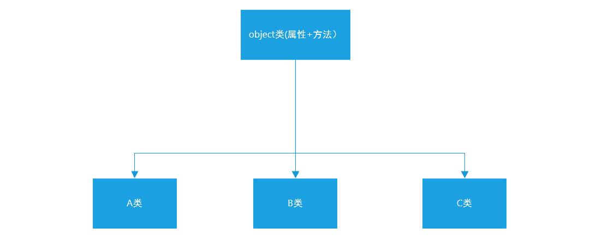
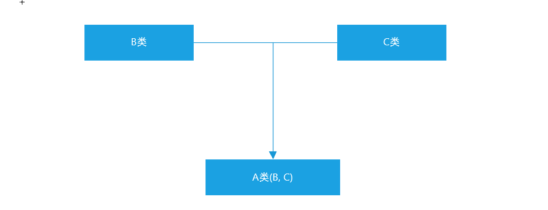
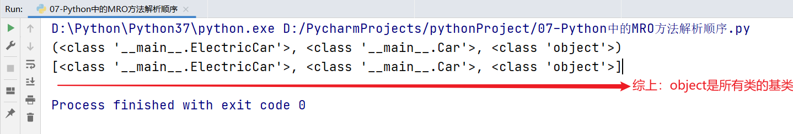
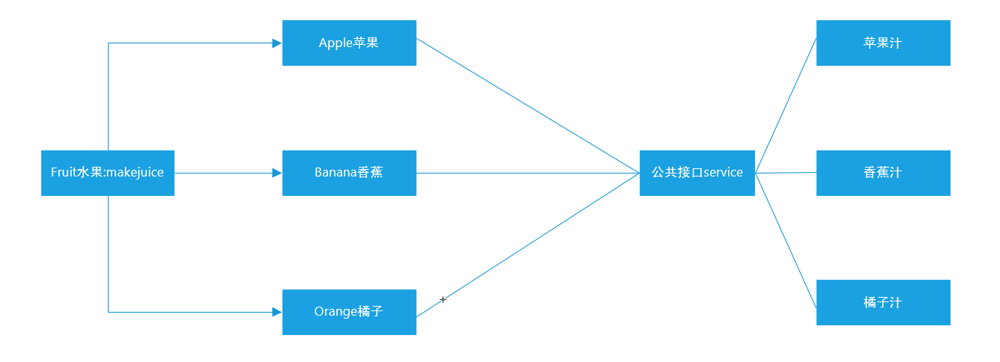

# Python面向对象高级与学生管理系统案例

# 一、Python中的继承

## 1、什么是继承

我们接下来来聊聊Python代码中的“继承”：类是用来描述现实世界中同一组事务的共有特性的抽象模型，但是类也有上下级和范围之分，比如：生物 => 动物 => 哺乳动物 => 灵长型动物 => 人类 => 黄种人

从哲学上说，就是共性与个性之间的关系，比如：白马和马！所以，我们在OOP代码中，也一样要体现出类与类之间的共性与个性关系，这里就需要通过类的继承来体现。简单来说，如果一个类A使用了另一个类B的成员（属性和方法），我们就可以说A类继承了B类，同时这也体现了OOP中==代码重用的特性==！

## 2、继承的基本语法

假设A类要继承B类中的所有属性和方法（私有属性和私有方法除外）

```python
class B(object):
    pass

class A(B):
    pass

a = A()
a.B中的所有公共属性
a.B中的所有公共方法
```

案例：Person类与Teacher、Student类之间的继承关系

```python
class Person(object):
    def eat(self):
        print('i can eat food!')

    def speak(self):
        print('i can speak!')
        
class Teacher(Person):
    pass

class Student(Person):
    pass

teacher = Teacher()
teacher.eat()
teacher.speak()

student = Student()
student.eat()
studnet.speak()
```

## 3、与继承相关的几个概念

继承：一个类从另一个已有的类获得其成员的相关特性，就叫作继承！

派生：从一个已有的类产生一个新的类，称为派生！

很显然，继承和派生其实就是从不同的方向来描述的相同的概念而已，本质上是一样的！


父类：也叫作基类，就是指已有被继承的类！

子类：也叫作派生类或扩展类


扩展：在子类中增加一些自己特有的特性，就叫作扩展，没有扩展，继承也就没有意义了！

单继承：一个类只能继承自一个其他的类，不能继承多个类，单继承也是大多数面向对象语言的特性！

多继承：一个类同时继承了多个父类， （C++、Python等语言都支持多继承）

## 4、单继承

单继承：一个类只能继承自一个其他的类，不能同时继承多个类。这个类会有具有父类的属性和方法。

基本语法：

```python
# 1、定义一个共性类（父类）
class Person(object):
    pass
# 2、定义一个个性类（子类）
class Student(Person):
    pass
```

案例：比如汽车可以分为两种类型（汽油车、电动车）

```python
# 1、定义一个共性类（车类）
class Car(object):
    def run(self):
        print('i can run')
# 2、定义汽油车
class GasolineCar(Car):
    pass
# 3、定义电动车
class EletricCar(Car):
    pass

bwm = GasolineCar()
bwm.run()
```

## 5、单继承特性（多层继承）：传递性

在Python继承中，如A类继承了B类，B类又继承了C类。则根据继承的传递性，则A类也会自动继承C类中所有属性和方法（公共）

```python
class C(object):
    def func(self):
        print('我是C类中的相关方法func')
        
class B(C):
    pass

class A(B):
    pass

a = A()
a.func()
```

## 6、编写面向对象代码中的常见问题

问题1：在定义类时，其没有遵循类的命名规则

答：在Python中，类理论上是区分大小写的（在Python中类可以全部大写也可以全部小写）。但是要遵循一定的命名规范：首字母必须是字母或下划线，其中可以包含字母、数字和下划线，而且要求其命名方式采用大驼峰。

电动汽车：EletricCar

父类：Father

子类：Son


问题2：父类一定要继承object么？Car(object)

答：在Python面向对象代码中，建议在编写父类时，让其自动继承object类。但是其实不写也可以，因为默认情况下，Python中的所有类都继承自object。




问题3：打印属性和方法时，不是只能使用print()函数输出，也可以使用return。

在实际打印对象信息，还建议使用`__str__`

```python
class Person():
    def __init__(self, name):
        self.name = name
        
    def speak(self):
        print('i can speak')
        
# 创建对象，打印属性和方法
p = Person('Tom')
print(p.name)
p.speak()
```

问题4：在定义魔术方法`__init__`而非`__int__`

## 7、多继承

什么是多继承？

Python语言是少数支持多继承的一门编程语言，所谓的多继承就是允许一个类同时继承自多个类的特性。



基本语法：

```python
class B(object):
    pass

class C(object):
    pass

class A(B, C):
    pass

a = A()
a.B中的所有属性和方法
a.C中的所有属性和方法
```

案例：汽油车、电动车 => 混合动力汽车（汽车 + 电动）

```python
class GasolineCar(object):
    def run_with_gasoline(self):
        print('i can run with gasoline')
        
class ElectricCar(object):
    def run_with_eletric(self):
        print('i can run with eletric')
        
class HybridCar(GasolineCar, ElectricCar):
    pass

tesla = HybridCar()
tesla.run_with_gasoline()
tesla.run_with_eletric()
```

> 注意：虽然多继承允许我们同时继承自多个类，但是实际开发中，应尽量避免使用多继承，因为如果两个类中出现了相同的属性和方法就会产生命名冲突。

## 8、子类扩展：重写父类属性和方法

扩展特性：继承让子类继承父类的所有公共属性和方法，但是如果仅仅是为了继承公共属性和方法，继承就没有实际的意义了，应该是在继承以后，子类应该有一些自己的属性和方法。

什么是重写？

重写也叫作==覆盖==，就是当子类成员与父类成员名字相同的时候，从父类继承下来的成员会重新定义！

此时，通过子类实例化出来的对象访问相关成员的时候，真正其作用的是子类中定义的成员！

class  Father(object):

​       属性

​       方法


class Son(Father):

​        父类属性和方法

​	     自己的属性和方法（如果子类中的属性和方法与父类中的属性或方法同名，则子类中的属性或方法会对父类中同名的属性或方法进行覆盖（重写））


上面单继承例子中 Animal 的子类 Cat和Dog 继承了父类的属性和方法，但是我们狗类Dog 有自己的叫声'汪汪叫'，猫类 Cat 有自己的叫声 '喵喵叫' ，这时我们需要对父类的 call() 方法进行重构。如下：

```python
class Animal(object):
    def eat(self):
        print('i can eat')
    
    def call(self):
        print('i can call')
        
class Dog(Animal):
    pass

class Cat(Animal):
    pass

wangcai = Dog()
wangcai.eat()
wangcai.call()

miaomiao = Cat()
miaomiao.eat()
miaomiao.call()
```

Dog、Cat子类重写父类Animal中的call方法：

```python
class Animal(object):
    def eat(self):
        print('i can eat')
    # 公共方法
    def call(self):
        print('i can call')


class Dog(Animal):
    # 重写父类的call方法
    def call(self):
        print('i can wang wang wang')


class Cat(Animal):
    # 重写父类的call方法
    def call(self):
        print('i can miao miao miao')


wangcai = Dog()
wangcai.eat()
wangcai.call()

miaomiao = Cat()
miaomiao.eat()
miaomiao.call()
```

思考：重写父类中的call方法以后，此时父类中的call方法还在不在？

答：还在，只不过是在其子类中找不到了。==类方法的调用顺序，当我们在子类中重构父类的方法后，Cat子类的实例先会在自己的类 Cat 中查找该方法，当找不到该方法时才会去父类 Animal 中查找对应的方法。==

## 9、super()调用父类属性和方法

super()：调用父类属性或方法，完整写法：`super(当前类名, self).属性或方法()`，在Python3以后版本中，调用父类的属性和方法我们只需要使用`super().属性或super().方法名()`就可以完成调用了。

案例：Car汽车类、GasolineCar汽油车、ElectricCar电动车

```python
class Car(object):
    def __init__(self, brand, model, color):
        self.brand = brand
        self.model = model
        self.color = color

    def run(self):
        print('i can run')


class GasolineCar(Car):
    def run(self):
        print('i can run with gasoline')


class ElectricCar(Car):
    def __init__(self, brand, model, color, battery):
        super().__init__(brand, model, color)
        # 电池属性
        self.battery = battery

    def run(self):
        print(f'i can run with electric，i have a {self.battery} + "kwh battery"')


bwm = GasolineCar('宝马', 'X5', '白色')
bwm.run()

tesla = ElectricCar('特斯拉', 'Model S', '红色', 70)
tesla.run()
```

## 10、MRO属性或MRO方法：方法解析顺序

MRO(Method Resolution Order)：方法解析顺序，我们可以通过`类名.__mro__`或`类名.mro()`获得“类的层次结构”，方法解析顺序也是按照这个“类的层次结构”寻找到。

```python
class Car(object):
    def __init__(self, brand, model, color):
        self.brand = brand
        self.model = model
        self.color = color

    def run(self):
        print('i can run')


class GasolineCar(Car):
    def run(self):
        print('i can run with gasoline')


class ElectricCar(Car):
    def __init__(self, brand, model, color, battery):
        super().__init__(brand, model, color)
        # 电池属性
        self.battery = battery

    def run(self):
        print(f'i can run with electric，i has a {self.battery} + "kwh battery"')
        
print(ElectricCar.__mro__)
print(ElectricCar.mro())
```



说明：有MRO方法解析顺序可知，在类的继承中，当某个类创建了一个对象时，调用属性或方法，首先在自身类中去寻找，如找到，则直接使用，停止后续的查找。如果未找到，继续向上一级继承的类中去寻找，如找到，则直接使用，没有找到则继续向上寻找...直到object类，这就是Python类继承中，其方法解析顺序。

> 综上：object类还是所有类的基类（因为这个查找关系到object才终止）

# 二、Python中多态(了解)

## 1、什么是多态

多态指的是一类事物有多种形态。


定义：多态是一种使用对象的方式，子类重写父类方法，调用不同子类对象的相同父类方法，可以产生不同的执行结果。

==不同对象 => 使用相同方法 => 产生不同的执行结果。==

① 多态依赖继承（不是必须的）

② 子类方法必须要重写父类方法

> 首先定义一个父类，其可能拥有多个子类对象。当我们调用一个公共方法（接口）时，传递的对象不同，则返回的结果不同。

好处：调用灵活，有了多态，更容易编写出通用的代码，做出通用的编程，以适应需求的不断变化！

## 2、多态原理图



公共接口service就是多态的体现，随着传入水果对象的不同，能返回不同的结果。

## 3、多态代码实现

多态：可以基于继承也可以不基于继承

```python
'''
首先定义一个父类，其可能拥有多个子类对象。当我们调用一个公共方法（接口）时，传递的对象不同，则返回的结果不同。
'''
class Fruit(object):
    def makejuice(self):
        print('i can make juice')

class Apple(Fruit):
    # 重写父类方法
    def makejuice(self):
        print('i can make apple juice')

class Banana(Fruit):
    # 重写父类方法
    def makejuice(self):
        print('i can make banana juice')

class Orange(Fruit):
    # 重写父类方法
    def makejuice(self):
        print('i can make orange juice')

# 定义一个公共接口（专门用于实现榨汁操作）
def service(obj):
    # obj要求是一个实例化对象，可以传入苹果对象/香蕉对象
    obj.makejuice()

# 调用公共方法
service(Orange())
```

## 扩展：在Python中还有哪些多态的案例呢？

\+ 多态体现

+加号只有一个，但是不同的对象调用+方法，其返回结果不同。

如果加号的两边都是数值类型的数据，则加号代表运算符

如果加号的两边传入的是字符串类型的数据，则加号代表合并操作，返回合并后的字符串

'a' + 'b' = 'ab'

如果加号的两边出入序列类型的数据，则加号代表合并操作，返回合并后的序列

[1, 2, 3] + [4, 5, 6] = [1, 2, 3, 4, 5, 6]

# 三、面向对象其他特性（重点）

## 1、类属性

Python中，属性可以分为==实例属性==和==类属性==。

类属性就是 类对象中定义的属性，它被该类的所有实例对象所共有。通常用来记录 与这类相关 的特征，类属性 不会用于记录 具体对象的特征。

> 在Python中，一切皆对象。类也是一个特殊的对象，我们可以单独为类定义属性。

```python
class Person(object):
    # 定义类属性
    count = 0
    def __init__(self, name, age):
        self.name = name
        self.age = age

        
p1 = Person('Tom', 23)
p2 = Person('Harry', 26)
```

## 2、类属性代码实现

定义count类属性，用于记录实例化Person类，产生对象的数量。

```python
class Person(object):
    # 定义类属性count
    count = 0

    # 定义一个__init__魔术方法，用于进行初始化操作
    def __init__(self, name):
        self.name = name
        # 对count类属性进行+1操作，用于记录这个Person类一共生成了多少个对象
        Person.count += 1

# 1、实例化对象p1
p1 = Person('Tom')
p2 = Person('Harry')
p3 = Person('Jennifer')
# 2、在类外部输出类属性
print(f'我们共使用Person类生成了{Person.count}个实例对象')
```

## 3、类方法

为什么需要类方法，在面向对象中，特别强调数据封装性。所以不建议直接在类的外部对类属性进行直接获取。所以我们如果想操作类属性，建议使用类方法。

```python
class Tool(object):
    # 定义一个类属性count
    count = 0
    # 定义一个__init__初始化方法
    def __init__(self, name):
        self.name = name
        Tool.count += 1
    # 封装一个类方法：专门实现对Tool.count类属性进行操作
    @classmethod
    def get_count(cls):
        print(f'我们使用Tool类共实例化了{cls.count}个工具')
        
t1 = Tool('斧头')
t2 = Tool('榔头')
t3 = Tool('铁锹')

Tool.get_count()
```

> 类方法主要用于操作类属性或类中的其他方法。

## 4、静态方法

在开发时，如果需要在类中封装一个方法，这个方法：  

==① 既 不需要访问实例属性或者调用实例方法==

==② 也 不需要访问类属性或者调用类方法==

这个时候，可以把这个方法封装成一个静态方法

```python
# 开发一款游戏
class Game(object):
    # 开始游戏，打印游戏功能菜单
    @staticmethod
    def menu():
        print('1、开始游戏')
        print('2、游戏暂停')
        print('3、退出游戏')
    

# 开始游戏、打印菜单
Game.menu()
```

## 5、案例

需求分析

设计一个`Game`类

属性：

定义一个类属性`top_score`记录游戏的历史最高分

定义一个实例属性`player_name`记录当前游戏的玩家姓名

方法：

静态方法`show_help`显示游戏帮助信息

类方法`show_top_score`显示历史最高分

实例方法`start_game`开始当前玩家的游戏


实例代码

```python
'''
设计一个`Game`类
属性：
定义一个类属性`top_score`记录游戏的历史最高分
定义一个实例属性`player_name`记录当前游戏的玩家姓名

方法：
静态方法`show_help`显示游戏帮助信息
类方法`show_top_score`显示历史最高分
实例方法`start_game`开始当前玩家的游戏
'''
class Game(object):
    # 1、定义类属性
    top_score = 0
    # 2、定义__init__初始化方法实现
    def __init__(self, player_name):
        self.player_name = player_name
    # 3、定义静态方法
    @staticmethod
    def show_help():
        print('-' * 40)
        print('【Start】开始游戏')
        print('【Stop】结束游戏')
        print('-' * 40)
    # 4、定义类方法 => 专门用于调用类属性（封装性）
    @classmethod
    def show_top_score(cls):
        print(f'本游戏的历史最高分：{Game.top_score}')
    # 5、定义实例方法
    def start_game(self):
        print(f'{self.player_name}开始游戏')

Game.show_help()       # 调用静态方法
Game.show_top_score()  # 调用类方法

game = Game('itheima')
game.start_game()
```

