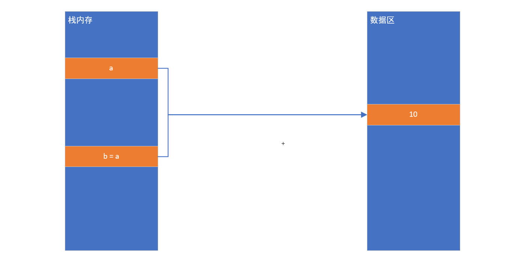
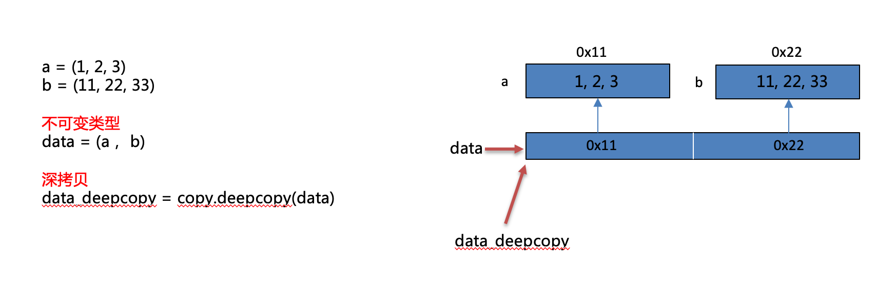

# Python闭包装饰器

# 一、闭包

## 1、作用域

在Python代码中，作用域分为两种情况：全局作用域 与 局部作用域

## 2、变量的作用域

在全局定义的变量 => 全局变量

在局部定义的变量 => 局部变量

## 3、全局变量与局部变量的访问范围

① 在全局作用域中可以访问全局变量，在局部作用域中可以访问局部变量

```python
# 全局作用域（全局变量）
num1 = 10
def func():
    # 局部作用域（局部变量）
    num2 = 20
    # ① 在局部访问局部变量
    print(num2)

# ① 在全局访问全局变量
print(num1)
# 调用函数
func()
```

② 在局部作用域中可以访问全局变量

```python
# 全局作用域（全局变量）
num1 = 10
def func():
    # 局部作用域（局部变量）
    # ② 在局部作用域中可以访问全局变量
    print(num1)

# 调用函数
func()
```

③ 在全局作用域中不能访问局部变量

```python
# 全局作用域（全局变量）
num1 = 10
def func():
    # 局部作用域（局部变量）
    num2 = 20

# 调用函数
func()
# 在全局作用域中调用局部变量num2
print(num2)
```

运行结果：


## 4、问题：为什么在全局作用域中无法访问局部变量

答：主要原因在于，在Python的底层存在一个“垃圾回收机制”，主要的作用就是回收内存空间。加快计算机的运行。我们在Python代码中定义的变量也是需要占用内存的，所以Python为了回收已经被已经过的内存，会自动将函数运行以后的内部变量和程序直接回收。

## 5、问题：我们有没有办法把函数内部的局部变量保留

答：使用==闭包==

在==函数嵌套==的前提下，内部函数==使用了外部函数的变量==，并且外部函数==返回了内部函数==，我们把这个使用外部函数变量的内部函数称为闭包。

## 6、闭包的构成条件（三步走）

第一步：有嵌套

第二步：有引用

第三步：有返回（return）

```python
'''
闭包程序三步走：① 有嵌套 ② 有引用 ③ 有返回
'''

def func():
    num = 20  # 局部变量
    def inner():
        print(num)
    return inner  # 实际上inner函数并没有执行，只是返回了inner函数在内存中的地址

f = func()  # 相当于把inner在内存中的地址0x7fbc9b3f8e18赋值给变量f
f()  # 找到inner函数的内存地址，并执行器内部的代码（num=20)，在于闭包函数保留了num=20这个局部变量
```

闭包的作用：正常情况下，当执行func()的时候，函数内部的变量num = 20，会随着函数的func函数的结束而被垃圾回收机制所回收。所以闭包的真正作用：就是可以在全局作用域中，实现间接对局部变量进行访问。

## 7、注意事项

注意点:

由于闭包引用了外部函数的变量，则外部函数的变量没有及时释放，消耗内存。

## 8、在闭包的内部实现对外部变量的修改

错误版本：

```python
'''
Python闭包：① 有嵌套 ② 有引用 ③ 有返回
'''

def outer():
    num = 10
    def inner():
        # 这种写法无法实现通过闭包修改外部的局部变量
        num = 20
    print('outer函数中的num：', num)  # 10
    inner()  # 执行函数inner，让num=20生效
    print('outer函数中的num：', num)  # 10
    return inner

f = outer()
f()
```

正确版本：

新知识点：nonlocal关键字（在函数内部修改函数外部的变量，这个变量非全局变量）

老知识点：global关键字（在函数内部声明变量，代表引用全局作用域中的全局变量）

```powershell
'''
Python闭包：① 有嵌套 ② 有引用 ③ 有返回
'''

def outer():
    num = 10
    def inner():
        # 这种写法无法实现通过闭包修改外部的局部变量'
        nonlocal num
        num = 20
    print('outer函数中的num：', num)  # 10
    inner()  # 执行函数inner，让num=20生效
    print('outer函数中的num：', num)  # 20
    return inner

f = outer()
f()
```

## 9、闭包的综合案例

闭包的作用：可以在全局作用域中间接访问局部变量（在函数执行以后）

```python
'''
闭包编写三步走：① 有嵌套 ② 有引用 ③ 有返回
分析：
执行f = func()的时候，result赋值为0，然后定义inner，返回inner，最终结果f = inner函数的内存地址
执行f(1)，相当于执行inner函数，nonlocal引用局部变量result=0，然后进行+1操作，弹出0+1=1
继续执行
执行f(2)，相当于执行inner函数，声明nonlocal result，代表还是引用外部的局部变量，由于此时外部的result已经被
f(1)更改为1了，所以由于局部变量一直没有消失，所以此时result=1，执行+2操作，最终结果为3
'''
def func():
    result = 0
    def inner(num):
        nonlocal result
        result += num
        print(result)
    return inner

f = func()
f(1)  # 1
f(2)  # 3
```

# 二、装饰器

## 1、什么是装饰器

在不改变现有函数源代码以及函数调用方式的前提下，实现给函数增加额外的功能。

装饰器的本质就是一个闭包函数（三步：① 有嵌套 ② 有引用 ③ 有返回）

> 有返回代表外部函数返回内部函数的内存地址（内部函数的名称），不带

## 2、装饰器的雏形

```python
# 要求：把登录功能封装起来（比如封装成一个函数，添加这个登录不能影响现有功能函数）
'''
装饰器：本质是一个闭包，有嵌套、有引用、有返回（返回的是函数的内存地址）
参数fn在check中也是一个局部变量
参数fn：就是要装饰的函数的函数名，如comment，如download
'''
def check(fn):
    def inner():
        # 开发登录功能
        print('登录功能')
        # 调用原函数
        fn()
    return inner


# 评论功能（前提：登录）
def comment():
    print('评论功能')

comment = check(comment)
comment()

# 下载功能（前提：登录）
def download():
    print('下载功能')

download = check(download)
download()
```

## 3、装饰器定义

```python
'''
装饰器：本质就是一个闭包 ① 有嵌套 ② 有引用 ③ 有返回
'''
def check(fn):
    
    def inner():
        # 开发登录验证功能
        print('验证登录')
        # 执行原有函数
        fn()
    return inner

@check
def comment():
    print('发表评论')

comment()
```

## 4、装饰器的作用：获取程序的执行时间

```python
'''
定义获取程序的执行时间装饰器 => 闭包（① 有嵌套 ② 有引用 ③ 有返回）
'''
import time

def get_time(fn):
    def inner():
        # ① 添加装饰器修饰功能（获取程序的执行时间）
        begin = time.time()
        # ② 调用fn函数，执行原函数代码
        fn()
        end = time.time()
        print(f'这个函数的执行时间：{end - begin}')
    return inner


@get_time
def demo():
    for i in range(1000000):
        print(i)

demo()
```

## 5、带有参数装饰器

```python
'''
带有参数的装饰器：① 有嵌套 ② 有引用 ③ 有返回
'''
def logging(fn):
    def inner(*args, **kwargs):
        # 添加装饰器代码（输出日志信息）
        print('-- 日志信息：正在努力计算机 --')
        # 执行要修饰的函数
        fn(*args, **kwargs)  # sum_num(a, b)
    return inner

@logging
def sum_num(*args, **kwargs):
    result = 0
    # *args代表不定长元组参数，args = (10, 20)
    for i in args:
        result += i
    # **kwargs代表不定长字典参数， kwargs = {a:30, b:40}
    for i in kwargs.values():
        result += i
    print(result)

# sum_num带4个参数，而且类型不同，10和20以元组形式传递，a=30，b=40以字典形式传递
sum_num(10, 20, a=30, b=40)
```

## 6、带有返回值装饰器

```python
'''
带有返回值的装饰器：① 有嵌套 ② 有引用 ③ 有返回
如果一个函数执行完毕后，没有return返回值，则默认返回None
'''
def logging(fn):
    def inner(*args, **kwargs):
        print('-- 日志信息：正在努力计算 --')
        return fn(*args, **kwargs)  # fn() = sub_num(20, 10) = result
    return inner

@logging
def sub_num(a, b):
    result = a - b
    return result

print(sub_num(20, 10))
```

## 7、通用版本的装饰器（以后所有的装饰器以此为准）

```python
'''
通用装饰器：① 有嵌套 ② 有引用 ③ 有返回 ④ 有不定长参数 ⑤ 有return返回值
'''
def logging(fn):
    def inner(*args, **kwargs):
        # 输出装饰器功能
        print('-- 正在努力计算 --')
        # 调用fn函数
        return fn(*args, **kwargs)
    return inner


@logging
def sum_num1(a, b):
    result = a + b
    return result

print(sum_num1(20, 10))

@logging
def sum_num2(a, b, c):
    result = a + b + c
    return result

print(sum_num2(10, 20, 30))
```

## 8、装饰器高级：使用装饰器传递参数（了解）

基本语法：

```python
def 装饰器(fn):
    ...

@装饰器('参数')
def 函数():
    # 函数代码
```

实例代码：根据传递参数不同，打印不同的日志信息

```python
'''
通用装饰器：① 有嵌套 ② 有引用 ③ 有返回 ④ 有不定长参数 ⑤ 有return返回值
真正问题：通过装饰器传递参数，我们应该如何接收这个参数呢？
答：在logging方法的外侧在添加一个函数，专门用于接收传递过来的参数
'''

def logging(flag):
    # flag = + 或 flag = -
    def decorator(fn):
        def inner(*args, **kwargs):
            if flag == '+':
                print('-- 日志信息：正在努力进行加法运算 --')
            elif flag == '-':
                print('-- 日志信息：正在努力进行减法运算 --')
            return fn(*args, **kwargs)
        return inner
    return decorator

@logging('+')
def sum_num(a, b):
    result = a + b
    return result

@logging('-')
def sub_num(a, b):
    result = a - b
    return result


print(sum_num(10, 20))
print(sub_num(100, 80))
```

# 三、深浅拷贝

## 1、几个概念

- 变量：是一个系统表的元素，拥有指向对象的连接空间
- 对象：被分配的一块内存，存储其所代表的值
- 引用：是自动形成的从变量到对象的指针
- 类型：属于对象，而非变量
- 不可变对象：一旦创建就不可修改的对象，包括数值类型、字符串、布尔类型、元组

*（该对象所指向的内存中的值不能被改变。当改变某个变量时候，由于其所指的值不能被改变，相当于把原来的值复制一份后再改变，这会开辟一个新的地址，变量再指向这个新的地址。）*

- 可变对象：可以修改的对象，包括列表、字典、集合

*（该对象所指向的内存中的值可以被改变。变量（准确的说是引用）改变后，实际上是其所指的值直接发生改变，并没有发生复制行为，也没有开辟新的地址，通俗点说就是原地改变。）*

当我们写：

```python
a = "python"
```

Python解释器干的事情：

① 创建变量a

② 创建一个对象(分配一块内存)，来存储值 'python'

③ 将变量与对象，通过指针连接起来，从变量到对象的连接称之为引用(变量引用对象)


## 2、赋值

**赋值: 只是复制了新对象的引用，不会开辟新的内存空间。**

并不会产生一个独立的对象单独存在，只是将原有的数据块打上一个新标签，所以当其中一个标签被改变的时候，数据块就会发生变化，另一个标签也会随之改变。



## 3、浅拷贝

**浅拷贝: 创建新对象，其内容是原对象的引用。**

浅拷贝之所以称为浅拷贝，是它仅仅只拷贝了一层，拷贝了最外围的对象本身，内部的元素都只是拷贝了一个引用而已。

案例1：赋值


案例2：可变类型浅拷贝


案例3：不可变类型浅拷贝


> 注：不可变类型进行浅拷贝不会给拷贝的对象开辟新的内存空间，而只是拷贝了这个对象的引用


浅拷贝有三种形式： 切片操作，工厂函数（list()），copy模块中的copy函数。

如： lst = [1,2,[3,4]]

切片操作：lst1 = lst[:] 或者 lst1 = [each for each in lst]

> 注：`[:]`它与`[0:]`相似，意思是从0索引拆分到末尾。它返回一个新列表。

工厂函数：lst1 = list(lst)

copy函数：lst1 = copy.copy(lst)

但是在lst中有一个嵌套的list[3,4]，如果我们修改了它，情况就不一样了。


浅复制要分两种情况进行讨论：

1）当浅复制的值是不可变对象（字符串、元组、数值类型）时和“赋值”的情况一样，对象的id值*（id()函数用于获取对象的内存地址）*与浅复制原来的值相同。

2）当浅复制的值是可变对象（列表、字典、集合）时会产生一个“不是那么独立的对象”存在。有两种情况：

*第一种情况：复制的对象中无复杂子对象，原来值的改变并不会影响浅复制的值，同时浅复制的值改变也并不会影响原来的值。原来值的id值与浅复制原来的值不同。*

*第二种情况：复制的对象中有复杂子对象（例如列表中的一个子元素是一个列表），如果不改变其中复杂子对象，浅复制的值改变并不会影响原来的值。 但是改变原来的值中的复杂子对象的值会影响浅复制的值。*

## 4、深拷贝

**深拷贝：和浅拷贝对应，深拷贝拷贝了对象的所有元素，包括多层嵌套的元素。深拷贝出来的对象是一个全新的对象，不再与原来的对象有任何关联。**

所以改变原有被复制对象不会对已经复制出来的新对象产生影响。只有一种形式，copy模块中的deepcopy函数。

可变类型深拷贝：


不可变类型深拷贝：不可变类型进行深拷贝不会给拷贝的对象开辟新的内存空间，而只是拷贝了这个对象的引用



## 5、案例演示

案例1：对于可变对象深浅拷贝

```python
import copy
a=[1,2,3]

print("=====赋值=====")
b=a
print(a)
print(b)
print(id(a))
print(id(b))

print("=====浅拷贝=====")
b=copy.copy(a)
print(a)
print(b)
print(id(a))
print(id(b))

print("=====深拷贝=====")
b=copy.deepcopy(a)
print(a)
print(b)
print(id(a))
print(id(b))
```

结果：

```python
=====赋值=====
[1, 2, 3]
[1, 2, 3]
37235144
37235144
=====浅拷贝=====
[1, 2, 3]
[1, 2, 3]
37235144
37191432
=====深拷贝=====
[1, 2, 3]
[1, 2, 3]
37235144
37210184
```

小结：

赋值： 值相等，地址相等

copy浅拷贝：值相等，地址不相等

deepcopy深拷贝：值相等，地址不相等


案例2：对于可变对象深浅拷贝（外层改变元素）

```python
import copy
l=[1,2,3,[4, 5]]

l1=l #赋值
l2=copy.copy(l) #浅拷贝
l3=copy.deepcopy(l) #深拷贝
l.append(6)

print(l)  
print(l1)
print(l2)
print(l3)
```

结果：

```python
[1, 2, 3, [4, 5], 6]     #l添加一个元素6
[1, 2, 3, [4, 5], 6]     #l1跟着添加一个元素6
[1, 2, 3, [4, 5]]        #l2保持不变
[1, 2, 3, [4, 5]]        #l3保持不变
```


案例3：对于可变对象深浅拷贝（内层改变元素）

```python
import copy
l=[1,2,3,[4, 5]]

l1=l #赋值
l2=copy.copy(l) #浅拷贝
l3=copy.deepcopy(l) #深拷贝
l[3].append(6) 

print(l) 
print(l1)
print(l2)
print(l3)
```

结果：

```python
[1, 2, 3, [4, 5, 6]]      #l[3]添加一个元素6
[1, 2, 3, [4, 5, 6]]      #l1跟着添加一个元素6
[1, 2, 3, [4, 5, 6]]      #l2跟着添加一个元素6
[1, 2, 3, [4, 5]]         #l3保持不变
```

小结：

① 外层添加元素时，浅拷贝不会随原列表变化而变化；内层添加元素时，浅拷贝才会变化。
② 无论原列表如何变化，深拷贝都保持不变。
③ 赋值对象随着原列表一起变化。
