# 计算机网络及TCP网络应用程序开发

# 学习目标

1、了解计算机网络相关信息

2、掌握Python3编码转换的方法

3、掌握TCP客户端及服务器端开发流程及应用实践

4、socket套接字之send和recv原理剖析

5、掌握网络综合案例：多任务版TCP服务端程序应用实践

# 一、计算机网络概述

## 1、网络的概念

网络就是将具有独立功能的多台计算机通过通信线路和通信设备连接起来，在网络管理软件及网络通信协议下，实现资源共享和信息传递的虚拟平台。


## 2、为什么要学习网络

学习网络的目的就是<font color="red">能够编写基于网络通信的软件或程序，通常来说就是网络编程。</font>


## 3、IP地址概述

思考一个问题，当我们在计算机中使用微信和你心中那个“她”聊天时，信息是如何精准的传递到她的计算机中的呢？


答：是通过计算机的IP地址来实现的，==IP地址是分配给网络设备上网使用的数字标签，它能够标识网络中唯一的一台设备，好比现实中每个人都有一个手机号。==

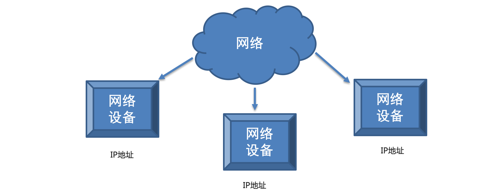

## 4、IP地址的表现形式

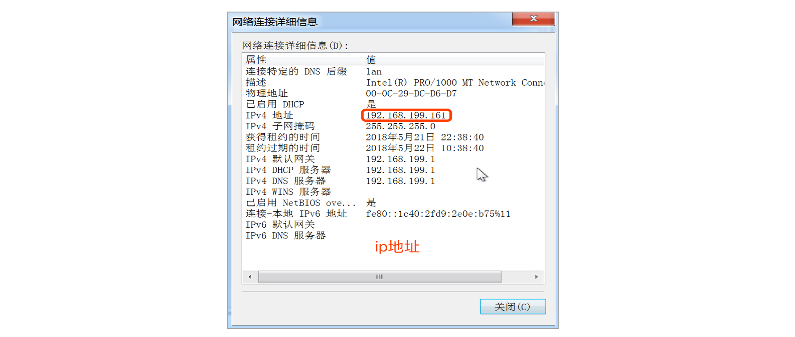

IP地址一共有4位，第1位，1\~223，第234位，0~255

注意事项：

① IP地址分为两类 : IPv4和IPv6

② IPv4是目前使用的IP地址

③ IPv6是未来使用的IP地址

## 5、IP地址的作用

通过IP地址找到网络中唯一一台设备，然后可以跟这个设备进行数据通信。

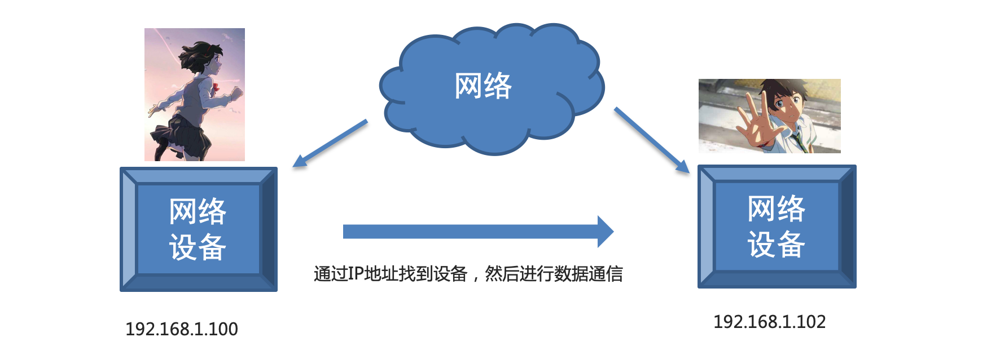


## 6、端口和端口号的概念

### ☆ 计算机通信原理

问题：如果在一台电脑上使用飞秋给另外一台电脑上的飞秋发送数据并且另外的这台电脑还运行着多个软件，它是如何区分这多个软件把数据给飞秋的呢?

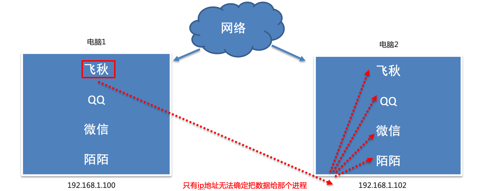

答：其实，每运行一个程序都会有一个端口，想要给对应的程序发送数据，找到对应的端口即可。端口就是<font color="red">传输数据的通道</font>，好比教室的门，是数据传输必经之路。

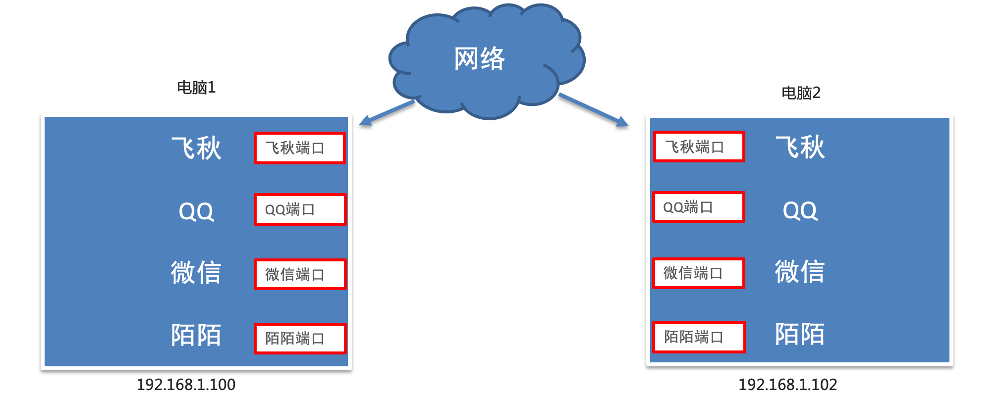

而且每一个端口都会有一个对应的端口号（操作系统为了统一管理这么多端口，就对端口进行了编号，这就是端口号，端口号其实就是一个数字，好比我们现实生活中的门牌号），想要找到端口通过端口号即可，如：飞秋软件的默认端口号就是2345。

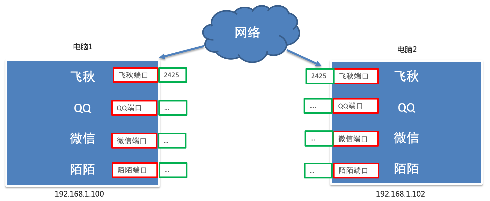

最终通信结果：通过ip地址找到对应的设备，通过端口号找到对应的端口，然后通过端口把数据给应用程序。

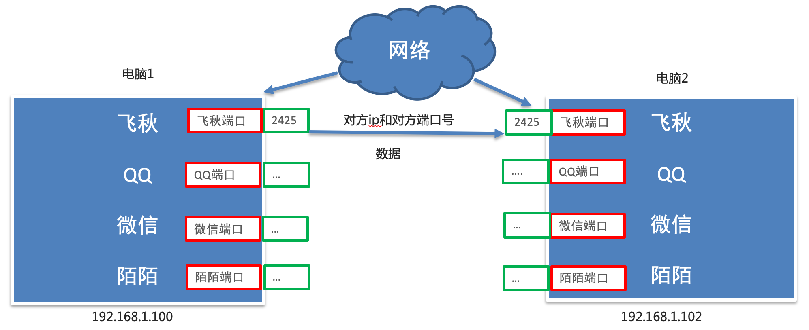

### ☆ 扩展：端口号扩展

① 知名端口号

知名端口号是指众所周知的端口号，范围从0到1023，这些端口号一般固定分配给一些服务，比如21端口分配给FTP（文件传输协议）服务，22端口分配给SSH（安全外壳协议，主要用于远程连接与文件传输），25端口分配给SMTP（简单邮件传输协议）服务，80端口分配给HTTP服务，443端口分配给HTTPS服务等等。


② 动态端口号

一般程序员开发应用程序使用端口号称为动态端口号。

动态端口号的范围是从1024到65535，如果程序员开发的程序没有设置端口号，操作系统会在动态端口号这个范围内随机生成一个给开发的应用程序使用。

> 注意：当运行一个程序默认会有一个端口号，当程序退出时，所占用的这个端口号就会被释放。

设置端口建议8000以后

## 7、TCP概述

### ☆ 为什么需要TCP协议

之前我们学习了IP地址和端口号，通过IP地址能够找到对应的设备，然后再通过端口号找到对应的端口，再通过端口把数据传输给应用程序，这里要注意，数据不能随便发送，在发送之前还要选择网络传输方式（传输协议），保证程序之间按照指定的传输规则进行数据的通信。


### ☆ TCP概述

TCP的英文全拼(Transmission Control Protocol)简称传输控制协议，它是一种面向连接的、可靠的、基于字节流的传输层通信协议。

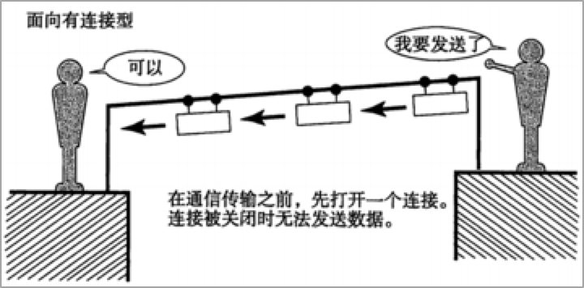

TCP通信步骤：① 创建连接  ② 传输数据  ③ 关闭连接

TCP通信模型相当于生活中的’打电话‘，在通信开始之前，一定要先建立好连接，才能发送数据，通信结束要关闭连接。

### ☆ TCP的特点

#### ① 面向连接

通信双方必须先建立好连接才能进行数据的传输，并且双方都会为此连接分配必要资源用来记录连接的状态和信息。当数据传输完成后，双方必须断开此连接，以释放系统资源。


#### ② 可靠传输

##### **☆ TCP采用发送应答机制**

通过TCP这种方式发送的每个报文段都必须得到接收方的应答才认为这个TCP报文段传送成功

##### **☆ 超时重传**

发送端发送一个报文之后就会启动定时器，如果指定时间内没有得到应答就会重新发送这个报文段

##### **☆ 错误校验**

TCP用一个校验和函数来校验数据是否有错误，在发送和接收时都要计算校验和

##### **☆ 流量控制和阻塞管理**

流量控制用来避免发送端发送过快而使得接收方来不及接收

### 扩展：UDP协议（不可靠传输协议）

TCP可靠协议（数据可以100%传输）

日常通信、数据传输一定要保证可靠性，使用TCP。


UDP不可靠协议（只能保证速度，但是没办法保证数据传输质量，发送5M => 接收3.75M）

有些情况下，我们对数据的质量没有要求，可以考虑使用UDP，如视频通话。

## 8、socket套接字

### ☆ 目前存在的问题

到目前为止我们学习了IP地址和端口号，使用这些我们就可以在茫茫的网络海洋中进行畅游了么？

答案是否定的！


### ☆ socket套接字

那我们需要什么工具呢？答：socket套接字工具，它是计算机之间进行**通信**的**一种约定**或一种方式。通过 socket 这种约定，一台计算机可以接收其他计算机的数据，也可以向其他计算机发送数据。

这就好比现实中的电话，当知道了对方的电话号码后需要使用电话才能进行通讯，程序之间想要进行网络通信需要基于这个socket套接字，socket套接字就是程序间进行网络通讯的工具。

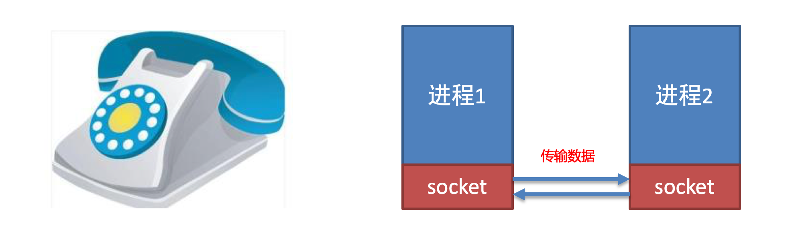

### ☆ socket使用场景

不夸张的说，只要跟<font color="red">网络相关的应用程序或者软件</font>都使用到了socket。


# 二、Python3编码转换

## 1、为什么要学习编码转换

在计算机网络中，数据都是以二进制的形式进行传输的。所以在网络传输数据的时候，数据需要先编码转化为二进制（bytes）数据类型

I Love Python => 字符串 => 转换为二进制数据 => 网络中传输

## 2、数据的编码转换

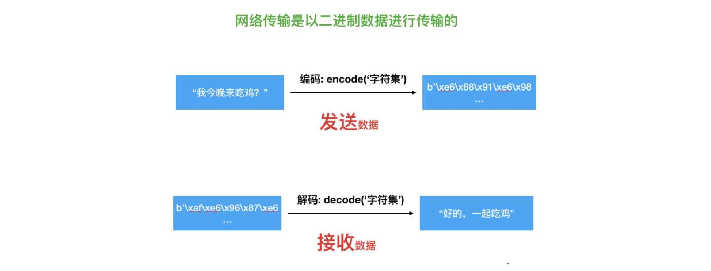

数据转换方法说明：

| 函数名 | 说明                      |
| ------ | ------------------------- |
| encode | 编码 将字符串转化为字节码 |
| decode | 解码 将字节码转化为字符串 |

提示：encoed()和decode()函数可以接受参数，encoding是指在编解码过程中使用的编码方案。

字符串编码：

```python
str.encode(encoding=”utf-8”)
```

二进制解码：

```python
bytes.decode(encoding=“utf-8”)
```

# 三、TCP客户端及服务器端开发实践

## 1、TCP网络应用程序开发分类

① TCP客户端应用程序开发

② TCP服务器端应用程序开发

客户端程序是指运行在用户设备上的程序，服务端程序是指运行在服务器设备上的程序，专门为客户端提供数据服务。那如何记忆呢？

> 主动发起建立连接请求的是客户端程序，等待接受连接请求的是服务端程序。

## 2、TCP客户端程序开发流程及应用实践（五步走）

### ☆ 开发流程介绍

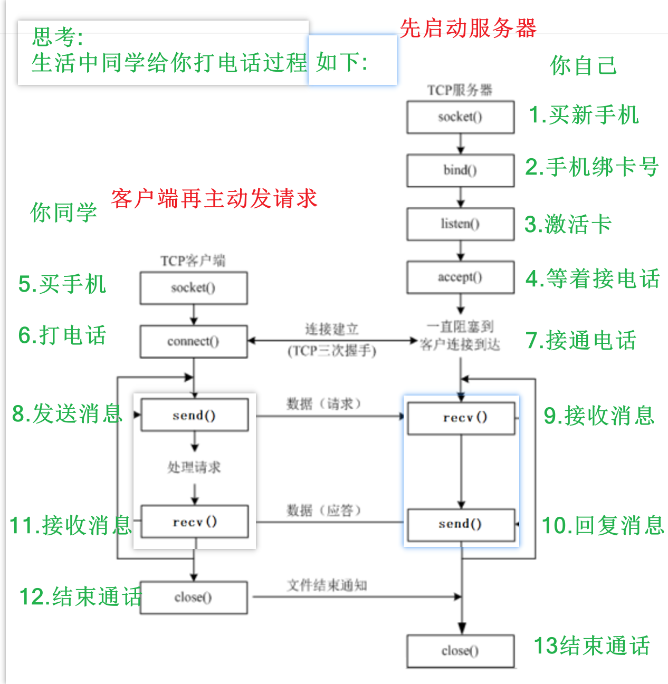

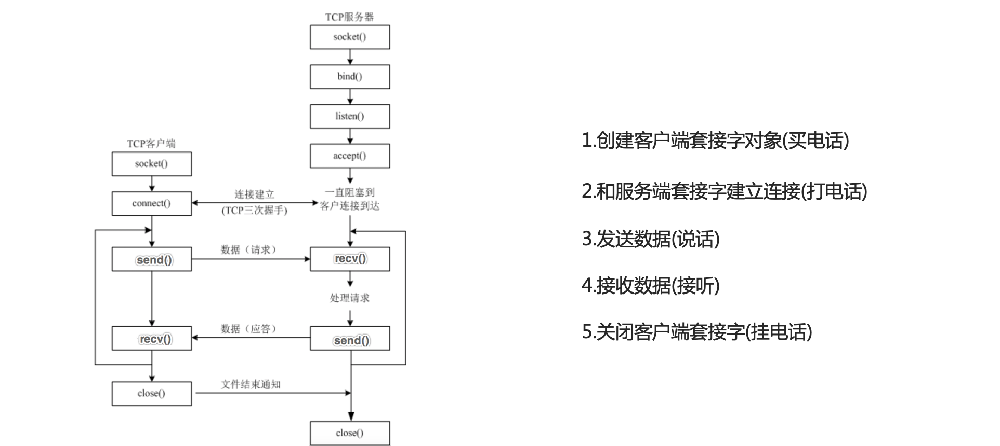

### ☆ socket类的介绍

```python
① 导入socket模块
import socket

② 创建客户端socket对象使用socket类
socket.socket(AddressFamily, Type)
```

客户端socket类的参数和方法说明：

| 参数名        | 说明                       |
| ------------- | -------------------------- |
| AddressFamily | IP地址类型, 分为IPv4和IPv6 |
| Type          | 传输协议类型               |

开发客户端需要使用的函数：

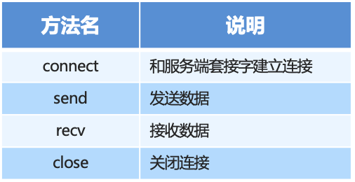

### ☆ TCP客户端程序开发实践

```python
import socket

if __name__ == '__main__':
    # 1、创建客户端套接字对象
    tcp_client_socket = socket.socket(socket.AF_INET, socket.SOCK_STREAM)
    # 2、和服务器端套接字建立连接(参数必须是一个元祖)
    tcp_client_socket.connect(("192.168.31.181", 8080))
    # 3、发送数据
    tcp_client_socket.send('hell, itheima'.encode(encoding='utf-8'))
    # 4、接收数据
    recv_data = tcp_client_socket.recv(1024).decode('utf-8')
    print(recv_data)
    # 5、关闭客户端套接字
    tcp_client_socket.close()
```

使用网络调试查看，效果如下图所示：

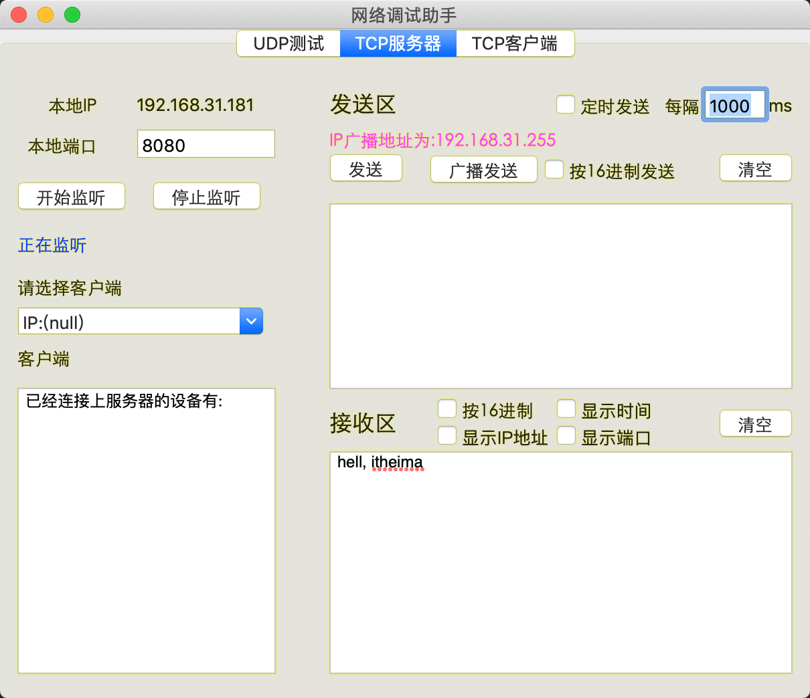

## 3、TCP服务器端开发流程及应用实践（七步走）

### ☆ 服务器端

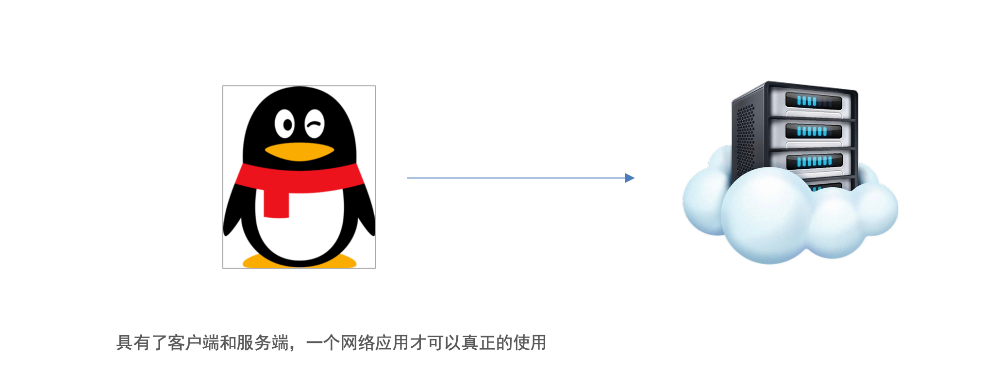

### ☆ 开发流程介绍

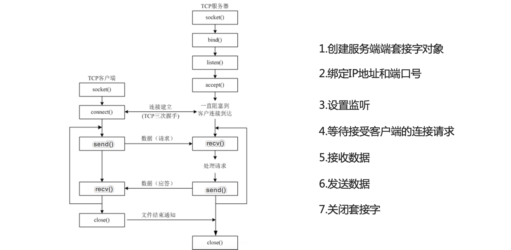


### ☆ socket类的介绍

```python
① 导入socket模块
import socket

② 创建客户端socket对象使用socket类
socket.socket(AddressFamily, Type)
```

客户端socket类的参数和方法说明：

| 参数名        | 说明                       |
| ------------- | -------------------------- |
| AddressFamily | IP地址类型, 分为TPv4和IPv6 |
| Type          | 传输协议类型               |

开发客户端需要使用的函数：

```python
① 导入socket模块
import socket

② 创建服务器端socket对象使用socket类
socket.socket(AddressFamily, Type)
```

客户端socket类的参数和方法说明：

| 参数名        | 说明                       |
| ------------- | -------------------------- |
| AddressFamily | IP地址类型, 分为TPv4和IPv6 |
| Type          | 传输协议类型               |

开发服务器端需要使用的函数：

| 方法名 | 说明                     |
| ------ | ------------------------ |
| bind   | 绑定IP地址和端口号       |
| listen | 设置监听                 |
| accept | 等待接受客户端的连接请求 |
| send   | 发送数据                 |
| recv   | 接收数据                 |


### ☆ TCP服务器端程序开发实践

```python
import socket

if __name__ == '__main__':
    # 1、创建服务器端套接字对象
    tcp_server_socket = socket.socket(socket.AF_INET, socket.SOCK_STREAM)
    # 2、绑定IP地址与端口号
    tcp_server_socket.bind(("", 8888))
    # 3、开启监听
    tcp_server_socket.listen(128)
    # 4、等待接收客户端连接请求
    conn_socket, ip_port = tcp_server_socket.accept()
    print('客户端IP+端口：', ip_port)
    # 5、接收数据
    recv_data = conn_socket.recv(1024)
    print('接收到的数据：', recv_data.decode())
    # 6、发送数据
    conn_socket.send("客户端的数据已经收到了".encode())
    # 7、关闭套接字
    conn_socket.close()
    tcp_server_socket.close()
```

(==<socket.socket fd=4, family=AddressFamily.AF_INET, type=SocketKind.SOCK_STREAM, proto=0, laddr=('10.1.1.10', 8888), raddr=('10.1.1.10', 48190)>==, <font color="red">('10.1.1.10', 48190)</font>)

变量1，变量2 = (第一个元素值，第二个元素值)

## 4、扩展：TCP服务器端开发之多客户端

```python
# 导入模块
import socket

# 1、创建套接字对象
tcp_server_socket = socket.socket(socket.AF_INET, socket.SOCK_STREAM)
# 2、绑定IP与端口
tcp_server_socket.bind(("", 8090))
# 3、设置监听
tcp_server_socket.listen(128)
# 4、等待客户端连接
while True:
    # 使用try...except捕获连接异常
    try:
        new_socket, ip_port = tcp_server_socket.accept()
        while True:
            try:
                # 5、接收客户端发送过来的消息
                recv_data = new_socket.recv(1024)

                recv_data = recv_data.decode('gbk')
                print(f'{ip_port}：{recv_data}')

                content = input('服务器端消息：').encode('gbk')
                new_socket.send(content)

            except ConnectionResetError:
                print(f'{ip_port}客户端连接已经断开')
                break
    except:
        print('出错，退出服务器监听')
        break

# 关闭套接字对象
tcp_server_socket.close()

```

## 5、TCP网络应用程序开发注意点

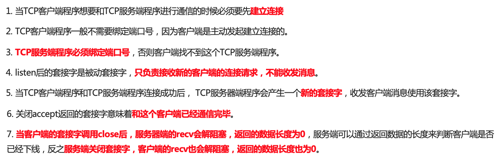

端口复用：

```python
import socket

if __name__ == '__main__':
    # 1、创建服务器端套接字对象
    tcp_server_socket = socket.socket(socket.AF_INET, socket.SOCK_STREAM)
    # 设置端口复用
    tcp_server_socket.setsockopt(socket.SOL_SOCKET, socket.SO_REUSEADDR, True)
    # 2、绑定IP地址与端口号
    tcp_server_socket.bind(("", 8888))
    # 3、开启监听
    tcp_server_socket.listen(128)
    # 4、等待接收客户端连接请求
    conn_socket, ip_port = tcp_server_socket.accept()
    print('客户端IP+端口：', ip_port)
    # 5、接收数据
    recv_data = conn_socket.recv(1024)
    print('接收到的数据：', recv_data.decode())
    # 6、发送数据
    conn_socket.send("客户端的数据已经收到了".encode())
    # 7、关闭套接字
    conn_socket.close()
    tcp_server_socket.close()
```

## 6、扩展：飞秋消息

```properties
content = '1:134871264:斌哥:黑马程序员:32:你好，帅哥！'


[0] 消息类型：'1'
[1] 发送者ID：'134871264'
[2] 发送者昵称：'斌哥'
[3] 群组或组织名称：'黑马程序员'
[4] 接收者ID：'32'
[5] 消息正文：'你好，帅哥！'

0.消息类型 (1)
    表示消息的类别。例如：1 可能表示文本消息；
    其他值可能代表文件传输、表情包等不同消息类型。
1. 发送者ID (134871264)
	标识发送者的唯一用户ID，在局域网内用于识别不同的用户。
2.发送者昵称 (斌哥)
	发送者的显示昵称，接收方可以直观地看到是谁发送的消息。
3.群组或组织名称 (黑马程序员)
	表示发送者所属的群组或者组织，用于标识团队或单位。
4.接收者ID (32)
	标识目标接收者的唯一用户ID，用于点对点通信时指定接收方。
5.消息正文 (你好，帅哥！)
	实际要发送的文本内容，可以是聊天信息或其他数据
```

点对点消息：

```python
import socket
# AF_INET: ipv4地址  SOCK_DGRAM:UDP协议
udp_client_socket = socket.socket(socket.AF_INET, socket.SOCK_DGRAM)
# 飞秋服务器地址和端口号
server = ('192.168.109.58', 2425)
# 消息内容
content = '1:134871264:斌哥:黑马程序员:32:你好，帅哥！'
# sendto():发送消息  注意:编码是gbk
udp_client_socket.sendto(content.encode('gbk'), server)
```

群发消息：

```python
import socket
# AF_INET: ipv4地址  SOCK_DGRAM:UDP协议
udp_client_socket = socket.socket(socket.AF_INET, socket.SOCK_DGRAM)
# TODO 设置广播SO_BROADCAST
udp_client_socket.setsockopt(socket.SOL_SOCKET, socket.SO_BROADCAST, 1)
# 飞秋服务器地址和端口号
server = ('192.168.109.255', 2425)
# 消息内容
content = '1:134871264:斌哥:黑马程序员:32:你好，帅哥！'
# sendto():发送消息  注意:编码是gbk
udp_client_socket.sendto(content.encode('gbk'), server)
```

