# Python进程和线程

# 学习目标

1、了解多任务的概念

2、了解进程的概念以及多进程的作用

3、掌握多进程完成多任务的工作原理及案例编写

4、掌握进程编号的获取方式以及进程使用的注意事项

5、了解线程的概念以及多线程的作用

6、掌握多进程完成多任务的工作原理及案例编写

# 一、多任务的概念

## 1、举个栗子

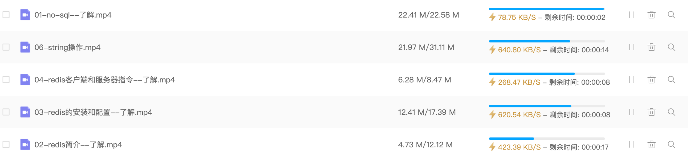

思考：我们在使用网盘下载资料的时候，为什么要多个任务同时下载呢？

答：多个任务同时执行可以大大提高程序的执行效率

## 2、提出问题

问题：利用我们目前所学的技术，我们能否实现多任务操作呢？

答：不能，因为之前所写的程序都是单任务的，也就是说一个函数或者方法执行完成 , 另外一个函数或者方法才能执行。要想实现多个任务同时执行就需要使用多任务。多任务的最大好处是充分利用CPU资源，提高程序的执行效率。

## 3、什么是多任务

多任务是指在同一时间内执行多个任务。

例如: 现在电脑安装的操作系统都是多任务操作系统，可以同时运行着多个软件。

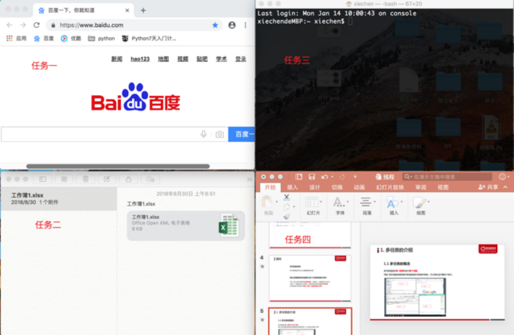

## 4、多任务的两种表现形式

① 并发

② 并行

## 5、并发操作

并发：在一段时间内交替去执行多个任务。

例如：对于单核cpu处理多任务,操作系统轮流让各个任务交替执行，假如:软件1执行0.01秒，切换到软件2，软件2执行0.01秒，再切换到软件3，执行0.01秒……这样反复执行下去
, 实际上每个软件都是交替执行的 . 但是，由于CPU的执行速度实在是太快了，表面上我们感觉就像这些软件都在同时执行一样 . 这里需要注意单核cpu是并发的执行多任务的。

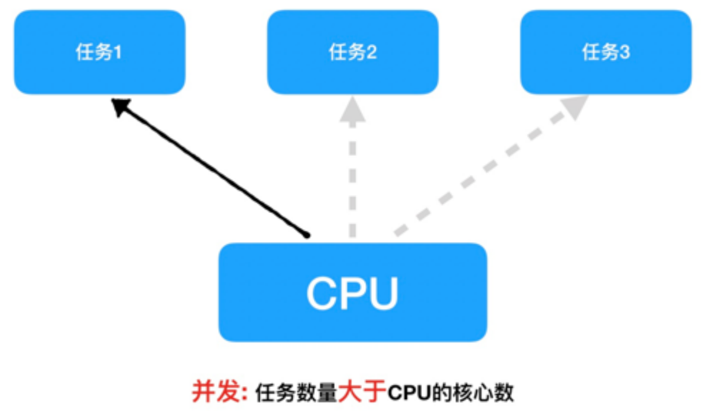

## 6、并行操作

并行：在一段时间内真正的同时一起执行多个任务。

对于多核cpu处理多任务，操作系统会给cpu的每个内核安排一个执行的任务，多个内核是真正的一起同时执行多个任务。这里需要注意多核cpu是并行的执行多任务，始终有多个任务一起执行。

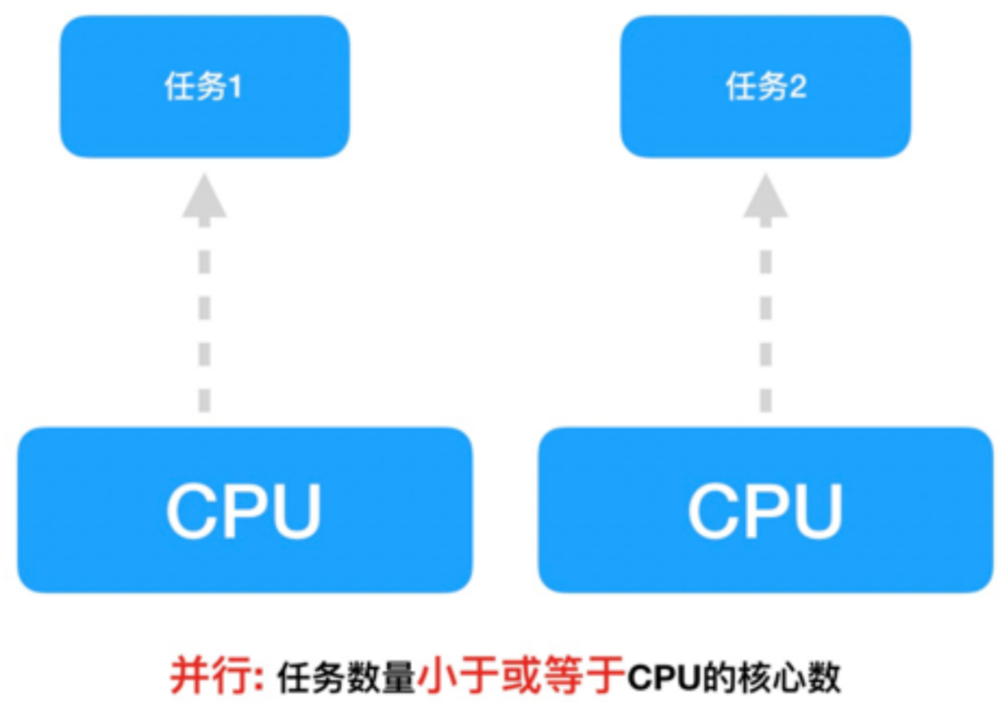


# 二、进程的概念

## 1、程序中实现多任务的方式

在Python中，想要实现多任务可以使用==多进程==来完成。

## 2、进程的概念

进程（Process）是资源分配的最小单位，它是操作系统进行资源分配和调度运行的基本单位，通俗理解：一个正在运行的程序就是一个进程。

例如:正在运行的qq , 微信等 他们都是一个进程。

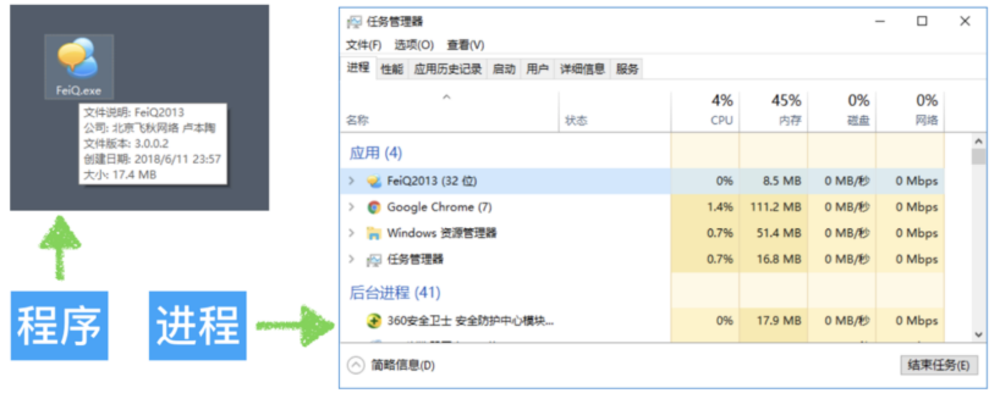

> 注： 一个程序运行后至少有一个进程 

## 3、多进程的作用

### ☆ 未使用多进程

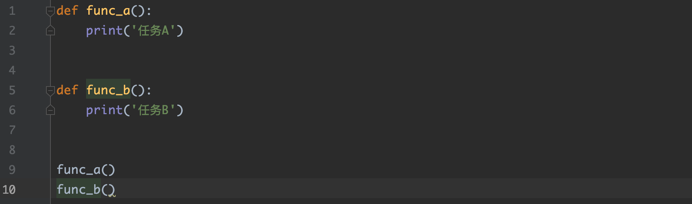

思考:

​         图中是一个非常简单的程序 , 一旦运行hello.py这个程序 , 按照代码的执行顺序 , func_a函数执行完毕后才能执行func_b函数 . 如果可以让func_a和func_b同时运行 , 显然执行hello.py这个程序的效率会大大提升 .

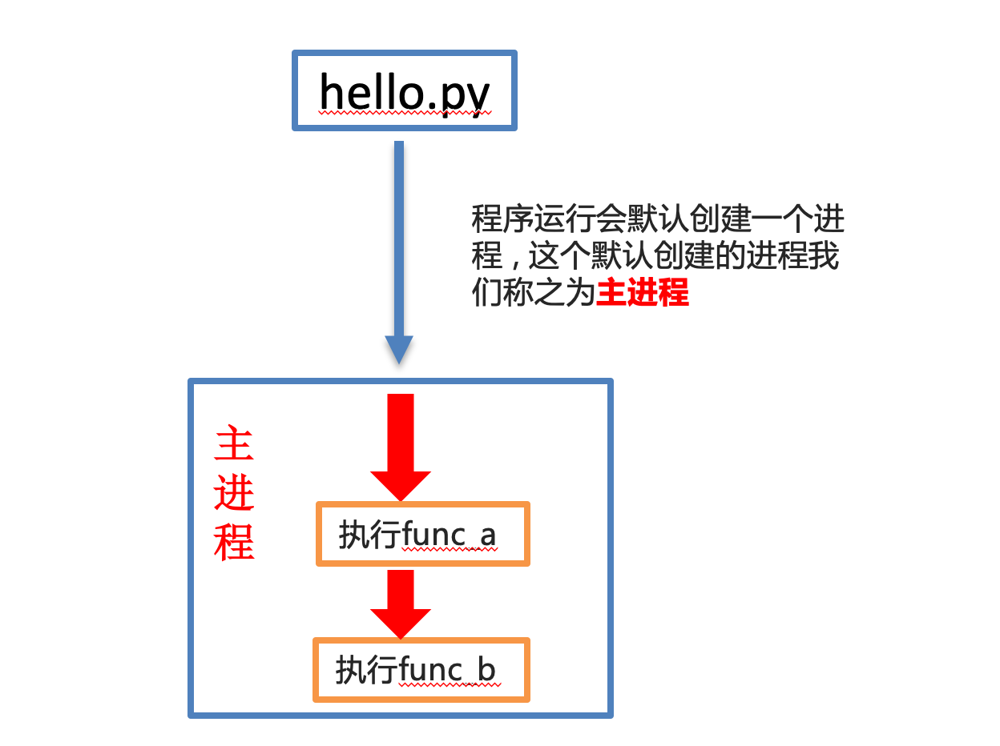

### ☆ 使用了多进程

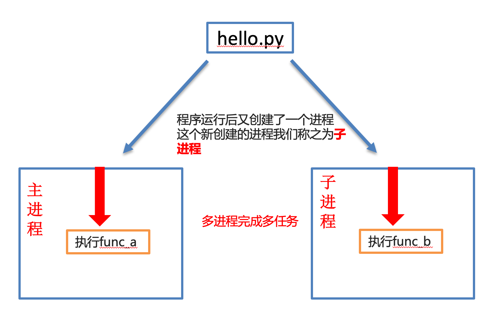

# 三、多进程完成多任务

## 1、多进程完成多任务

```python
① 导入进程包
import multiprocessing

② 通过进程类创建进程对象 
进程对象 = multiprocessing.Process() 

③ 启动进程执行任务
进程对象.start()
```

## 2、通过进程类创建进程对象

```python
进程对象 = multiprocessing.Process([group [, target=任务名 [, name]]])
```

参数说明：

| 参数名 | 说明                                       |
| ------ | ------------------------------------------ |
| target | 执行的目标任务名，这里指的是函数名(方法名) |
| name   | 进程名，一般不用设置                       |
| group  | 进程组，目前只能使用None                   |

## 3、进程创建与启动的代码

边听音乐边敲代码：

```python
import multiprocessing
import time


def music():
    for i in range(3):
        print('听音乐...')
        time.sleep(0.2)


def coding():
    for i in range(3):
        print('敲代码...')
        time.sleep(0.2)

if __name__ == '__main__':
    music_process = multiprocessing.Process(target=music)
    coding_process = multiprocessing.Process(target=coding)

    music_process.start()
    coding_process.start()
```

## 4、进程执行带有参数的任务

```python
Process([group [, target [, name [, args [, kwargs]]]]])
```

参数说明：

| 参数名 | 说明                                                         |
| ------ | ------------------------------------------------------------ |
| args   | 以元组的方式给执行任务传参，args表示调用对象的位置参数元组，args=(1,2,'anne',) |
| kwargs | 以字典方式给执行任务传参，kwargs表示调用对象的字典,kwargs={'name':'anne','age':18} |

案例：args参数和kwargs参数的使用

```python
import multiprocessing
import time


def music(num):
    for i in range(num):
        print('听音乐...')
        time.sleep(0.2)


def coding(count):
    for i in range(count):
        print('敲代码...')
        time.sleep(0.2)


music_process = multiprocessing.Process(target=music, args=(3, ))
coding_process = multiprocessing.Process(target=coding, kwargs={'count': 3})

music_process.start()
coding_process.start()
```

案例：多个参数传递

```python
import multiprocessing
import time


def music(num, name):
    for i in range(num):
        print(name)
        print('听音乐...')
        time.sleep(0.2)


def coding(count):
    for i in range(count):
        print('敲代码...')
        time.sleep(0.2)


if __name__ == '__main__':
    music_process = multiprocessing.Process(target=music, args=(3, '多任务开始'))
    coding_process = multiprocessing.Process(target=coding, kwargs={'count': 3})

    music_process.start()
    coding_process.start()
```

# 四、获取进程编号

## 1、进程编号的作用

当程序中进程的数量越来越多时 , 如果没有办法区分主进程和子进程还有不同的子进程 , 那么就无法进行有效的进程管理 , 为了方便管理实际上每个进程都是有自己编号的。

## 2、两种进程编号

① 获取当前进程编号

```python
getpid()
```

② 获取当前进程的父进程ppid = parent pid

```python
getppid()
```

## 3、获取当前进程编号

```python
import os


def work():
    # 获取当前进程的编号
    print('work进程编号', os.getpid())
    # 获取父进程的编号
    print('work父进程的编号', os.getppid())
    

work()
```

案例：获取子进程编号

```python
import multiprocessing
import time
import os


def music(num):
    print('music>> %d' % os.getpid())
    for i in range(num):
        print('听音乐...')
        time.sleep(0.2)


def coding(count):
    print('coding>> %d' % os.getpid())
    for i in range(count):
        print('敲代码...')
        time.sleep(0.2)


if __name__ == '__main__':
    music_process = multiprocessing.Process(target=music, args=(3, ))
    coding_process = multiprocessing.Process(target=coding, kwargs={'count': 3})

    music_process.start()
    coding_process.start()
```

案例：获取父进程与子进程编号

```python
import multiprocessing
import time
import os


def music(num):
    print('music>> %d' % os.getpid())
    print('music主进程>> %d' % os.getppid())
    for i in range(num):
        print('听音乐...')
        time.sleep(0.2)


def coding(count):
    print('coding>> %d' % os.getpid())
    print('music主进程>> %d' % os.getppid())
    for i in range(count):
        print('敲代码...')
        time.sleep(0.2)


if __name__ == '__main__':
    print('主进程>> %d' % os.getpid())
    music_process = multiprocessing.Process(target=music, args=(3, ))
    coding_process = multiprocessing.Process(target=coding, kwargs={'count': 3})

    music_process.start()
    coding_process.start()
```

# 五、进程应用注意点

## 1、进程间不共享全局变量

实际上==创建一个子进程就是把主进程的资源进行拷贝产生了一个新的进程==，这里的主进程和子进程是互相独立的。


案例：

```python
import multiprocessing

my_list = []


def write_data():
    for i in range(3):
        my_list.append(i)
        print('add:', i)
    print(my_list)


def read_data():
    print('read_data', my_list)


if __name__ == '__main__':
    # 创建写入数据进程
    write_process = multiprocessing.Process(target=write_data)
    # 创建读取数据进程
    read_process = multiprocessing.Process(target=read_data)

    # 启动进程执行相关任务
    write_process.start()
    time.sleep(1)
    read_process.start()
```

原理分析：

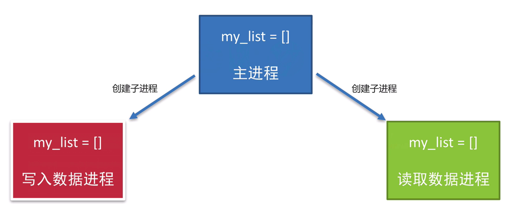

> 三个进程分别操作的都是自己进程里面的全局变量my_list, 不会对其它进程里面的全局变量产生影响，所以进程之间不共享全局变量，只不过进程之间的全局变量名字相同而已，但是操作的不是同一个进程里面的全局变量。

知识点小结：

创建子进程会对主进程资源进行拷贝，也就是说子进程是主进程的一个副本，好比是一对双胞胎，之所以进程之间不共享全局变量，是因为操作的不是同一个进程里面的全局变量，只不过不同进程里面的全局变量名字相同而已。

## 2、主进程与子进程的结束顺序

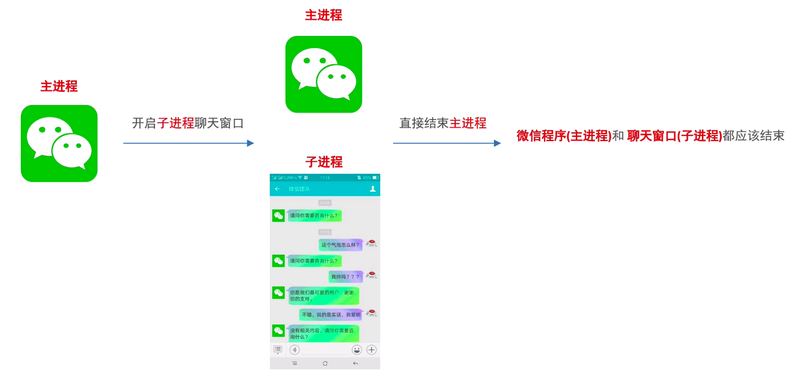

代码演示：

```python
import multiprocessing
import time


# 工作函数
def work():
    for i in range(10):
        print('工作中...')
        time.sleep(0.2)


if __name__ == '__main__':
    # 创建子进程
    work_process = multiprocessing.Process(target=work)
    # 启动子进程
    work_process.start()

    # 延迟1s
    time.sleep(1)
    print('主进程执行完毕')
```

执行结果：

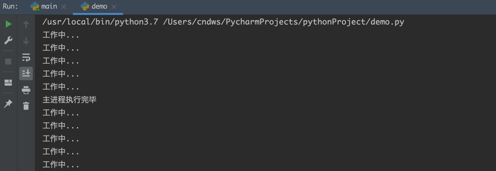

### ☆ 解决方案一：设置守护进程

```python
import multiprocessing
import time


# 工作函数
def work():
    for i in range(10):
        print('工作中...')
        time.sleep(0.2)


if __name__ == '__main__':
    # 创建子进程
    work_process = multiprocessing.Process(target=work)
    # 设置守护主进程，主进程退出后子进程直接销毁，不再执行子进程中的代码
    work_process.daemon = True
    # 启动子进程
    work_process.start()

    # 延迟1s
    time.sleep(1)
    print('主进程执行完毕')
```

### ☆ 解决方案二：销毁子进程

```python
import multiprocessing
import time


# 工作函数
def work():
    for i in range(10):
        print('工作中...')
        time.sleep(0.2)


if __name__ == '__main__':
    # 创建子进程
    work_process = multiprocessing.Process(target=work)
    # 启动子进程
    work_process.start()

    # 延迟1s
    time.sleep(1)
    
    # 让子进程直接销毁，表示终止执行， 主进程退出之前，把所有的子进程直接销毁就可以了
    work_process.terminate()
    
    print('主进程执行完毕')
```

> 提示: 以上两种方式都能保证主进程退出子进程销毁

# 六、线程的概念

## 1、线程的概念

在Python中，想要实现多任务还可以使用多线程来完成。

## 2、为什么使用多线程？

进程是分配资源的最小单位 , 一旦创建一个进程就会分配一定的资源 , 就像跟两个人聊QQ就需要打开两个QQ软件一样是比较浪费资源的 . 

线程是<font color="red">程序执行的最小单位</font> , 实际上进程只负责分配资源 , 而利用这些资源执行程序的是线程 , 也就说进程是线程的容器 , 一个进程中最少有一个线程来负责执行程序 。同时线程自己不拥有系统资源，只需要一点儿在运行中必不可少的资源，但它可与同属一个进程的其它线程<font color="red">共享进程所拥有的全部资源</font> 。这就像通过一个QQ软件(一个进程)打开两个窗口(两个线程)跟两个人聊天一样 , 实现多任务的同时也节省了资源。

## 3、多线程的作用

```python
def func_a():
    print('任务A')


def func_b():
    print('任务B')


func_a()
func_b()
```

### ☆ 单线程执行


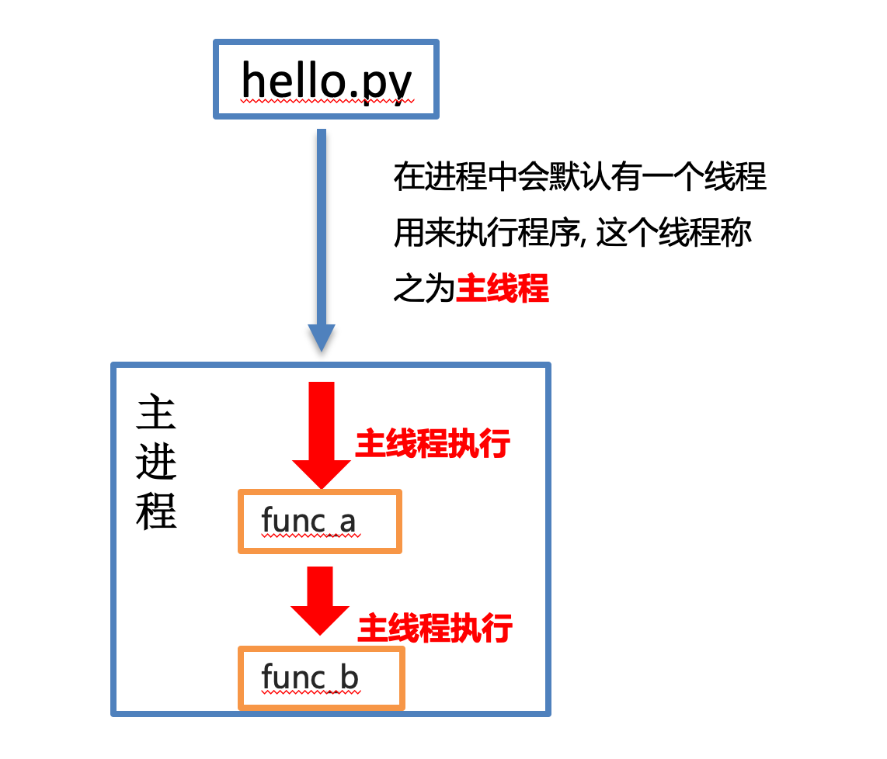

### ☆ 多线程执行

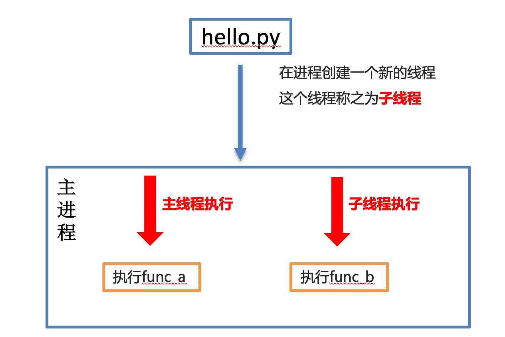

# 八、多线程完成多任务

## 1、多线程完成多任务

```python
① 导入线程模块
import threading

② 通过线程类创建线程对象
线程对象 = threading.Thread(target=任务名) 

② 启动线程执行任务
线程对象.start()
```

| 参数名 | 说明                                      |
| ------ | ----------------------------------------- |
| target | 执行的目标任务名,这里指的是函数名(方法名) |
| name   | 线程名，一般不用设置                      |
| group  | 线程组，目前只能使用None                  |

## 2、线程创建与启动代码

单线程案例：

```python
import time


def music():
    for i in range(3):
        print('听音乐...')
        time.sleep(0.2)


def coding():
    for i in range(3):
        print('敲代码...')
        time.sleep(0.2)


if __name__ == '__main__':
    music()
    coding()
```

多线程案例：

```python
import time
import threading


def music():
    for i in range(3):
        print('听音乐...')
        time.sleep(0.2)


def coding():
    for i in range(3):
        print('敲代码...')
        time.sleep(0.2)


if __name__ == '__main__':
    music_thread = threading.Thread(target=music)
    coding_thread = threading.Thread(target=coding)

    music_thread.start()
    coding_thread.start()
```

## 3、线程执行带有参数的任务

| 参数名 | 说明                       |
| ------ | -------------------------- |
| args   | 以元组的方式给执行任务传参 |
| kwargs | 以字典方式给执行任务传参   |

```python
import time
import threading


def music(num):
    for i in range(num):
        print('听音乐...')
        time.sleep(0.2)


def coding(count):
    for i in range(count):
        print('敲代码...')
        time.sleep(0.2)


if __name__ == '__main__':
    music_thread = threading.Thread(target=music, args=(3, ))
    coding_thread = threading.Thread(target=coding, kwargs={'count': 3})

    music_thread.start()
    coding_thread.start()
```

## 4、主线程和子线程的结束顺序

```python
import time
import threading


def work():
    for i in range(10):
        print('work...')
        time.sleep(0.2)


if __name__ == '__main__':
    # 创建子进程
    work_thread = threading.Thread(target=work)
    # 启动线程
    work_thread.start()

    # 延时1s
    time.sleep(1)
    print('主线程执行完毕')
```

### ☆ 设置守护线程方式一

```python
import time
import threading


def work():
    for i in range(10):
        print('work...')
        time.sleep(0.2)


if __name__ == '__main__':
    # 创建子线程并设置守护主线程
    work_thread = threading.Thread(target=work, daemon=True)
    # 启动线程
    work_thread.start()

    # 延时1s
    time.sleep(1)
    print('主线程执行完毕')
```

### ☆ 设置守护线程方式二

```python
import time
import threading


def work():
    for i in range(10):
        print('work...')
        time.sleep(0.2)


if __name__ == '__main__':
    # 创建子线程
    work_thread = threading.Thread(target=work)
    # 设置守护主线程
    work_thread.setDaemon(True)
    # 启动线程
    work_thread.start()

    # 延时1s
    time.sleep(1)
    print('主线程执行完毕')
```

## 5、线程间的执行顺序

```python
for i in range(5):
    sub_thread = threading.Thread(target=task)
    sub_thread.start()
```

思考：当我们在进程中创建了多个线程，其线程之间是如何执行的呢？按顺序执行？一起执行？还是其他的执行方式呢？

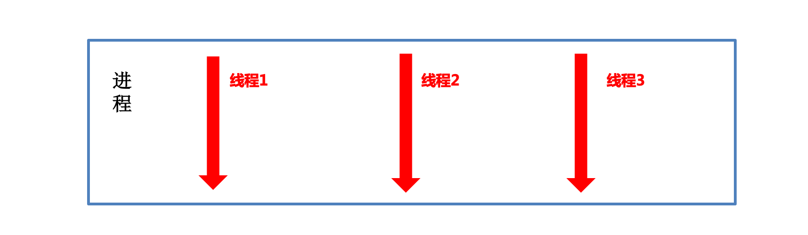

答：线程之间的执行是无序的，验证

### ☆ 获取当前线程信息

```python
# 通过current_thread方法获取线程对象
current_thread = threading.current_thread()

# 通过current_thread对象可以知道线程的相关信息，例如被创建的顺序
print(current_thread)
```

### ☆ 线程间的执行顺序

```python
import threading
import time

def get_info():
    # 可以暂时先不加，查看效果
    time.sleep(0.5)
    current_thread = threading.current_thread()
    print(current_thread)


if __name__ == '__main__':
    # 创建子线程
    for i in range(10):
        sub_thread = threading.Thread(target=get_info)
        sub_thread.start()
```

> 总结：线程之间执行是无序的，是由CPU调度决定某个线程先执行的。

## 6、线程间共享全局变量

### ☆ 线程间共享全局变量

多个线程都是在同一个进程中 , 多个线程使用的资源都是<font color="red">同一个进程中的资源</font> ，因此多线程间是共享全局变量

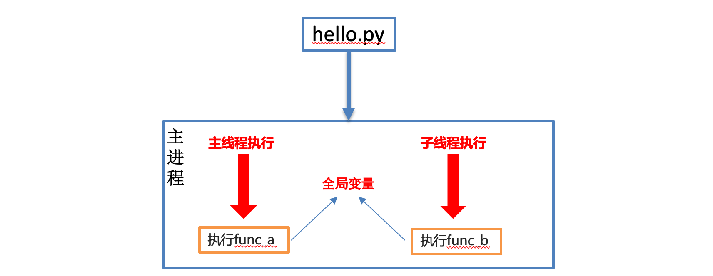

示例代码：

```python
import threading
import time


my_list = []


def write_data():
    for i in range(3):
        print('add：', i)
        my_list.append(i)
    print(my_list)


def read_data():
    print('read：', my_list)


if __name__ == '__main__':
    write_thread = threading.Thread(target=write_data)
    read_thread = threading.Thread(target=read_data)

    write_thread.start()
    time.sleep(1)
    read_thread.start()
```

## 7、总结：进程和线程对比

### ☆ 关系对比

① 线程是依附在进程里面的，没有进程就没有线程。

② 一个进程默认提供一条线程，进程可以创建多个线程。


### ☆ 区别对比

① 进程之间不共享全局变量

② 线程之间共享全局变量

③ 创建进程的资源开销要比创建线程的资源开销要大

④ 进程是操作系统资源分配的基本单位，线程是CPU调度的基本单位

### ☆ 优缺点对比

① 进程优缺点:

优点：可以用多核

缺点：资源开销大

② 线程优缺点

优点：资源开销小

缺点：不能使用多核

