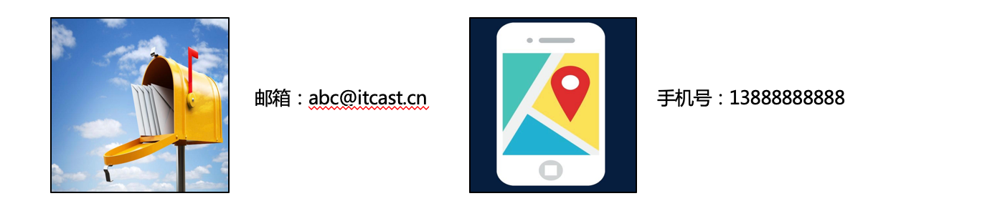
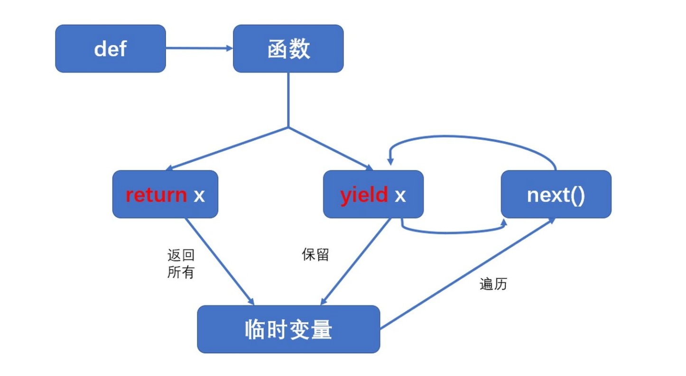

# Python高级语法与正则表达式

# 学习目标

1、能够知道生成器的两种创建方式

2、能够知道深拷贝和浅拷贝的区别

3、能够掌握Python中的正则表达式编写


# 二、正则表达式概述

## 1、为什么要学习正则表达式

在实际开发过程中经常会有查找符合某些复杂规则的字符串的需要

比如：邮箱、图片地址、手机号码等

这时候想<font color="red">匹配或者查找符合某些规则的字符串</font>就可以使用==正则表达式==了



## 2、什么是正则表达式

正则表达式(regular expression)描述了一种字符串匹配的==模式==，可以用来检查一个串是否含有==某种==子串、将匹配的子串做替换或者从某个串中取出符合某个条件的子串等。 

模式：一种特定的字符串模式，这个模式是通过一些特殊的符号组成的。
某种：也可以理解为是一种模糊匹配。

精准匹配：select * from blog where title='python';

模糊匹配：select * from blog where title like ‘%python%’;

正则表达式并不是Python所特有的，在Java、PHP、Go以及JavaScript等语言中都是支持正则表达式的。

## 3、正则表达式的功能

① 数据验证（表单验证、如手机、邮箱、IP地址）
② 数据检索（数据检索、数据抓取）
③ 数据隐藏（135****6235 王先生）
④ 数据过滤（论坛敏感关键词过滤）
…

# 三、re模块的介绍

## 1、什么是re模块

在Python中需要通过正则表达式对字符串进行匹配的时候，可以使用一个re模块

## 2、re模块使用三步走

```python
# 第一步：导入re模块
import re
# 第二步：使用match方法进行匹配操作
result = re.match(pattern正则表达式, string要匹配的字符串, flags=0)
# 第三步：如果数据匹配成功，使用group方法来提取数据
result.group()
```

match函数参数说明：

| 参数    | 描述                                                         |
| ------- | ------------------------------------------------------------ |
| pattern | 匹配的正则表达式                                             |
| string  | 要匹配的字符串。                                             |
| flags   | 标志位，用于控制正则表达式的匹配方式，如：是否区分大小写，多行匹配等等。参见：正则表达式修饰符 - 可选标志 |

匹配成功re.match方法返回一个匹配的对象，否则返回None。

我们可以使用group(num) 或 groups() 匹配对象函数来获取匹配数据。


正则表达式可以包含一些可选标志修饰符来控制匹配的模式。修饰符被指定为一个可选的标志。多个标志可以通过按位 OR(|) 它们来指定。如 re.I | re.M 被设置成 I 和 M 标志：

| 修饰符 | 描述                                                         |
| ------ | ------------------------------------------------------------ |
| re.I   | ==使匹配对大小写不敏感==                                     |
| re.L   | 做本地化识别（locale-aware）匹配，这个功能是为了支持多语言版本的字符集使用环境的，比如在转义符\w，在英文环境下，它代表[a-zA-Z0-9_]，即所以英文字符和数字。如果在一个法语环境下使用，缺省设置下，不能匹配"é" 或   "ç"。加上这L选项和就可以匹配了。不过这个对于中文环境似乎没有什么用，它仍然不能匹配中文字符。 |
| re.M   | ==多行匹配，影响 ^ 和 $==                                    |
| re.S   | ==使 . 匹配包括换行在内的所有字符==                          |
| re.U   | 根据Unicode字符集解析字符。这个标志影响 \w, \W, \b, \B.      |
| re.X   | VERBOSE，冗余模式， 此模式忽略正则表达式中的空白和#号的注释，例如写一个匹配邮箱的正则表达式。该标志通过给予你更灵活的格式以便你将正则表达式写得更易于理解。 |

## 3、re模块的相关方法

### ☆ re.match(pattern, string, flags=0)

* 从字符串的起始位置匹配，如果匹配成功则返回匹配内容， 否则返回None

### ☆ re.findall(pattern, string, flags=0)

- 扫描整个串，返回所有与pattern匹配的列表
- 注意: 如果pattern中有分组则返回与分组匹配的列表
- 举例： `re.findall("\d","chuan1zhi2") >> ["1","2"]`

### ☆ re.finditer(pattern, string, flags)

* 功能与上面findall一样，不过返回的时迭代器


参数说明：

- pattern : 模式字符串。
- repl : 替换的字符串，也可为一个函数。
- string : 要被查找替换的原始字符串。
- count : 模式匹配后替换的最大次数，默认 0 表示替换所有的匹配。
- flags: 匹配方式:
  - re.I 使匹配对大小写不敏感，I代表Ignore忽略大小写
  - re.S 使 . 匹配包括换行在内的所有字符
  - re.M 多行模式,会影响^,$

## 4、正则表达式快速入门

案例1：查找一个字符串中是否具有数字“8”

```python
import re


result = re.findall('8', '13566128753')
# print(result)
if result:
    print(result)
else:
    print('未匹配到任何数据')
```

案例2：查找一个字符串中是否具有数字

```python
import re


result = re.findall('\d', 'a1b2c3d4f5')
# print(result)
if result:
    print(result)
else:
    print('未匹配到任何数据')
```

案例3：查找一个字符串中是否具有非数字

```python
import re


result = re.findall('\D', 'a1b2c3d4f5')
# print(result)
if result:
    print(result)
else:
    print('未匹配到任何数据')
```

# 三、正则表达式详解

## 正则编写三步走：查什么、查多少、从哪查

正则表达式通常是由两部分数据组成的：普通字符 与 元字符

普通字符：0123456789abcd@...

元字符：正则表达式所特有的符号 => [0-9]，^，*，+，？

## 1、查什么

| 代码 | 功能                      |
| ---- | ------------------------- |
| .（英文点号） | 匹配任意某1个字符（除了\n） |
| [ ]  | 匹配[ ]中列举的某1个字符，专业名词 => ==字符簇== |
| \[^指定字符] | 匹配除了指定字符以外的其他某个字符，^专业名词 => ==托字节== |
| \d   | 匹配数字，即0-9           |
| \D   | 匹配非数字，即不是数字    |
| \s   | 匹配空白，即   空格，tab键               |
| \S   | 匹配非空白                               |
| \w   | 匹配非特殊字符，即a-z、A-Z、0-9、_ |
| \W   | 匹配特殊字符，即非字母、非数字、非下划线 |

字符簇常见写法：

① [abcdefg] 代表匹配abcdefg字符中的任意某个字符（1个）

② [aeiou] 代表匹配a、e、i、o、u五个字符中的任意某个字符

③ [a-z] 代表匹配a-z之间26个字符中的任意某个

④ [A-Z] 代表匹配A-Z之间26个字符中的任意某个

⑤ [0-9] 代表匹配0-9之间10个字符中的任意某个

⑥ [0-9a-zA-Z] 代表匹配0-9之间、a-z之间、A-Z之间的任意某个字符


字符簇 + 托字节结合代表取反的含义：

① \[^aeiou] 代表匹配除了a、e、i、o、u以外的任意某个字符

② \[^a-z] 代表匹配除了a-z以外的任意某个字符


\d 等价于 [0-9]， 代表匹配0-9之间的任意数字

\D 等价于 \[^0-9]，代表匹配非数字字符，只能匹配1个

## 2、查多少

| 代码  | 功能                                                         |
| ----- | ------------------------------------------------------------ |
| *     | 匹配前一个字符出现0次或者无限次，即可有可无（0到多）         |
| +     | 匹配前一个字符出现1次或者无限次，即至少有1次（1到多）        |
| ?     | 匹配前一个字符出现1次或者0次，即要么有1次，要么没有（0或1）  |
| {m}   | 匹配前一个字符出现m次，匹配手机号码\d{11}                    |
| {m,n} | 匹配前一个字符出现从m到n次，\w{6,10}，代表前面这个字符出现6到10次 |

基本语法：

正则匹配字符.或\w或\S + 跟查多少

如\w{6, 10}

如.*，匹配前面的字符出现0次或多次

## 3、从哪查

| 代码 | 功能                 |
| ---- | -------------------- |
| ^    | 匹配以某个字符串开头 |
| $    | 匹配以某个字符串结尾 |


# 四、几个重要概念

## 1、子表达式（又称之为分组）

在正则表达式中，通过一对圆括号括起来的内容，我们就称之为=="子表达式"==。

```powershell
re.search(r'\d(\d)(\d)', 'abcdef123ghijklmn')

注意：Python正则表达式前的 r 表示原生字符串（rawstring），该字符串声明了引号中的内容表示该内容的原始含义，避免了多次转义造成的反斜杠困扰。
```

正则表达式中\d\d\d中，(\\d)(\d)就是子表达式，一共有两个`()`圆括号，则代表两个子表达式

> 说明：findall方法，如果pattern中有分组则返回与分组匹配的列表，所以分组操作中不适合使用findall方法，建议使用search(匹配一个)或finditer(匹配多个)方法。

## 2、捕获

当正则表达式在字符串中匹配到相应的内容后，计算机系统会自动把子表达式所匹配的到内容放入到系统的对应缓存区中（缓存区从$1开始）


案例演示：

```python
import re


# 匹配字符串中连续出现的两个相同的单词
str1 = 'abcdef123ghijklmn'
result = re.search(r'\d(\d)(\d)', str1)
print(result.group())
print(result.group(1))
print(result.group(2))
```

## 3、反向引用（后向引用）

在正则表达式中，我们可以通过\n（n代表第n个缓存区的编号）来引用缓存区中的内容，我们把这个过程就称之为"反向引用"。

① 连续4个数字

re.search(r'\d\d\d\d, str1)

1234、5678、6789

② 连续的4个数字，但是数字的格式为1111、2222、3333、4444、5555效果？

 re.search(r'(\d)\1\1\1, str1)

## 4、几个练习题

① 查找连续的四个数字，如：3569

答：`\d{4}`

② 查找连续的相同的四个数字，如：1111，2222, 3333, 4444
答：`(\d)\1\1\1`

③ 查找数字，如：1221,3443
答：`(\d)(\d)\2\1`

④ 查找字符，如：AABB,TTMM（提示：A-Z，正则：[A-Z]）
答：`([A-Z])\1([A-Z])\2`

⑤ 查找连续相同的四个数字或四个字符（提示：\w）

答：`(\w)\1\1\1`

# 五、正则表达式其他方法

## 1、选择匹配符

`|`可以匹配多个规则

案例：匹配字符串hellojava或hellopython

## 2、分组别名（了解）

| 代码       | 功能                             |
| ---------- | -------------------------------- |
| (?P<name>) | 分组起别名                       |
| (?P=name)  | 引用别名为name分组匹配到的字符串 |

案例：匹配\<book>\</book>

```python
# 导入模块
import re

str1 = '<book></book>'
result = re.search(r'<(?P<mark>\w+)></(?P=mark)>', str1)

print(result.group())
```

## 3、综合案例

①需求：在列表中["apple", "banana", "orange", "pear"]，匹配apple和pear

```python
import re

list1 = ["apple", "banana", "orange", "pear"]
str1 = str(list1)
result = re.finditer('(apple|pear)', str1)
if result:
    for i in result:
        print(i.group())
else:
    print('未匹配到任何数据')
```

② 需求：匹配出163、126、qq等邮箱

```python
import re

email = '1478670@qq.com, go@126.com, heima123@163.com'
result = re.finditer('\w+@(qq|126|163).com', email)
if result:
    for i in result:
        print(i.group())
else:
    print('未匹配到任何数据')
```

③需求 :  匹配qq:10567这样的数据，提取出来qq文字和qq号码

```python
import re

str1 = 'qq:10567'
result = re.split(r':', str1)
if result:
    print(f'{result[0]}号：{result[1]}')
else:
    print('未匹配到任何数据')
```

④需求：匹配出<html>hh</html>

⑤需求：匹配出<html><h1>www.itcast.cn</h1></html>


# 扩展：正则工具箱

https://c.runoob.com/front-end/7625/#!flags=&re=1%5B3-9%5D%5Cd%7B9%7D

https://c.runoob.com/front-end/854/


# 其他Python高级语法

## 0、自定义迭代器

>迭代器（Iterator）是 Python 中的一种对象，用于在数据集合中逐个访问元素，而不需要暴露数据集合的底层实现。它提供了一种遍历集合元素的标准方式，适用于任何支持迭代的数据结构，如列表、元组等，range()就是一个迭代器
>
>迭代器是一个实现了 __iter__() 和 __next__() 方法的对象，使得可以逐步遍历它的元素。
>特点：
>手动管理：需要显式地实现 __iter__() 和 __next__() 方法。
>状态管理：迭代器需要自己管理迭代的状态，包括当前位置和结束条件。
>内存使用：内存使用取决于迭代器的实现，通常是惰性计算（即按需生成数据）。

```python
# 自定义迭代器类
class my_range:
    def __init__(self, start, end, step=1):
        self.current = start
        self.end = end
        self.step = step

    def __iter__(self):
        return self

    def __next__(self):
        if self.current >= self.end:
            raise StopIteration
        else:
            value = self.current
            self.current += self.step
            return value


# 注意: 迭代器是惰性的, 只有在需要时才计算, 因此可以无限迭代下去
# 使用自己的迭代器类完成类似range的效果
for i in my_range(1, 5, 2):
    print(i)
print("-----------------------------------------------")
for i in range(1, 5, 2):
    print(i)
```


## 1、生成器的创建方式

根据程序设计者制定的规则循环生成数据，当条件不成立时则生成数据结束

数据不是一次性全部生成出来，而是使用一个，再生成一个，可以节约大量的内存。


创建生成器的方式

① 生成器推导式

② yield 关键字

### ☆ 生成器推导式

与列表推导式类似，只不过生成器推导式使用小括号。

```python
# 创建生成器
my_generator = (i * 2 for i in range(5))
print(my_generator)

# next获取生成器下一个值
# value = next(my_generator)
# print(value)

# 遍历生成器
for value in my_generator:
    print(value)
```

生成器相关函数：

```powershell
next 函数获取生成器中的下一个值
for  循环遍历生成器中的每一个值 
```

### ☆ yield生成器

yield 关键字生成器的特征：在def函数中具有yield关键字

```python
def generator(n):
    for i in range(n):
        print('开始生成...')
        yield i
        print('完成一次...')
        
g = generator(5)
print(next(g))
print(next(g))
print(next(g))
print(next(g))
print(next(g))				----->    正常
print(next(g))  			----->    报错
Traceback (most recent call last):
  File "/Users/cndws/PycharmProjects/pythonProject/demo.py", line 14, in <module>
    print(next(g))
StopIteration
```

```python
def generator(n):
    for i in range(n):
        print('开始生成...')
        yield i
        print('完成一次...')
        
g = generator(5)
for i in g:
    print(i)
```

```python
def generator(n):
    for i in range(n):
        print('开始生成...')
        yield i
        print('完成一次...')
        
g = generator(5)
while True:
    try:
        print(next(g))
    except StopIteration:
        break
```

注意点：

① 代码执行到 yield 会暂停，然后把结果返回出去，下次启动生成器会在暂停的位置继续往下执行

② 生成器如果把数据生成完成，再次获取生成器中的下一个数据会抛出一个StopIteration 异常，表示停止迭代异常

③ while 循环内部没有处理异常操作，需要手动添加处理异常操作

④ for 循环内部自动处理了停止迭代异常，使用起来更加方便，推荐大家使用。

### ☆ yield关键字和return关键字

如果不太好理解`yield`，可以先把`yield`当作`return`的同胞兄弟来看，他们都在函数中使用，并履行着返回某种结果的职责。

这两者的区别是：

有`return`的函数直接返回所有结果，程序终止不再运行，并销毁局部变量；

```python
def example():
    x = 1
    return x

example = example()
print(example)
```

而有`yield`的函数则返回一个可迭代的 generator（生成器）对象，你可以使用for循环或者调用next()方法遍历生成器对象来提取结果。

```python
def example():
    x = 1
    y = 10
    while x < y:
        yield x
        x += 1

example = example()
print(example)
```




### ☆ 为什么要使用yield生成器

```python
import memory_profiler as mem


# nums = [1, 2, 3, 4, 5]
# print([i*i for i in nums])


nums = list(range(10000000))
print('运算前内存：', mem.memory_usage())
# 列表
# square_nums = [n * n for n in nums]
# 生成器
square_nums = (n * n for n in nums)
print('运算后内存：', mem.memory_usage())
```

