# 数据结构与算法

## 数据结构与算法简介

**学习目标：**

知道什么是数据结构

知道什么是算法

### 什么是数据结构

>我们如何用Python中的类型来保存一个班的学生信息？ 如果想要快速的通过学生姓名获取其信息呢？
>
>实际上当我们在思考这个问题的时候，我们已经用到了数据结构。列表和字典都可以存储一个班的学生信息，但是想要在列表中获取一名同学的信息时，就要遍历这个列表，其时间复杂度为O(n)，而使用字典存储时，可将学生姓名作为字典的键，学生信息作为值，进而查询时不需要遍历便可快速获取到学生信息，其时间复杂度为O(1)。
>
>我们为了解决问题，需要将数据保存下来，然后根据数据的存储方式来设计算法实现进行处理，那么数据的存储方式不同就会导致需要不同的算法进行处理。我们希望算法解决问题的效率越快越好，于是我们就需要考虑数据究竟如何保存的问题，这就是数据结构。
>
>在上面的问题中我们可以选择Python中的列表或字典来存储学生信息。列表和字典就是Python内建帮我们封装好的两种数据结构。
>
>#### 数据结构
>
>**数据**是一个抽象的概念，将其进行分类后得到程序设计语言中的基本类型。如：int，float，char等。数据元素之间不是独立的，存在特定的关系，这些关系便是结构。数据结构指数据对象中数据元素之间的关系。
>
>Python给我们提供了很多现成的数据结构类型，这些系统自己定义好的，不需要我们自己去定义的数据结构叫做Python的内置数据结构，比如列表、元组、字典。而有些数据组织方式，Python系统里面没有直接定义，需要我们自己去定义实现这些数据的组织方式，这些数据组织方式称之为Python的扩展数据结构，比如栈，队列等。
>
>####  算法与数据结构的关系
>
>数据结构只是静态的描述了数据元素之间的关系。
>
>高效的程序需要在数据结构的基础上设计和选择算法。
>
>**程序 = 数据结构 + 算法**
>
>==**总结：算法是为了解决实际问题而设计的，数据结构是算法需要处理的问题载体**==

**存储、组织数据的方式**

数据的种类有很多：字符串、整数、浮点..

同样的数据不同的组织方式就是数据结构

列表方式： 字典方式: 

[老王,18,男] {name:"老王",age:18,sex:"男"}

### 什么是算法

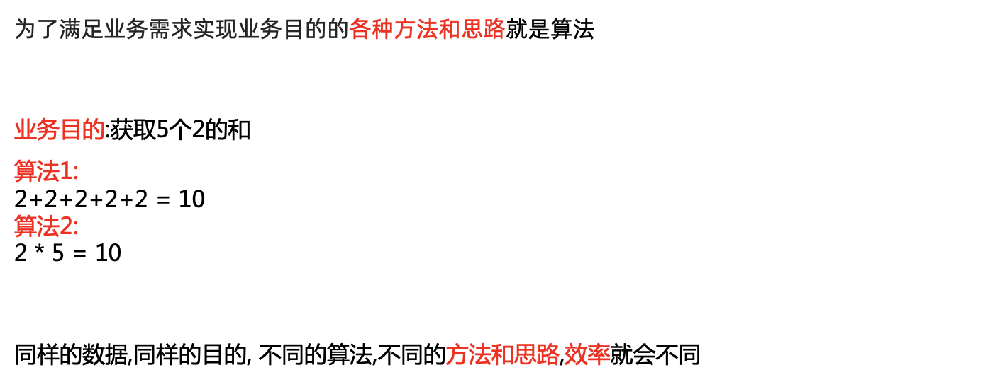

数据结构与算法的作用:

①大大提升程序的性能

②面试高频考点


友情提示:

数据结构与算法虽然是迎娶白富美 , 走上人生巅峰的必备神器。但冰冻三尺非一日之寒 , 数据结构与算法需要我们长时间的积累,本次课程就是为大家开启积累的第一步.


## 算法

### 算法的特性

**学习目标：**

1.知道算法的独立性

2.知道算法的五大特性

#### 独立性

算法是计算机处理信息的本质，因为 **计算机程序本质上是一个算法** 来告诉计算机确切的步骤来执行一个指定的任务。一般地，当算法在处理信息时，会从输入设备或数据的存储地址读取数据，把结果写入输出设备或某个存储地址供以后再调用。

> **算法是独立存在的一种解决问题的方法和思想.**
>
> > 刚才我们提到了 **穷举法**, 穷举法就是一种算法, 一种思想.

  对于算法而言，实现的语言并不重要，重要的是思想。也就是说算法本身是独立于程序和各种编程语言的,而我们的程序只不过是对算法的一种表达和实现.

  算法可以有不同的语言描述实现版本（如C描述、C++描述、Python描述等），我们现在是在用Python语言进行描述实现。

首先我们先来看一道题:

> **如果 a+b+c=1000，且 a^2+b^2=c^2（a,b,c 为自然数），如何求出所有a、b、c可能的组合?**

解题算法一：

  这里我们的思路:把所有的a,b,c的可能性都列举出来,然后一一进行验证最终得出结果.这种方法我们称之为 **穷举法** (这也是我们的一种算法)

```python
import time
# 穷举法
t1 = time.time()
for a in range(0,1001):
    for b in range(0,1001):
        for c in range(0,1001):
            if a+b+c == 1000 and a**2 +b**2 == c**2:
                print(f"输出结果{a},{b},{c}")
t2 = time.time()
print(t2-t1)
```


#### 五大特性

1. **输入**: 算法具有0个或多个输入
2. **输出**: 算法至少有1个或多个输出
3. **有穷性**: 算法在有限的步骤之后会自动结束而不会无限循环，并且每一个步骤可以在可接受的时间内完成
4. **确定性**：算法中的每一步都有确定的含义，不会出现二义性
5. **可行性**：算法的每一步都是可行的，也就是说每一步都能够执行有限的次数完成


### 算法的时间效率衡量

**学习目标：**

1.知道如何衡量算法的优劣

2.知道算法的时间效率衡量

#### 解题算法二

**如果 a+b+c=1000，且 a^2+b^2=c^2（a,b,c 为自然数），如何求出所有a、b、c可能的组合?**

知道a、b、c他们三者是有一个关系的，就可以不用对c进行遍历，直接把c列成一个条件即可。

解题算法二：

```python
import time
t1 = time.time()
for a in range(0,1001):
    for b in range(0,1001):
        c = 1000-a-b
        if a**2 + b**2 == c**2:
            print(f'输出结果{a},{b},{c}')
t2 = time.time()
print(t2-t1)
```

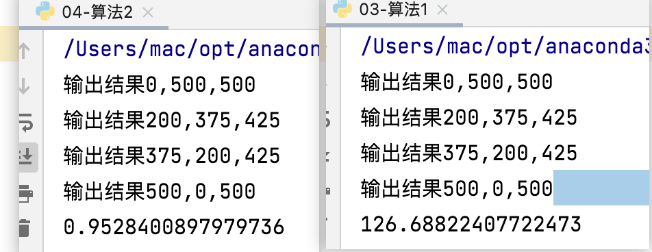

#### 算法对比

对于同一问题，我们给出了两种解决算法，在两种算法的实现中，我们对程序执行的时间进行了测算，发现两段程序执行的时间相差悬殊（214.583347秒相比于0.182897秒），由此我们可以得出结论：**实现算法程序的执行时间可以反应出算法的效率，即算法的优劣。**

> 单靠时间值绝对可信吗？

  假设我们将第二次尝试的算法程序运行在一台配置古老性能低下的计算机中，情况会如何？很可能运行的时间并不会比在我们的电脑中运行算法一的214.583347秒快多少。

> **单纯依靠运行的时间来比较算法的优劣并不一定是客观准确的！**

  程序的运行离不开计算机环境（包括硬件和操作系统），这些客观原因会影响程序运行的速度并反应在程序的执行时间上。那么如何才能客观的评判一个算法的优劣呢？


#### 算法的时间效率衡量

我们假定计算机执行算法每一个基本操作的时间是固定的一个时间单位，那么有多少个基本操作就代表会花费多少时间单位。显然对于不同的机器环境而言，确切的单位时间是不同的，但是对于算法进行多少个基本操作（即花费多少时间单位）在 **规模数量级** 上却是相同的，由此可以忽略机器环境的影响而客观的反应算法的时间效率。


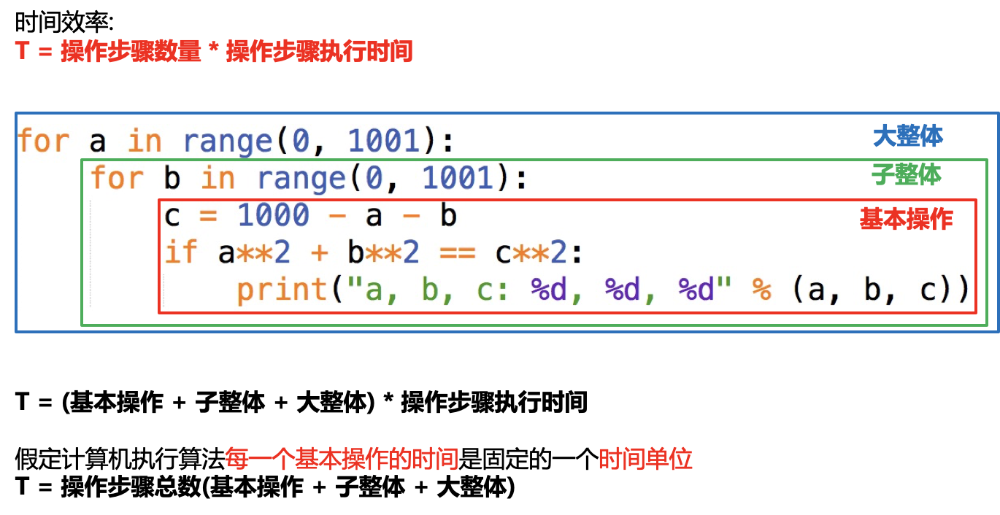


### 时间复杂度

**学习目标：**

1.理解什么是时间复杂度

2.知道时间复杂度的表示形式

3.掌握时间复杂度的计算规则

4.能够计算出算法的时间复杂度

5.知道什么是最坏时间复杂度

6.知道什么是最优时间复杂度

7.知道常见的时间复杂度

8.知道时间复杂度之间的关系


#### 算法一的时间效率

> 为了理解时间复杂度,我们先来算一下我们刚才使用的 **方法一** 总步骤数量.
>
> > 方法一:

```python
for a in range(1001):                                            # 1001次
    for b in range(1001):                                        # 1001次
        for c in range(1001):                                     # 1001次
            if 1000 == a + b + c and a**2 + b**2 == c**2:
                print("a,b,c: %d,%d,%d" % (a,b,c))
```

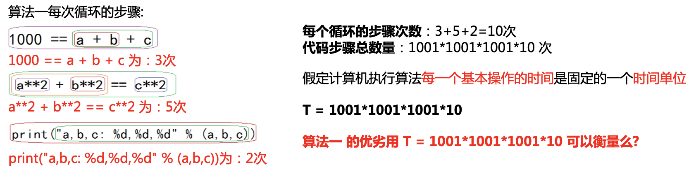

#### 规律总结

> 以方法一为例：通过规模的不同，来计算时间总量T

总量为1000：
`T = 1001*1001*1001*10 次`

总量为2000:
`T = 2001*2001*2001*10 次`

总量为3000：
`T = 3001*3001*3001*10 次`

总量为n：
`T = n*n*n*10 次`

我们就将上面的算数，总结为一个表达式：
`T(n) = n*n*n*10`
我们把这个表达式称为：时间复杂度

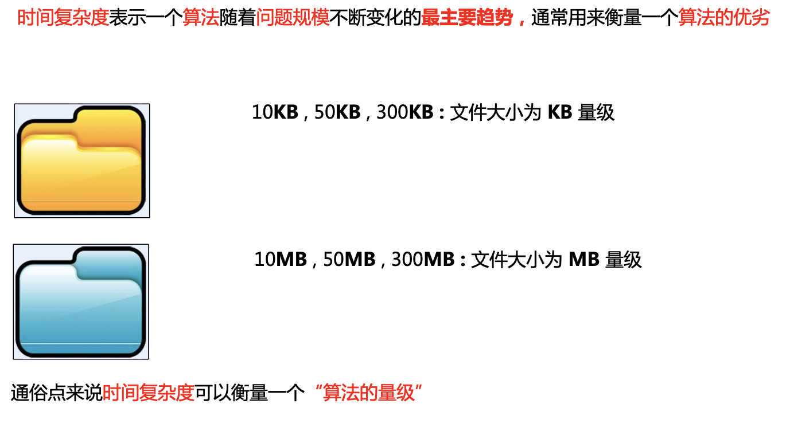


#### 算法二的时间复杂度

```python
for a in range(1001):                                            # 1001次
    for b in range(1001):                                        # 1001次
        c = 1000 - a - b
        if a**2 + b**2 == c**2:
            print("a,b,c: %d,%d,%d" % (a,b,c))
```

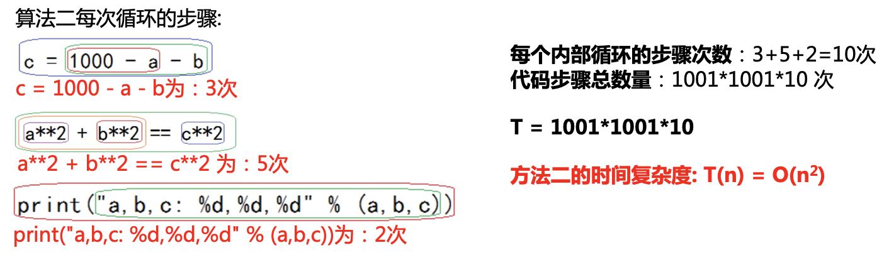


#### 时间复杂度的计算规则

①基本操作

​    时间复杂度为O(1)

②顺序结构

   时间复杂度按**加法**进行计算

③循环结构

   时间复杂度按**乘法**进行计算

④分支结构

   时间复杂度**取最大值**

⑤判断一个算法的效率时，往往只需要关注操作数量的**最高次项**，其它次要项和常数项可以忽略

⑥在没有特殊说明时，我们所分析的算法的时间复杂度都是指**最坏时间复杂度**


#### 最优最坏时间复杂度

分析算法时，存在几种可能的考虑：

- 算法完成工作最少需要多少基本操作，即**最优时间复杂度**
- 算法完成工作最多需要多少基本操作，即**最坏时间复杂度**
- 算法完成工作平均需要多少基本操作，即**平均时间复杂度**

  对于最优时间复杂度，其价值不大，因为它没有提供什么有用信息，其反映的只是最乐观最理想的情况，没有参考价值。
  对于最坏时间复杂度，提供了一种保证，表明算法在此种程度的基本操作中一定能完成工作。
  对于平均时间复杂度，是对算法的一个全面评价，因此它完整全面的反映了这个算法的性质。但另一方面，这种衡量并没有保证，不是每个计算都能在这个基本操作内完成。而且，对于平均情况的计算，也会因为应用算法的实例分布可能并不均匀而难以计算。


> **因此，我们主要关注算法的最坏情况，亦即最坏时间复杂度。**


#### 常见的时间复杂度

| **执行次数函数举例** | **阶**  | **非正式术语** |
| -------------------- | ------- | -------------- |
| 12                   | O(1)    | 常数阶         |
| 2n+3                 | O(n)    | 线性阶         |
| 3n2+2n+1             | O(n2)   | 平方阶         |
| 5log2n+20            | O(logn) | 对数阶         |
| 6n3+2n2+3n+4         | O(n3)   | 立方阶         |


**课堂练习**

下面程序时间复杂度:

```python
i = 8
j = 6
sum = i + j
```

O(1)

**课堂练习**

下面程序时间复杂度:

```python
def func(n):
    i = 1
    while i<=n:
        i = i*2
```

O(logn)

**课堂练习**

下面程序时间复杂度:

```python
def func(n):
    i = 1
    while i<=n:
        i = i*3
```

O(logn)

**课堂练习**

下面程序时间复杂度:

```python
def cal(m, n):
    sum_1 = 0
    for i in range(1, m):
        sum_1 += i

    sum_2 = 0
    for j in range(1, n):
        sum_2 += j
    return sum_1 + sum_2
```

O(m+n)


### 空间复杂度

**学习目标：**

1.了解什么是空间复杂度

2.了解常见的空间复杂度

#### 空间复杂度

空间复杂度是对一个算法在运行过程中临时占用存储空间大小的度量


类似于时间复杂度，一个算法的空间复杂度S(n)定义为该算法所耗费的存储空间，也使用大O记法。


和时间复杂度类似，空间复杂度一般常见的有：


O(1) < O(logn) < O(n) < O(n2) < O(n3)

#### 常数阶O(1)

普通常量、变量、对象、元素数量与输入数据大小 N 无关的集合，皆使用常数大小的空间。


栗子🌰 :

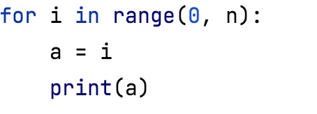

上述代码虽然循环了n次，但是使用的临时空间并没有随n增大而增加，所以空间复杂度是O(1)


#### 线性阶O(n)

元素数量与 N 呈线性关系的任意类型集合（常见于一维数组、链表等），均使用线性大小的空间。


栗子🌰 :

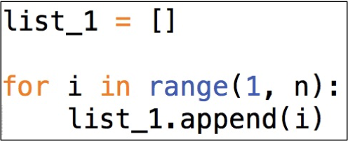


上述代码循环了n次，但是使用的临时空间list_1会随n的变化进行线性增长，所以空间复杂度是O(n)


#### **平方阶**O(n2)

元素数量与 N 呈平方关系的任意类型集合（常见于矩阵），均使用平方大小的空间。


栗子🌰 :

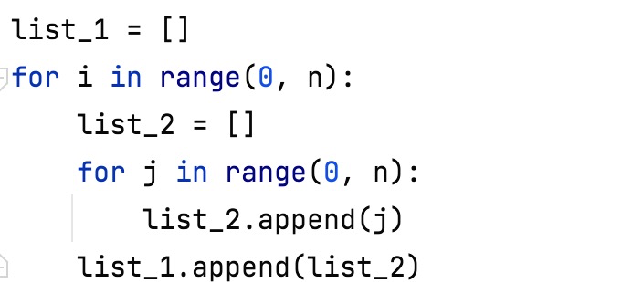

上述代码循环了n次，但是使用的临时空间list_1会随n的变化进行平方增长，所以空间复杂度是O(n2) 


## 数据结构

**学习目标：**

1.理解什么是数据结构

2.知道数据结构和算法的关系

3.知道数据结构的类型

4.知道线性结构和非线性结构的区别


### 数据结构

最常用的数据运算有五种：

- 插入
- 删除
- 修改
- 查找
- 排序


#### 内存的存储结构

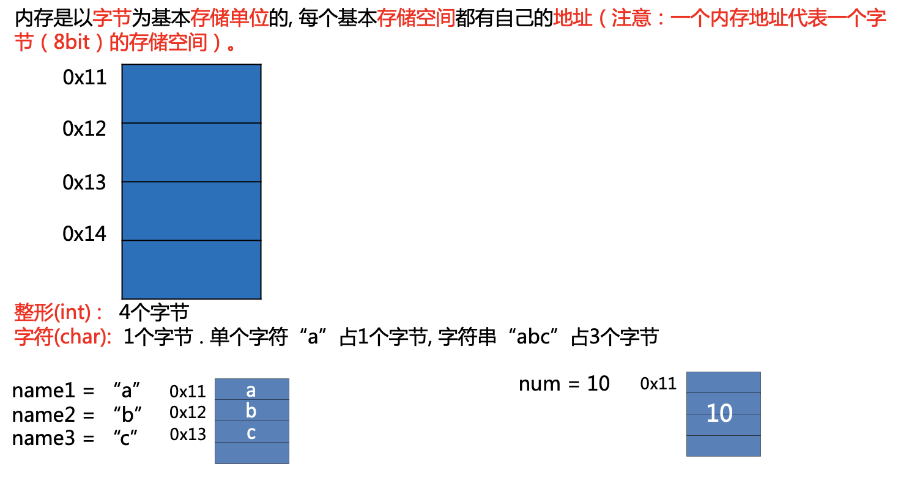


#### 数据结构的分类

根据数据结构中数据之间的关系，将数据结构分类为:

- 线性结构

- 非线性结构

#### 线性结构

线性结构就是数据结构中各个结点具有**线性关系**

线性结构的特点:

①线性结构是非空集

②线性结构所有结点都最多只有一个直接前驱结点和一个直接后继结点

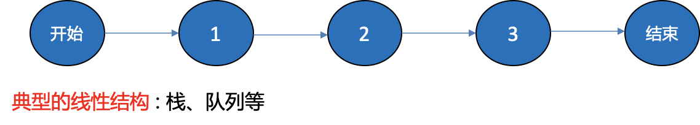

#### 非线性结构

非线性结构就是数据结构中各个结点之间具有**多个对应关系**

非线性结构的特点:

①非线性结构是非空集

②非线性结构的一个结点可能有多个直接前驱结点和多个直接后继结点

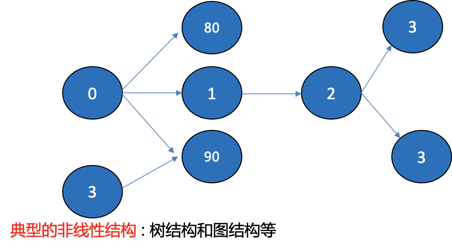


### 顺序表

**学习目标：**

1.知道线性结构的分类

2.知道顺序表存储方式

3.知道顺序表的存储结构

4.知道顺序表扩充的两种策略

#### 线性表存储方式的分类

线性结构的实际存储方式，分为两种：

**①顺序表** **:** 将元素顺序地存放在一块**连续的存储区里**，元素间的顺序关系由它们的存储顺序自然表示

**②链表** **:** 将元素存放在通过链接构造起来的一系列存储块中 , **存储区是非连续的**

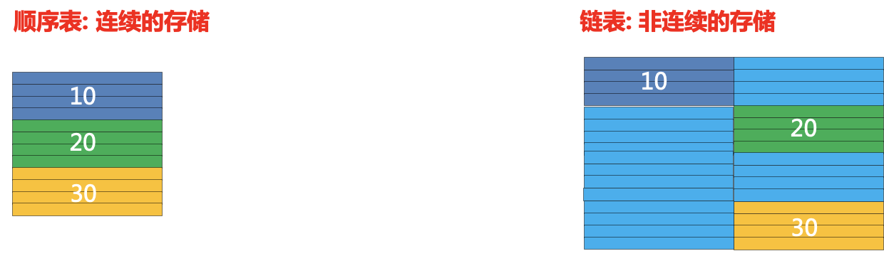

#### 顺序表的存储方式

顺序表元素顺序地存放在一块**连续的存储区里，**具体的存储方式的两种情况:

- 一体式结构

- 分离式结构

##### 一体式存储

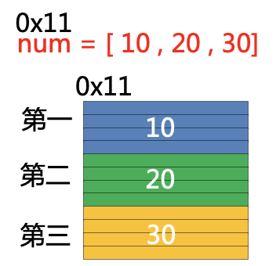

num会记录列表的**首元素**地址0x11

由于列表所有的数据都是整形,大小都为4个字节,偏移量为4

第一个元素10 : 通过0x11偏移4*0个字节可以找到

第二个元素20 : 通过0x11偏移4*1个字节可以找到

第三个元素30 : 通过0x11偏移4*2个字节可以找到

查找数据的公示 : 0x11 偏移 **4** ***** **(n-1)** 个字节

##### 分离式存储

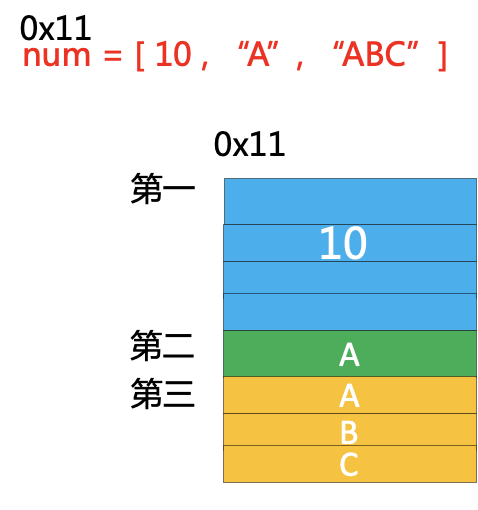

num会记录列表的**首元素**地址0x11

由于列表中数据**大小不固定** , 偏移量也不确定 , 无法通过偏移的方式查找，地址的大小为4字节是固定的 , 我们可以不存储数据 , 而是存储地址

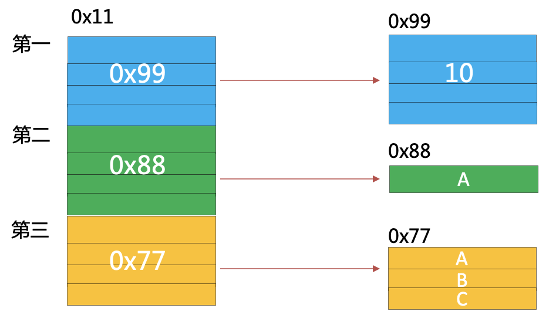

无论一体式结构还是分离式结构，顺序表在获取数据的时候直接通过下标偏移就可以找到数据所在空间的地址 , 而无需遍历后才可以获取地址 . 所以顺序表在获取地址操作时的时间复杂度 : **O(1)**

#### 顺序表的结构与扩充

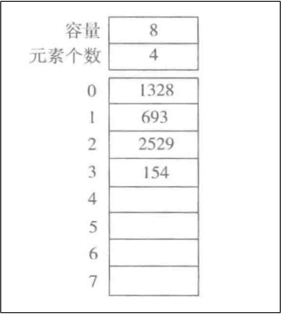

一个顺序表的完整信息包括两部分，一部分是表中的元素集合，另一部分是为实现正确操作而需记录的信息，即有关表的整体情况的信息，这部分信息主要包括元素存储区的**容量**和当前表中已有的**元素个数**两项。

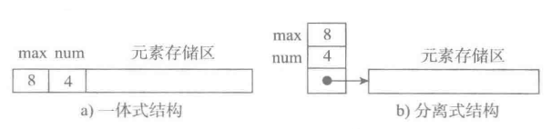

图a为一体式结构，存储表信息的单元与元素存储区以连续的方式安排在一块存储区里，两部分数据的整体形成一个完整的顺序表对象。

一体式结构整体性强，易于管理。但是由于数据元素存储区域是表对象的一部分，顺序表创建后，元素存储区就固定了。

图b为分离式结构，表对象里只保存与整个表有关的信息（即容量和元素个数），实际数据元素存放在另一个独立的元素存储区里，通过链接与基本表对象关联。


**扩充的两种策略**

- 每次扩充增加固定数目的存储位置，如每次扩充增加10个元素位置，这种策略可称为线性增长。

  特点：节省空间，但是扩充操作频繁，操作次数多。

- 每次扩充容量加倍，如每次扩充增加一倍存储空间。

  特点：减少了扩充操作的执行次数，但可能会浪费空间资源。以空间换时间，推荐的方式。

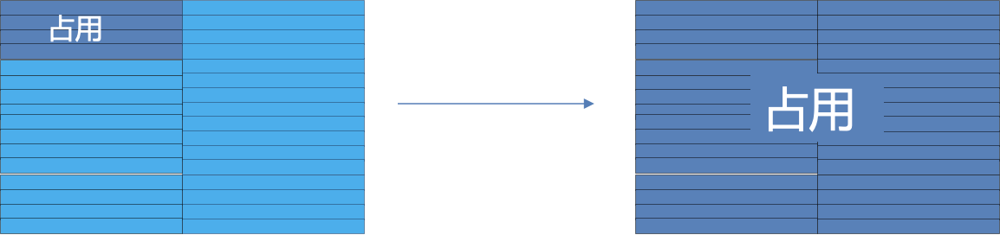

一体式结构由于顺序表信息区与数据区连续存储在一起，所以若想更换数据区，则只能整体搬迁，即整个顺序表对象（指存储顺序表的结构信息的区域）改变了。

分离式结构若想更换数据区，只需将表信息区中的数据区链接地址更新即可，而该顺序表对象不变。

采用分离式结构的顺序表，若将数据区更换为存储空间更大的区域，则可以在不改变表对象的前提下对其数据存储区进行了扩充，所有使用这个表的地方都不必修改。只要程序的运行环境（计算机系统）还有空闲存储，这种表结构就不会因为满了而导致操作无法进行。人们把采用这种技术实现的顺序表称为动态顺序表，因为其容量可以在使用中动态变化。

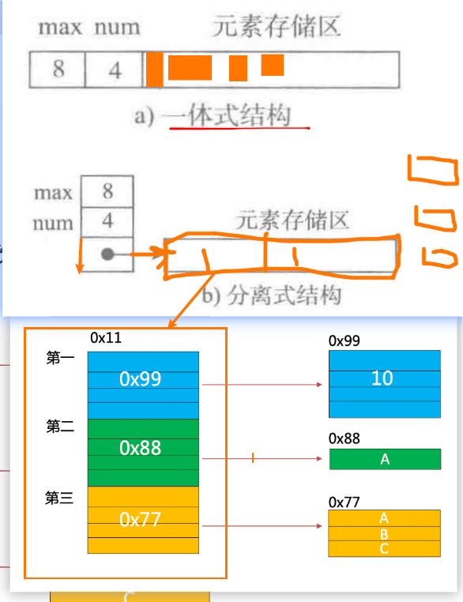

#### 顺序表增加和删除元素

##### 增加元素

如图所示，为顺序表增加新元素111的三种方式

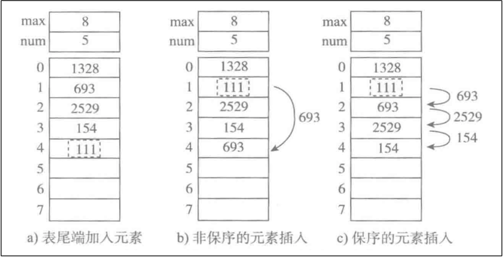a. 尾端加入元素，时间复杂度为O(1)

b. 非保序的加入元素（不常见），时间复杂度为O(1)

c. 保序的元素加入，时间复杂度为O(n)

##### 删除元素

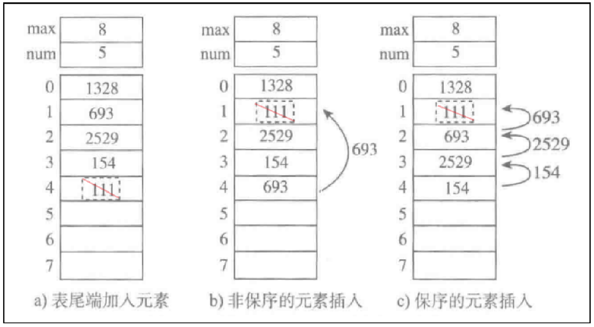

a. 删除表尾元素，时间复杂度为O(1)

b. 非保序的元素删除（不常见），时间复杂度为O(1)

c. 保序的元素删除，时间复杂度为O(n)


### 链表

单向链表也叫单链表，是链表中最简单的一种形式，它的每个节点包含两个域，一个信息域（元素域）和一个链接域。这个链接指向链表中的下一个节点，而最后一个节点的链接域则指向一个空值。

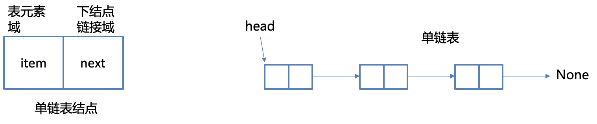

- 表元素域item用来存放具体的数据。
- 链接域next用来存放下一个节点的位置（python中的标识）
- 变量p指向链表的头节点（首节点）的位置，从p出发能找到表中的任意节点。

#### 节点实现

```Python
class SingleNode(object):
    """单链表的结点"""
    def __init__(self,item):
        # item存放数据元素
        self.item = item
        # next是下一个节点的标识
        self.next = None
```

#### 单链表的操作

- is_empty() 链表是否为空
- length() 链表长度
- travel() 遍历整个链表
- add(item) 链表头部添加元素
- append(item) 链表尾部添加元素
- insert(pos, item) 指定位置添加元素
- remove(item) 删除节点
- search(item) 查找节点是否存在

#### 单链表的实现

```Python
class SingleLinkList(object):
    """单链表"""
    def __init__(self):
        self.__head = None

    def is_empty(self):
        """判断链表是否为空"""
        return self.__head == None

    def length(self):
        """链表长度"""
        # cur初始时指向头节点
        cur = self.__head
        count = 0
        # 尾节点指向None，当未到达尾部时
        while cur != None:
            count += 1
            # 将cur后移一个节点
            cur = cur.next
        return count

    def travel(self):
        """遍历链表"""
        cur = self.__head
        while cur != None:
            print cur.item,
            cur = cur.next
        print ""
```

#### **头部添加元素**

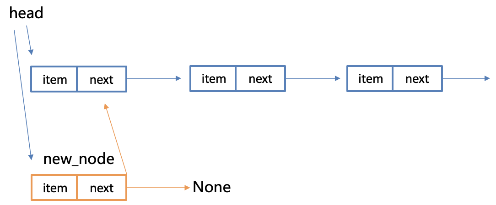

```Python
    def add(self, item):
        """头部添加元素"""
        # 先创建一个保存item值的节点
        node = SingleNode(item)
        # 将新节点的链接域next指向头节点，即_head指向的位置
        node.next = self.__head
        # 将链表的头_head指向新节点
        self.__head = node
```

#### **尾部添加元素**

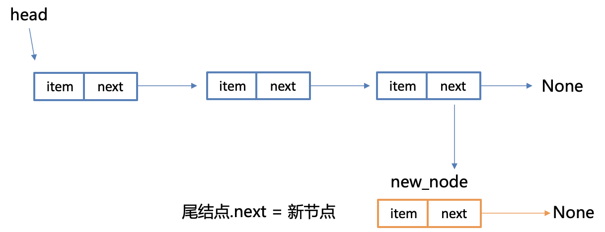

```Python
    def append(self, item):
        """尾部添加元素"""
        node = SingleNode(item)
        # 先判断链表是否为空，若是空链表，则将_head指向新节点
        if self.is_empty():
            self.__head = node
        # 若不为空，则找到尾部，将尾节点的next指向新节点
        else:
            cur = self.__head
            while cur.next != None:
                cur = cur.next
            cur.next = node
```

#### **指定位置添加元素**

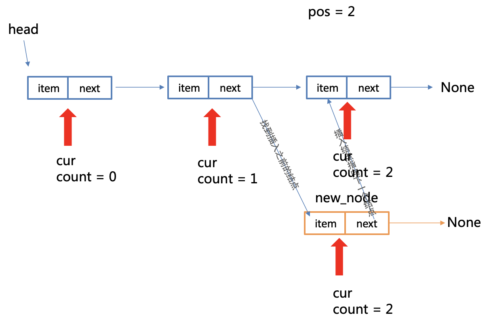

```Python
    def insert(self, pos, item):
        """指定位置添加元素"""
        # 若指定位置pos为第一个元素之前，则执行头部插入
        if pos <= 0:
            self.add(item)
        # 若指定位置超过链表尾部，则执行尾部插入
        elif pos > (self.length()-1):
            self.append(item)
        # 找到指定位置
        else:
            node = SingleNode(item)
            count = 0
            # pre用来指向指定位置pos的前一个位置pos-1，初始从头节点开始移动到指定位置
            pre = self.__head
            while count < (pos-1):
                count += 1
                pre = pre.next
            # 先将新节点node的next指向插入位置的节点
            node.next = pre.next
            # 将插入位置的前一个节点的next指向新节点
            pre.next = node
```

#### **删除节点**

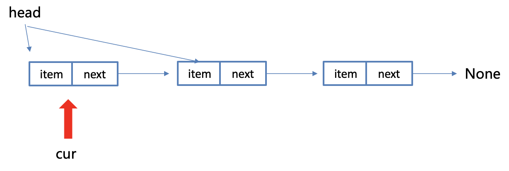

```python
    def remove(self,item):
        """删除节点"""
        cur = self.__head
        pre = None
        while cur != None:
            # 找到了指定元素
            if cur.item == item:
                # 如果第一个就是删除的节点
                if not pre:
                    # 将头指针指向头节点的后一个节点
                    self.__head = cur.next
                else:
                    # 将删除位置前一个节点的next指向删除位置的后一个节点
                    pre.next = cur.next
                break
            else:
                # 继续按链表后移节点
                pre = cur
                cur = cur.next
```

#### **查找节点是否存在**

```python
    def search(self,item):
        """链表查找节点是否存在，并返回True或者False"""
        cur = self.__head
        while cur != None:
            if cur.item == item:
                return True
            cur = cur.next
        return False
```


#### 链表与顺序表的对比

链表失去了顺序表随机读取的优点，同时链表由于增加了结点的指针域，空间开销比较大，但对存储空间的使用要相对灵活。

链表与顺序表的各种操作复杂度如下所示：

| 操作            | 链表 | 顺序表 |
| --------------- | :--: | ------ |
| 访问元素        | O(n) | O(1)   |
| 在头部插入/删除 | O(1) | O(n)   |
| 在尾部插入/删除 | O(n) | O(1)   |
| 在中间插入/删除 | O(n) | O(n)   |

注意虽然表面看起来复杂度都是 O(n)，但是链表和顺序表在插入和删除时进行的是完全不同的操作。链表的主要耗时操作是遍历查找，删除和插入操作本身的复杂度是O(1)。顺序表查找很快，主要耗时的操作是拷贝覆盖。因为除了目标元素在尾部的特殊情况，顺序表进行插入和删除时需要对操作点之后的所有元素进行前后移位操作，只能通过拷贝和覆盖的方法进行。


