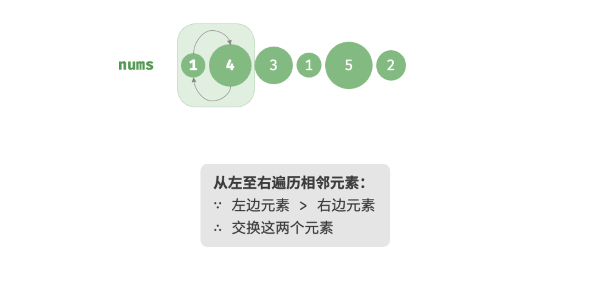

# 排序算法和树


## 排序算法

### 算法稳定性

所谓排序，使一串记录，按照其中的某个或某些关键字的大小，递增或递减的排列起来的操作

排序算法，就是如何使得记录按照要求排列的方法

排序算法在很多领域是非常重要

​    在大量数据的处理方面：一个优秀的算法可以节省大量的资源。

​    在各个领域中考虑到数据的各种限制和规范，要得到一个符合实际的优秀算法，得经过大量的推理和分析


举个例子：


把以上数据进行升序排列：


☆ 假定在待排序的记录序列中，存在多个具有相同的关键字的记录

☆ 若经过排序，这些记录的相对次序保持不变,则称这种排序算法是稳定的, 否则称为不稳定的

> 记忆：具有相同关键字的纪录经过排序后，相对位置保持不变，这样的算法是稳定性算法


再来看一个例子：


升序排序后的结果


> 无序数据具有2个关键字，
>
> 先按照关键字1排序，
>
> 若关键字1值相同，再按照关键字2排序。
>
> 稳定性算法具有良好的作用。

### 排序算法

排序犹如一把将混乱变为秩序的魔法钥匙，使我们能以更高效的方式理解与处理数据。

无论是简单的升序，还是复杂的分类排列，排序都向我们展示了数据的和谐美感。


#### ☆ 冒泡排序

##### 冒泡思路

冒泡排序（bubble sort）通过连续地比较与交换相邻元素实现排序。这个过程就像气泡从底部升到顶部一样，因此得名冒泡排序。

> 冒泡过程可以利用元素交换操作来模拟：从数组最左端开始向右遍历，依次比较相邻元素大小，如果“左元素 > 右元素”就交换二者。遍历完成后，最大的元素会被移动到数组的最右端。


第一轮第一步排序：



第一轮第二步排序：


第一轮第三步排序：


第一轮第四步排序：


第一轮第五步排序：


第一轮最终排序结果：


重复以上步骤，直至完成最终排序。

##### 冒泡步骤

设列表的长度为 n ，冒泡排序的步骤如上图所示。

1. 首先，对 n 个元素执行“冒泡”，**将列表的最大元素交换至正确位置**。
2. 接下来，对剩余 n−1 个元素执行“冒泡”，**将第二大元素交换至正确位置**。
3. 以此类推，经过 n−1 轮“冒泡”后，**前 n−1 大的元素都被交换至正确位置**。
4. 仅剩的一个元素必定是最小元素，无须排序，因此列表排序完成。


##### 代码实现

```python
def bubble_sort(nums: list[int]):
    """冒泡排序"""
    n = len(nums)
    # 外循环：未排序区间为 [0, i]
    for i in range(n - 1, 0, -1):
        # 内循环：将未排序区间 [0, i] 中的最大元素交换至该区间的最右端
        for j in range(i):
            if nums[j] > nums[j + 1]:
                # 交换 nums[j] 与 nums[j + 1]
                nums[j], nums[j + 1] = nums[j + 1], nums[j]
```

##### 效率优化

我们发现，如果某轮“冒泡”中没有执行任何交换操作，说明数组已经完成排序，可直接返回结果。因此，可以增加一个标志位 `flag` 来监测这种情况，一旦出现就立即返回。

经过优化，冒泡排序的最差时间复杂度和平均时间复杂度仍为 O(n2) ；但当输入数组完全有序时，可达到最佳时间复杂度 O(n) 

```python
def bubble_sort_with_flag(nums: list[int]):
    """冒泡排序（标志优化）"""
    n = len(nums)
    # 外循环：未排序区间为 [0, i]
    for i in range(n - 1, 0, -1):
        flag = False  # 初始化标志位
        # 内循环：将未排序区间 [0, i] 中的最大元素交换至该区间的最右端
        for j in range(i):
            if nums[j] > nums[j + 1]:
                # 交换 nums[j] 与 nums[j + 1]
                nums[j], nums[j + 1] = nums[j + 1], nums[j]
                flag = True  # 记录交换元素
        if not flag:
            break  # 此轮“冒泡”未交换任何元素，直接跳出
```


#### ☆ 选择排序

选择排序（selection sort）的工作原理非常简单：开启一个循环，每轮从未排序区间选择最小的元素，将其放到已排序区间的末尾。

##### 排序思路

设列表的长度为 n ，选择排序的算法流程如下图所示：

第一轮：


第一轮：


第二轮：


第二轮：


第三轮：


第三轮：


第四轮：


第四轮：


第五轮：


第五轮：


完成排序，最终结果：


##### 排序步骤

> 1. 初始状态下，所有元素未排序，即未排序（索引）区间为 [0,n−1] 。
> 2. 选取区间 [0,n−1] 中的最小元素，将其与索引 0 处的元素交换。完成后，数组前 1 个元素已排序。
> 3. 选取区间 [1,n−1] 中的最小元素，将其与索引 1 处的元素交换。完成后，数组前 2 个元素已排序。
> 4. 以此类推。经过 n−1 轮选择与交换后，数组前 n−1 个元素已排序。
> 5. 仅剩的一个元素必定是最大元素，无须排序，因此数组排序完成。

##### 代码实现

```python
def selection_sort(nums: list[int]):
    """选择排序"""
    n = len(nums)
    for i in range(n - 1):
        # 内循环：找到未排序区间内的最小元素
        k = i
        for j in range(i + 1, n):
            if nums[j] < nums[k]:
                k = j  # 记录最小元素的索引
        # 仅当最小元素不在未排序区间的首个位置时，才进行交换
        if k != i:
            nums[i], nums[k] = nums[k], nums[i]
```

#### ...

## 树

###  01-树的基本概念


树是一种一对多关系的数据结构，主要分为：

1. 多叉树
   1. 每个结点有0、或者多个子节点
   2. 没有父节点的结点成为根节点
   3. 每一个非根节点有且只有一个父节点
   4. 除了根节点外，每个子节点可以分为多个互不相交的子树
2. 二叉树
   1. 每个结点有0、1、2 个子节点
   2. 没有父节点的结点成为根节点
   3. 每一个非根节点有且只有一个父节点
   4. 除了根节点外，每个子节点可以分为多个互不相交的子树


### 02-树的相关术语


### 03-二叉树的种类


### 04-二叉树的存储


顺序存储、链式存储。树在存储的时候，要存储什么？

1. 值
2. 结点关系


如果树是完全二叉树、满二叉树，可以使用顺序存储。大多数构建出的树都不是完全、满二叉树，所以使用链式存储比较多。

```python
class TreeNode:
  
  def __init__(self):
    self.item = value
    self.parent = 父亲
    self.lchild = 左边树
    self.rchild = 右边树
```


对于树而言，只要拿到根节点，就相当于拿到整棵树。


.

完全二叉树适合顺序结构存储，但其插入删除元素效率较差。


大多数的二叉树都是使用链式结构存储。


### 05-树的应用场景_数据库索引


### 06-二叉树的概念和性质


### 07-广度优先遍历


```python
class Node(object):
    """节点类"""
    def __init__(self, item):
        self.item = item
        self.lchild = None
        self.rchild = None


class BinaryTree(object):
    """二叉树"""
    def __init__(self, node=None):
        self.root = node

    def add(self, item):
        """添加节点"""
        pass

    def bradh_travel(self):
        """广度优先遍历"""
        pass
```


1. 深度优先遍历：沿着某一个路径遍历到叶子结点，再从另外一个路径遍历，直到遍历完所有的结点
2. 广度优先遍历：按照层次进行遍历


### 08-添加节点思路分析


1. 初始操作：初始化队列、将根节点入队、创建新结点
2. 重复执行：
   1. 获得并弹出队头元素
      1. 如果当前结点的左右子结点不为空，则将其左右子节点入队
      2. 如果当前结点的左右子节点为空，则将新结点挂到为空的左子结点、或者右子节点


### 09.遍历方法的实现


```python
class Node(object):
    """节点类"""
    def  __init__(self, item):
        self.item = item
        self.lchild = None
        self.rchild = None


class BinaryTree(object):
    """完全二叉树"""
    def __init__(self, node=None):
        self.root = node

    def add(self, item):
        """添加节点"""
	
  			# 初始操作：初始化队列
        if self.root == None:
            self.root = Node(item)
            return

        # 队列
        queue = []
        # 根节点入队
        queue.append(self.root)
				
        while True:
            # 从头部取出数据
            node = queue.pop(0)
            # 判断左节点是否为空
            if node.lchild == None:
                node.lchild = Node(item)
                return
            else:
                queue.append(node.lchild)

            if node.rchild == None:
                node.rchild = Node(item)
                return
            else:
                queue.append(node.rchild)


if __name__ == '__main__':
    tree = BinaryTree()
    tree.add("A")
    tree.add("B")
    tree.add("C")
    tree.add("D")
    tree.add("E")
    tree.add("F")
    tree.add("G")
    tree.add("H")
    tree.add("I")
    tree.breadh_travel()
```


### 10-二叉树的三种深度优先遍历

先序遍历：先访问根节点、再访问左子树、最后访问右子树

中序遍历：先访问左子树、再访问根节点、最后访问右子树

后序遍历：先访问左子树、再访问右子树、最后访问根节点


1. 无论那种遍历方式，都是先访问左子树、再访问右子树
2. 碰到根节点就输出、碰到左子树、右子树就递归     注意：左子树右子树是一棵树所以递归；根节点是一个节点所以打印输出


### 11-二叉树的三种深度优先遍历代码实现


```python
class Node(object):
    """节点类"""
    def  __init__(self, item):
        self.item = item
        self.lchild = None
        self.rchild = None


class BinaryTree(object):
    """完全二叉树"""
    def __init__(self, node=None):
        self.root = node

    def add(self, item):
        """添加节点"""

        if self.root == None:
            self.root = Node(item)
            return

        # 队列
        queue = []
        # 从尾部添加数据
        queue.append(self.root)

        while True:
            # 从头部取出数据
            node = queue.pop(0)
            # 判断左节点是否为空
            if node.lchild == None:
                node.lchild = Node(item)
                return
            else:
                queue.append(node.lchild)

            if node.rchild == None:
                node.rchild = Node(item)
                return
            else:
                queue.append(node.rchild)

    def breadh_travel(self):
        """广度优先遍历"""

        if self.root == None:
            return

        # 队列
        queue = []
        # 添加数据
        queue.append(self.root)

        while len(queue)>0:
            # 取出数据
            node = queue.pop(0)
            print(node.item, end="")

            # 判断左右子节点是否为空
            if node.lchild is not None:
                queue.append(node.lchild)
            if node.rchild is not None:
                queue.append(node.rchild)

    def preorder_travel(self, root):
        """先序遍历 根 左 右"""
        if root is not None:
            # 先访问根节点
            print(root.item, end="")
            # 递归再访问左子树
            self.preorder_travel(root.lchild)
            # 递归访问右子树
            self.preorder_travel(root.rchild)

    def inorder_travel(self, root):
        """中序遍历 左 根 右"""
        if root is not None:
            self.inorder_travel(root.lchild)
            print(root.item, end="")
            self.inorder_travel(root.rchild)

    def postorder_travel(self, root):
        """后序遍历 根 左 右"""
        if root is not None:
            self.postorder_travel(root.lchild)
            self.postorder_travel(root.rchild)
            print(root.item, end="")


if __name__ == '__main__':
    tree = BinaryTree()
    tree.add("0")
    tree.add("1")
    tree.add("2")
    tree.add("3")
    tree.add("4")
    tree.add("5")
    tree.add("6")
    tree.add("7")
    tree.add("8")
    tree.add("9")
    tree.preorder_travel(tree.root)
    print()
    tree.inorder_travel(tree.root)
    print()
    tree.postorder_travel(tree.root)
```


### 12-二叉树由遍历结果反推二叉树的结构


我们需要知道先序遍历结果和中序遍历结果、或者后序遍历结果和中序遍历结果才能够确定唯一一棵树。

只知道先序遍历、后序遍历结果，不能保证确定唯一一棵树。


通过先序遍历可以确定哪个元素是根节点，通过中序遍历可以知道左子树都有那些结点、右子树都有那些结点。


