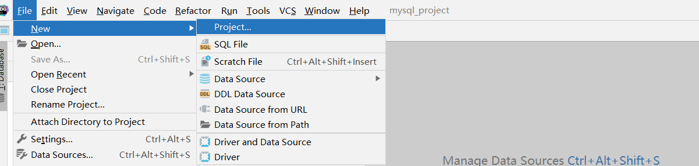
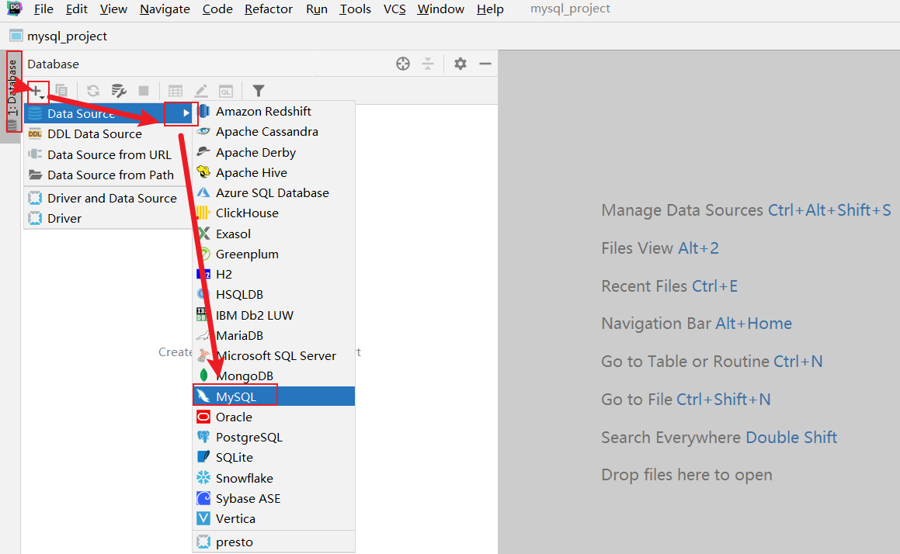
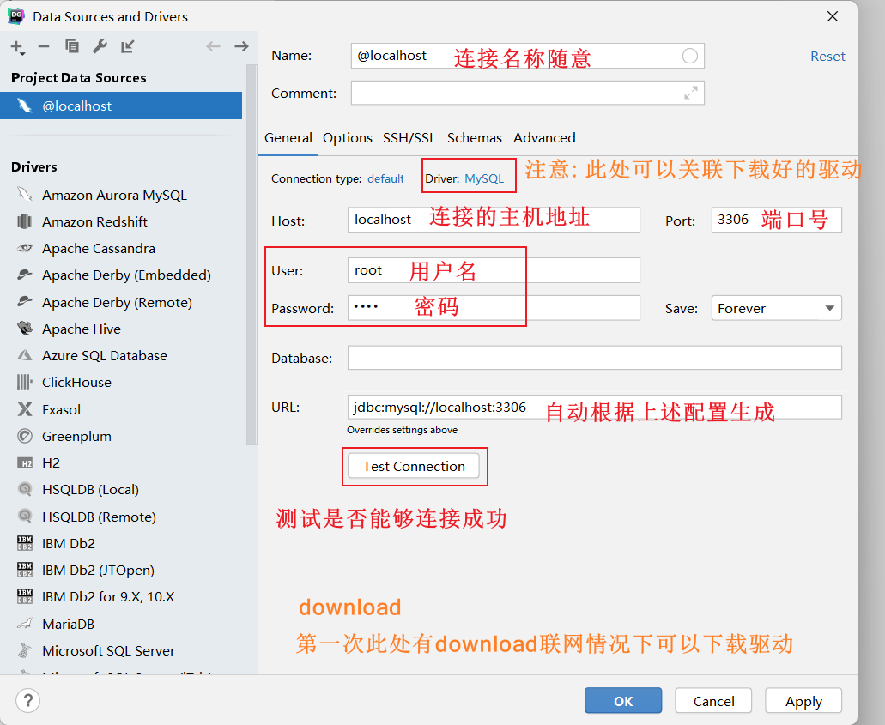
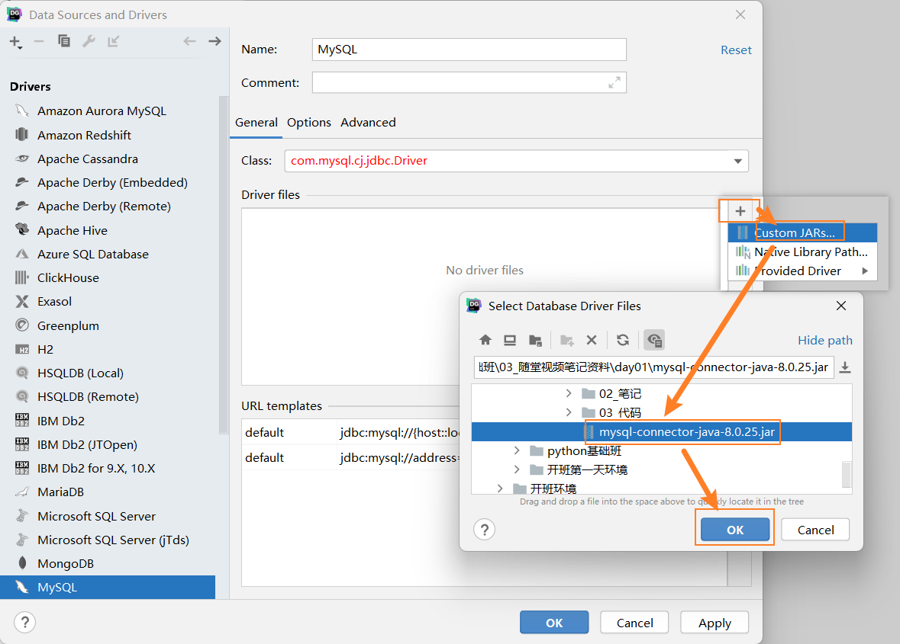
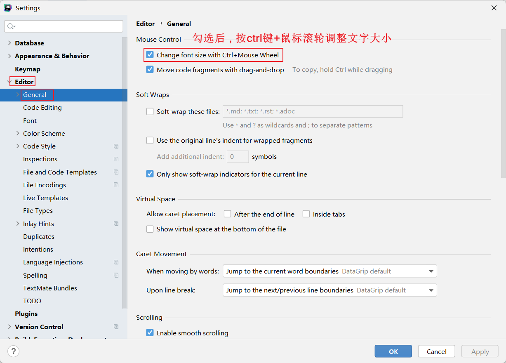
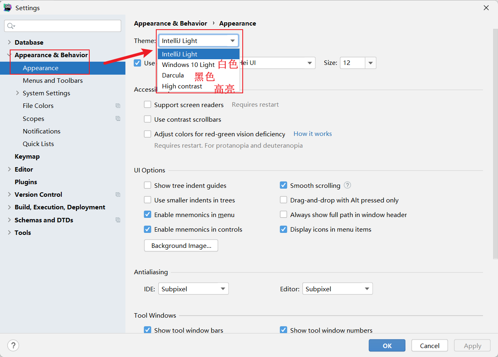
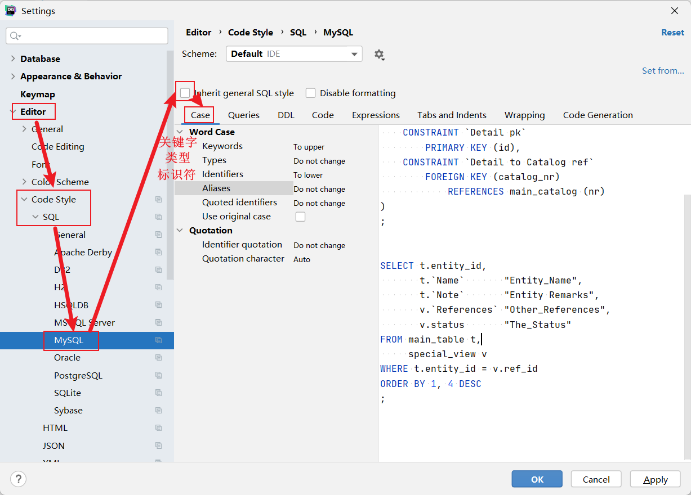
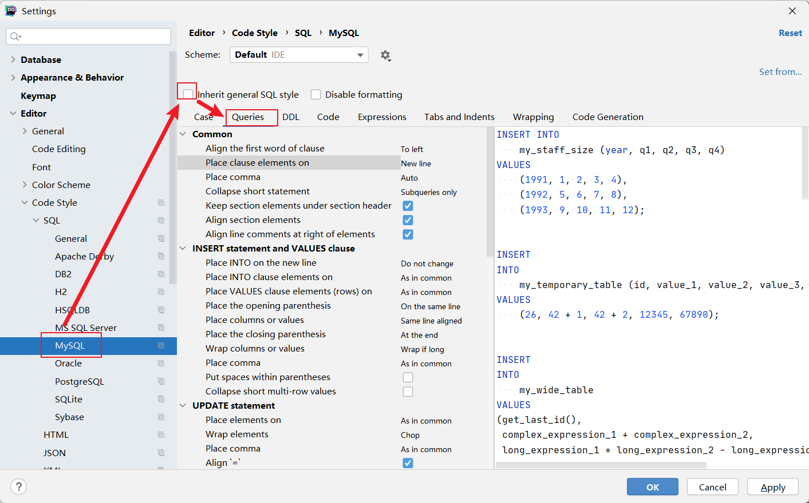
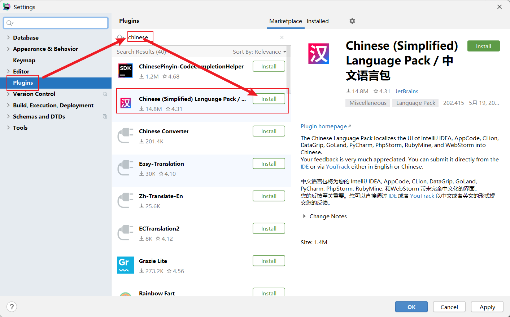
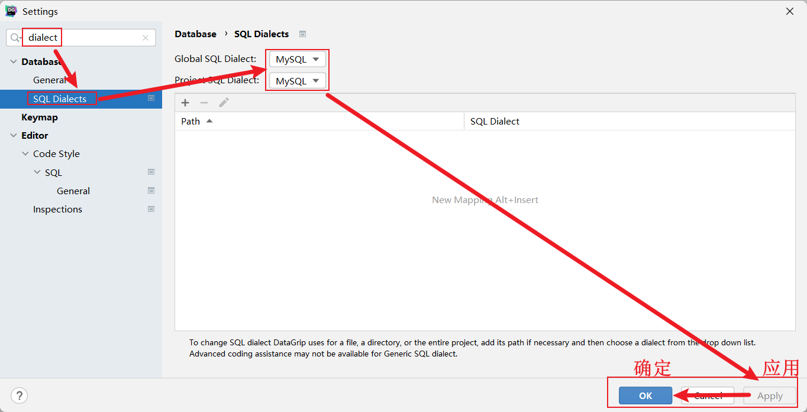

# mysql入门

## 数据库概述

```properties
数据库概念: 存储数据的仓库,本质是一个文件系统

数据库分类: 关系型数据和非关系型数据库

关系型数据库: 必须遵循SQL规范,强调以二维表格的形式存储数据
		举例: MySQL  ORACLE  DB2  SqlServer SQLite

非关系型数据: NoSQL不仅仅是SQL,强调以key-value形式存储数据
		举例: HBase Redis  MongoDB
```

## MySQL数据库连接

>MySQL是最好的 RDMS (Relational Database Management System，关系数据库管理系统) 应用软件，目前属于 Oracle 旗下产品，MySQL 是最流行的关系型数据库管理系统中的一个
>
>本次课程使用MySQL8.0版本， MySQL Community Server进行学习

### 命令连接

```properties
登录:
	方式1: mysql -u用户名 -p密码
	方式2: mysql -u用户名 -p 回车后再输入密码
	方式3: mysql -h主机地址 -p 回车后再输入密码
	注意: localhost默认代表本地主机,或者127.0.0.1也代表本机
	
登出: 
	方式1: exit
	方式2: quit
	方式3: \q
	注意: 在mac/linux中使用ctrl+d/ctrl+c也能退出
	
查看ip地址
	window: ipconfig
	mac/linux: ifconfig
```

### 工具连接

#### 创建项目



#### 连接mysql服务





#### 关联驱动




### 工具设置

#### 字体



#### 主题



#### mysql相关





#### 插件



#### 方言




## SQL规范

### SQL简介

```properties
SQL: 结构化查询语言, 是所有关系型数据库都要遵循的规范

大白话解释: 可以理解成sql是普通话,mysql,oracle等是方言
```

### SQL分类

```properties
DDL: 数据定义语言:简称DDL(Data Definition Language)
		作用: 用来定义数据库对象：数据库，表，列/字段等。
		关键字: create，drop，alter等
		
DML: 数据操作语言:简称DML(Data Manipulation Language)
		作用:用来对数据库中表的记录进行更新。
		关键字: insert，delete，update等
		
DQL: 数据查询语言:简称DQL(Data Query Language)
		作用:用来查询数据库中表的记录。
		关键字: select，from，where等
		
DCL: 数据控制语言：简称DCL(Data Control Language)
		用来定义数据库的访问权限和安全级别，及创建用户。

```

## SQL通用语法

```properties
1、SQL语句可以单行或多行书写，以分号结尾。  
		举例: select *  from 表名 where 条件;
2、可使用空格和缩进来增强语句的可读性
        select *  
        from 表名 
        where 条件;
3、MySQL数据库的SQL语句不区分大小写，关键字建议使用大写
 		例如:select *  from 表名 where 条件; SELECT * FROM 表名 WHERE 条件;
 		大小写切换快捷键: ctrl+shift+u
4、可以使用 /**/，--，# 的方式完成注释
		/**/：多行注释，在注释区域内可以随意换行
		-- 和# ：单行注释，写在语句开头，换行后注释截止。注意: -- 后面必须有一个空格
		单行注释快捷键: ctrl+/         
		多行注释快捷键: ctrl+shift+/
```

## 数据库增删改查操作

>==数据库英文单词: database==

### 知识点:

```properties
创建数据库: create database [if not exists] 数据库名;  注意: 默认字符集就是utf8

删除数据库: drop database [if exists] 数据库名;

使用/切换数据库: use 数据库名;

查看所有的数据库名: show databases;
查看当前使用的数据库: select database();
查看指定库的建库语句: show create database 数据库名;
```

### 示例:

```mysql
# 一.数据库的增删改查
# 1.创建数据库:
create database test;
create database test; # 报错,因为test已经存在
# if not exists: 如果库不存在就创建,存在就忽略
create database test1;
create database IF NOT EXISTS test1; # 存在忽略
create database IF NOT EXISTS test2; # 不存在就创建
# character set utf8: 设置编码为utf8,注意: mysql大多数版本已经都默认utf8
create database test3 CHARACTER SET utf8;
create database test4 CHARSET utf8;


# 2.删除数据库:
drop database test4;
# if exists: 如果库存在就删除,不存在就忽略
drop database IF EXISTS test4;

# 3.切换数据库:
use test;
use test1;

# 4.1查看所有库:
show databases;
# 4.1查看当前库:
select database();
# 4.3查看建库语句:
show create database test;
```

## 数据类型

```properties
字符串类型: varchar(字符长度)

整数类型: int    注意: 默认长度是11,如果int不够用就用bigint

浮点类型: float(python默认) 或者 double(java默认)   decimal(默认是有效位数是10,小数后位数是0)

日期时间: date  datetime  year
```

## 库中表增删改查操作

>==表的英文单词: table==

### 知识点:

```properties
创建表: create table [if not exists] 表名(字段1名 字段1类型 [字段1约束] , 字段2名 字段2类型 [字段2约束] ...);

删除表: drop table [if exists] 表名;

修改表名: rename table 旧表名 to 新表名;  
	注意: 修改表中字段本质都是修改表,咱们后面演示此处略

查看所有表: show tables;
查看指定表的建表语句: show create table 表名;
```

### 示例:

```mysql
# 创建day01_db数据库
create database day01_db;
# 使用day01_db库
use day01_db;
# 操作表的前提: 先创建库,并使用它
# 需求:创建学生表,用于存储学生的姓名,年龄,身高,生日信息
create table student(
    id int,
    name VARCHAR(100),
    age int,
    height float,
    birthday date
);
create table test1(
    id int
);
create table IF NOT EXISTS test1(
    id int
);
# 删除表
drop table test1;
drop table IF EXISTS  test1;
# 修改表名
rename TABLE student to stu;
# 查看所有表
show tables;
# 查看建表语句
/*
1.表名字段名都自动加了反引号``,注意: 关键字的会忽略
2.int加了默认长度11
3.所有字段值设置了默认值null
4.如果是字符串类型还设置了默认编码
5.默认选择了存储引擎,有的版本默认myisam,有的版本默认innodb
6.整个表也都设置了默认编码
*/
show create table stu;

```

## 修改表中字段(增删改)

>==列/纵队的英文单词:column==

### 知识点:

```properties
注意: 操作字段本质就是在修改表

添加字段:  alter table 表名 add [column] 字段名 字段类型 [字段约束];

删除字段:  alter table 表名 drop [column] 字段名;

修改字段名和字段类型:  alter table 表名 change [column] 旧字段名 新字段名 字段类型 [字段约束];
modify只修改字段类型: alter table 表名 modify [column]  字段名 字段类型 [字段约束];

查看字段信息: desc 表名;
```

### 示例:

```mysql
# 三.表中字段的增删改查
# 注意: 修改表中字段本质都是在修改表!!!
# 添加字段
alter table stu add weight double ;
# 注意: 如果字段名是关键字,需要用反引号引起来!!!
alter table stu add `desc` VARCHAR(100) ;

# 删除字段
alter table stu drop weight;
alter table stu drop `desc`;

# 修改字段
alter table stu change birthday bir DATETIME;
alter table stu change bir birthday DATETIME;
alter table stu change birthday birthday date;
# 注意: 了解modify,因为只能改类型,所以大家以后直接记change即可
alter table stu MODIFY height DOUBLE;

# 查看字段信息
desc stu;
```

## 表中记录操作

### 知识点:

```properties
插入数据记录: insert into 表名 (字段名...) values (具体值...) , (具体值...);   
			注意1: 具体值要和前面的字段名以及顺序一一对应上
			注意2: 如果要插入的是所有字段,那么字段名可以省略(默认代表所有列都要插入数据)
			注意3: 如果要插入多条记录,values后多条数据使用 逗号 分隔
			
修改数据记录: update 表名 set 字段名=值 [where 条件];
			注意: 如果没有加条件就是修改对应字段的所有数据

删除数据记录: delete from 表名 [where 条件];
			注意: 如果没有加条件就是删除所有数据
			
清空所有数据:
    方式1: delete from 表名;   注意:此方式有警告
    方式2: truncate [table] 表名;  注意: 此方式没有警告 
```

### 示例:

```mysql
/*
操作库的前提: 先启动mysql服务,并连接它
操作表的前提: 先有库,并使用它
操作数据的前提: 先有表,并有对应字段
*/
# 创建库
create database day02_db;
# 使用库
use day02_db;
# 创建表
create table student(
    id int,
    name VARCHAR(100),
    age int
);
# 插入数据
# 指定字段插入一条数据
insert into student(name) values ('张三');
# 指定字段插入多条数据
insert into student(name) values ('李四'),('王五'),('赵六');
# 注意: 不指定字段本质代表指定所有字段
# 不指定字段插入一条数据
insert into student values (1,'张三',18);
# 不指定字段插入多条数据
insert into student values (1,'张三',18),(2,'李四',18),(3,'王五',18);


# 修改数据
# 修改李四的年龄为28
update student set age = 28 where name = '李四';
# 修改王五和赵六的年龄为39
update student set age = 39 where name = '王五' or name = '赵六';
# 修改赵六的id为4,年龄为40
update student set id = 4,age = 40 where name = '赵六';
# 注意: 如果没有加条件,修改的是所有数据(慎用!!!)
update student set age = 12; # 报黄警告!然后弹窗警告,如果非要执行,选择execute


# 删除数据
# 删除id为1的记录
delete from student where id = 1;
# 删除id为1,以及id为3的记录
delete from student where id = 2 or id = 3;
# 注意: 如果不加条件删除的是所有数据(慎用!!!)
delete from student; # 报黄警告!然后弹窗警告,如果非要执行,选择execute

# 为了演示truncate删除数据,重新插入多条
insert into student values (1,'张三',18),(2,'李四',18),(3,'王五',18);
# truncate也能删除所有数据
truncate table student; # 不会警告,官方推荐使用truncate清空数据,为什么? 后面讲解
```


## 表中约束

>==约束作用: 限制数据的插入和删除==

### 主键约束

#### 知识点:

```properties
主键约束关键字: primary key

主键约束特点: 限制主键插入的数据不能为空,不能重复

建表的时候添加主键约束:  create table 表名(主键名 主键类型 primary key , 其他字段...);

注意: 一个表中只能有一个主键
```

### 主键自增

#### 知识点:

```properties
自增关键字: auto_increment

自增特点: 默认从1开始,每次自动加1  
注意: 如果插入数据的时候指定了id字段,可以使用null或者0占位表示自动使用自增

建表的时候添加主键自增约束:  create table 表名(主键名 主键类型 primary key auto_increment , 其他字段...);
```


### delete和truncate区别

#### 知识点:

```properties
delete和truncate的区别?
    共同点: 都能删除表中所有数据
    不同点:
        delete删除所有数据: 自增顺序保留,下次再插入的时候继续自增
        truncate删除所有数据: 自增顺序重置,下次再插入数据的时候从1重新开始自增
```

#### 示例:

```mysql
# delete删除所有数据: 自增顺序保留,下次再插入的时候继续自增
delete from stu3; -- 警告2次(慎用)
# 如果再次插入数据,自增顺序按照删除前最后值继续
insert into stu3(name, age) VALUES ('王五',38);
insert into stu3(name, age) VALUES ('王五',38);
insert into stu3(name, age) VALUES ('王五',38);

# truncate删除所有数据: 自增顺序重置,下次再插入数据的时候从1重新开始自增
truncate stu3; -- 没有警告(慎用)如果真要清空所有数据建议用truncate
# 如果再次插入数据,自增重新从1开始自增
insert into stu3(name, age) VALUES ('王五',38);
insert into stu3(name, age) VALUES ('王五',38);
insert into stu3(name, age) VALUES ('王五',38);
```

### 非空约束

#### 知识点:

```properties
非空约束关键字: not null

非空约束特点: 限制对应数据不能为空null

建表的时候添加非空约束:  create table 表名(主键名 主键类型 primary key ,字段名 字段类型 not null , 其他字段...);

注意: 一个表中可以有多个非空约束
```


### 唯一约束

#### 知识点

```properties
唯一约束关键字: unique

唯一约束特点: 限制对应的数据不能重复

建表的时候添加唯一约束:  create table 表名(主键名 主键类型 primary key ,字段名 字段类型 unique, 其他字段...);

注意: 一个表中可以有多个唯一约束
```


### 默认约束

#### 知识点:

```properties
默认约束关键字: default

默认约束特点: 可以提前给字段设置默认值

建表的时候添加默认约束:  create table 表名(主键名 主键类型 primary key ,字段名 字段类型 default 默认值, 其他字段...);

注意: 一个表中可以有多个默认约束
```

