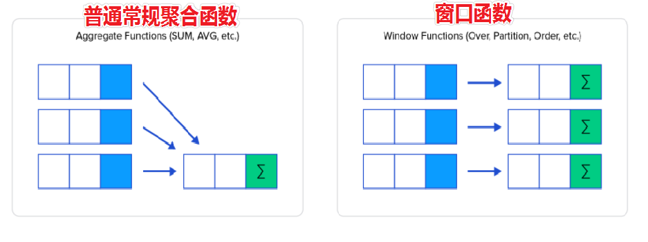

# MySQL函数

## 内置函数简介

>在MySQL中有很多内置函数，除了之前学习的聚合函数之外，还有很多其他内置函数：数值函数、字符串函数、时间日期函数、流程控制函数、加解密函数、开窗函数等。
>
>问题：内置函数该如何学习？
>熟悉常用的内置函数，其他用到再查帮助文档
>官网文档：https://dev.mysql.com/doc/refman/8.0/en/functions.html
>在mysql命令行或DataGrip软件中通过 HELP '函数名' 查看指定函数的帮助文档
>    示例: help ‘count’;

## 开窗函数

>==作用：查询每一行数据时，使用指定的窗口函数对每行关联的一组数据进行处理。==
>
>
>
>基本语法：<ranking function> OVER (ORDER BY 列名, ...)
>OVER(...)的作用就是设置每一行数据关联的一组数据范围，OVER()时，每行关联的数据范围都是整张表的数据。
><window function>表示使用的窗口函数，窗口函数可以使用之前已经学过的聚合函数，比如COUNT、SUM、AVG、MAX、MIN等，也可以ROW_NUMBER、RANK、DENSE_RANK等，后面会依次介绍。
>
>常用排序函数:
>
>**RANK()**：产生的排名序号 ，有并列的情况出现时序号不连续
>**DENSE_RANK()** ：产生的排序序号是连续的，有并列的情况出现时序号会重复
>**ROW_NUMBER()** ：返回连续唯一的行号，排名序号不会重复
>
>其他函数:
>
>**NTILE(X)**：将每个分区的数据均匀的分成X组，返回每行对应的组号
>**LAG(字段, [N], [M])**：返回分区中当前行前第N行的指定字段的内容，如果没有，默认返回M
>**LEAD(字段, [N], [M])**：返回分区中当前行后第N行的指定字段的内容，如果没有，默认返回M
>...


>```sql
># ----------------------------------- 1. 窗口函数简介 -----------------------------------
>
>-- 窗口函数是 MySQL8.0 以后加入的功能，之前需要通过定义临时变量和大量的子查询才能完成的工作，使用窗口函数实现起来更加简洁高效
>
>-- 示例1：针对 students 表的数据，计算每个同学的Score分数和整体平均分数的差值
>-- 数据准备
>CREATE TABLE `students`
>(
>`ID`     INT(11)       NOT NULL AUTO_INCREMENT,
>`Name`   VARCHAR(24)   NOT NULL,
>`Gender` VARCHAR(8)    NOT NULL,
>`Score`  DECIMAL(5, 2) NOT NULL,
>PRIMARY KEY (`ID`)
>);
>
>
>INSERT INTO
>`students`
>VALUES
>(1, 'smart', 'Male', 90.00),
>(2, 'linda', 'Female', 81.00),
>(3, 'lucy', 'Female', 83.00),
>(4, 'david', 'Male', 94.00),
>(5, 'Tom', 'Male', 92.00),
>(6, 'Jack', 'Male', 88.00);
>-- 查询
>SELECT *,
>AVG(score) OVER ()         AS `avg`,
>score - AVG(score) OVER () AS `difference`
>FROM
>students;
>
>
># ------------------------------------ 2. 窗口函数基础用法 -----------------------------------
>-- 窗口函数的作用是在处理每行数据时，针对每一行关联的一组数据进行处理。
>
>-- 基础语法：<window function> OVER(...)
>-- <window function> 表示使用的窗口函数，窗口函数可以使用之前已经学过的聚合函数，比如COUNT()、SUM()、AVG()等，也可以是其他函数，比如 ranking 排序函数等，后面的课程中会介绍
>-- OVER(...)的作用就是设置每行数据关联的窗口数据范围，OVER()时，每行关联的数据范围都是整张表的数据。
>
>
>
>-- 典型应用场景1：计算每个值和整体平均值的差值
>
>-- 示例1
># 需求：计算每个学生的 Score 分数和所有学生整体平均分的差值。
># 查询结果字段：
>#   ID、Name、Gender、Score、AVG_Score(学生整体平均分)、difference(每位学生分数和整体平均分的差值)
>SELECT *,
>AVG(score) OVER ()         AS avg_score,
>score - AVG(score) OVER () AS diff
>FROM
>students;
>
>
>-- 典型应用场景2：计算每个值占整体之和的占比
>
># 需求：计算每个学生的Score分数占所有学生分数之和的百分比
># 查询结果字段：
>#   ID、Name、Gender、Score、sum(所有学生分数之和)、ratio(每位学生分数占所有学生分数之和的百分比)
>SELECT *,
>SUM(score) OVER () AS sum_score,
>score / SUM(score) OVER () * 100
>FROM
>students;
>
>
># ----------------------------------- 3. PARTITION BY分区 -----------------------------------
>
>-- 基本语法：<window function> OVER(PARTITION BY 列名, ...)
>-- PARTITION BY 列名, ...的作用是按照指定的列对整张表的数据进行分区
>-- 分区之后，在处理每行数据时，<window function>是作用在该行数据关联的分区上，不再是整张表上
>
>-- 示例1
>-- 需求：计算每个学生的 Score 分数和同性别学生平均分的差值
>-- 查询结果字段：
>--  ID、Name、Gender、Score、Avg(同性别学生的平均分)、difference(每位学生分数和同性别学生平均分的差值)
>SELECT *,
>AVG(score) OVER (PARTITION BY gender)         AS gender_score,
>score - AVG(score) OVER (PARTITION BY gender) AS diff
>FROM
>students;
>
>
>-- PARTITION BY 和 GROUP BY的区别
>-- 使用场景不同
>-- PARTITION BY用在窗口函数中，结果是：一进一出
>-- GROUP BY用在分组聚合中，结果是：多进一出
>
># ----------------------------------- 4. 排名函数 -----------------------------------
>
>-- 基本语法：<ranking function> OVER (ORDER BY 列名, ...)
>-- OVER() 中可以指定 ORDER BY 按照指定列对每一行关联的分区数据进行排序，然后使用排序函数对分区内的每行数据产生一个排名序号
>
>
>
>-- 排名函数
>-- RANK()：产生的排名序号 ，有并列的情况出现时序号不连续
>-- DENSE_RANK() ：产生的排序序号是连续的，有并列的情况出现时序号会重复
>-- ROW_NUMBER() ：返回连续唯一的行号，排名序号不会重复
>
>
>-- PARTITION BY和排序函数配合
>
>-- 示例：
>-- 需求：按照不同科目，对学生的分数从高到低进行排名(要求：连续可重复)
>-- 查询结果字段：
>--  name、course、score、dense_rank(排名序号)
>SELECT *,
>DENSE_RANK() OVER (PARTITION BY course ORDER BY score DESC) as dr
>FROM
>tb_score;
>
>
>
>-- 典型应用：获取指定排名的数据
>
>-- 示例
> -- 需求：获取每个科目，排名第二的学生信息
>-- 查询结果字段：
>--  name、course、score
>SELECT *
>FROM
>(SELECT *,
>DENSE_RANK() OVER (PARTITION BY course ORDER BY score DESC) AS dr
>FROM
>tb_score) t
>WHERE
>dr = 2;
>
>
>
>
>-- 拓展: CTE(公用表表达式)
>-- CTE(公用表表达式)：Common Table Expresssion，类似于子查询，相当于一张临时表，可以在 CTE 结果的基础上，进行进一步的查询操作。
>-- 基础语法
>/*
>WITH tmp1 AS (
>-- 查询语句
>), tmp2 AS (
>-- 查询语句
>), tmp3 AS (
>-- 查询语句
>)
>SELECT
>字段名
>FROM 表名;
>*/
>
>-- 示例1
>-- 需求：获取每个科目，排名第二的学生信息
>-- 查询结果字段：
>--  name、course、score
>WITH
>temp AS (SELECT *,
>DENSE_RANK() OVER (PARTITION BY course ORDER BY score DESC) AS dr
>FROM
>tb_score
>)
>
>SELECT *
>FROM
>temp
>WHERE
>dr = 2;
>
>```
>

