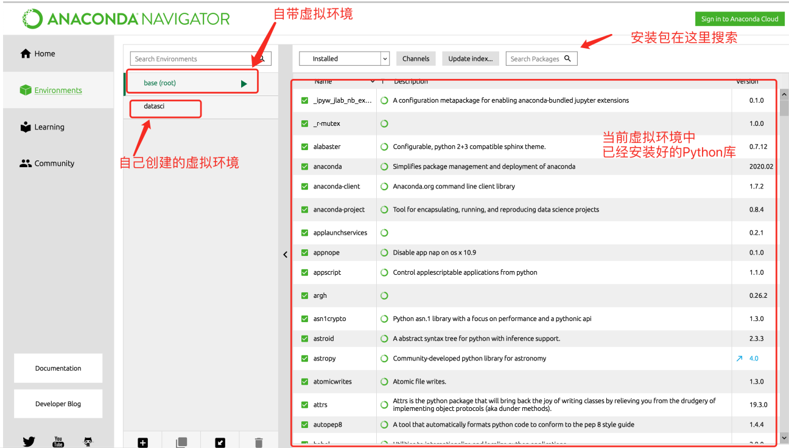
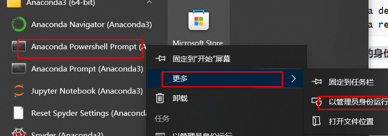

#### 今日内容大纲

* Python数据分析的优势
* Python数据分析环境搭建
* Jupyter Notebook初体验
* 配置PyCharm连接Jupyter
* Numpy详解
  * 属性
  * 创建
  * 内置函数
  * 运算

---

#### 1.Python数据处理分析简介

* Python作为当下最为流行的编程语言之一
  * 可以独立完成数据分析的各种任务
  * 数据分析领域里有海量开源库
  * 机器学习/深度学习领域最热门的编程语言
  * 在爬虫，Web开发等领域均有应用
* 与Excel，PowerBI，Tableau等软件比较
  * Excel有百万行数据限制
  * PowerBI ，Tableau在处理大数据的时候速度相对较慢
  * Excel，Power BI 和Tableau 需要付费购买授权
  * Python功能远比Excel，PowerBI，Tableau等软件强大
  * Python跨平台，Windows，MacOS，Linux都可以运行
* 与R语言比较
  * Python在处理海量数据的时候比R语言效率更高
  * Python的工程化能力更强，R专注于统计与数据分析领域
  * Python在非结构化数据（文本，图像）和深度学习领域比R更有优势
  * 在数据分析相关开源社区，python相关的内容远多于R语言
* 总结
  1. Python应用广泛, 且是当下最热门的编程语言之一.
  2. Python功能强大, 且开源, 免费.
  3. Python的社区活跃度相对较高. 


#### 2.常用Python数据分析开源库介绍

* **NumPy(Numerical Python)** 
  * 它是 Python 语言的一个扩展程序库。是一个运行速度非常快的数学库.
  * 主要用于数组计算
  * 包含：
    * 一个强大的N维数组对象 ndarray
    * 广播功能函数
    * 整合 C/C++/Fortran 代码的工具
    * 线性代数、傅里叶变换、随机数生成等功能
* **Pandas**
  * Pandas是一个强大的分析结构化数据的工具集
  * 它的使用基础是Numpy（提供高性能的矩阵运算）
  * 用于数据挖掘和数据分析，同时也提供数据清洗功能
  * **Pandas利器之 Series**，是一种类似于一维数组的对象
  * **Pandas利器之 DataFrame**，是Pandas中的一个表格型的数据结构
* **Matplotlib** 
  * 它是一个功能强大的数据可视化开源Python库
  * Python中使用最多的图形绘图库
  * 可以创建静态, 动态和交互式的图表
* **Seaborn**
  * 它是一个Python数据可视化开源库, 建立在matplotlib之上，并集成了pandas的数据结构
  * Seaborn通过更简洁的API来绘制信息更丰富，更具吸引力的图像
  * 面向数据集的API，与Pandas配合使用起来比直接使用Matplotlib更方便
* **Sklearn** 
  * scikit-learn 是基于 Python 语言的机器学习工具
  * 简单高效的数据挖掘和数据分析工具
  * 可供大家在各种环境中重复使用
  * 建立在 NumPy ，SciPy 和 matplotlib 上
* **jupyter notebook**
  - **它不是开源库,** 它是一个开源Web应用程序, 可以创建和共享代码、公式、可视化图表、笔记文档
  - 是数据分析学习和开发的首选开发环境, 作用如下: 
    - 数据清理和转换
    - 数值模拟
    - 统计分析
    - 数据可视化
    - 机器学习等


#### 3.Python数据分析环境搭建-本地环境

> 主要有**本地环境** 和 **虚拟机环境**两种, 区别是: 看在哪里安装Anaconda软件.

* Anaconda介绍
  * Anaconda 是最流行的数据分析平台，全球两千多万人在使用
  * Anaconda 附带了一大批常用数据科学包
  * Anaconda 是在 conda（一个包管理器和环境管理器）上发展出来的
  * 可以帮助你在计算机上安装和管理数据分析相关包
  * 包含了虚拟环境管理工具

* Anaconda安装

  * Anaconda 可用于多个平台（ Windows、Mac OS X 和 Linux）

  * 可以在官网上下载对应平台的安装包

  * 如果计算机上已经安装了 Python，安装不会对你有任何影响

  * 下载链接为: https://www.anaconda.com/products/individual

  * 安装的过程很简单，一路下一步即可

  * 检测是否安装成功

    

* Anaconda界面介绍

  

  

* Anaconda的命令操作

  * 安装包的命令

    ```python
    # 安装包的命令
    conda install 包名字
    pip install 报名字
    
    
    # 注意，使用pip时最好指定安装源, 参考镜像地址, 
    阿里云：https://mirrors.aliyun.com/pypi/simple/
    豆瓣：https://pypi.douban.com/simple/
    清华大学：https://pypi.tuna.tsinghua.edu.cn/simple/
    中国科学技术大学 http://pypi.mirrors.ustc.edu.cn/simple/
    
    # 完整格式如下
    pip install 包名 -i https://mirrors.aliyun.com/pypi/simple/  #通过阿里云镜像安装
    ```

  * 操作虚拟环境(沙箱)的命令

    ```python
    通过命令行创建虚拟环境
    conda create -n 虚拟环境名字 python=python版本  #创建虚拟环境
    conda activate 虚拟环境名字 #进入虚拟环境
    conda deactivate 虚拟环境名字 #退出虚拟环境
    conda remove -n 虚拟环境名字 --all  #删除虚拟环境
    conda env list   # 查看所有虚拟环境(沙箱)
    ```

* 以**管理员的身份**打开 Anaconda的命令窗口, 运行jupyter lab 或者 jupyter notebook即可

  

  


#### 5.Jupyter NoteBook的使用

- 菜单栏中相关按钮功能介绍

  > Jupyter Notebook的代码的输入框和输出显示的结果都称之为**cell**，cell行号前的 * ，表示代码正在运行

  

- 常用快捷键

  > Jupyter Notebook中分为两种模式：命令模式和编辑模式

  - 两种模式通用快捷键

    - **`Shift+Enter`，执行本单元代码，并跳转到下一单元**
    - **`Ctrl+Enter`，执行本单元代码，留在本单元**

  - 按ESC进入**命令模式**

    

    - `Y`，cell切换到Code模式
    - `M`，cell切换到Markdown模式
    - `A`，在当前cell的上面添加cell
    - `B`，在当前cell的下面添加cell
    - `双击D`：删除当前cell

  - **编辑模式**：按Enter进入，或鼠标点击代码编辑框体的输入区域

    

    - 撤销：`Ctrl+Z`（Mac:CMD+Z）
    - 反撤销: `Ctrl + Y`（Mac:CMD+Y）
    - 补全代码：变量、方法后跟`Tab键`
    - 为一行或多行代码添加/取消注释：`Ctrl+/`（Mac:CMD+/）
    - 代码提示: `shift + Tab`

- 使用Markdown

  - 在命令模式中，按M即可进入到Markdown编辑模式

  - 使用Markdown语法可以在代码间穿插格式化的文本作为说明文字或笔记

  - Markdown基本语法：标题和缩进

    - 代码如下:

      

    - 效果图如下

      


#### 6.配置PyCharm连接Anaconda

* 连接本地的Anaconda环境

  

  

* 连接本地的Anaconda环境

  * 确保Linux的Jupyter环境开启了

    

  * 配置方式和上述步骤一样,只不过把URL地址换成 http://192.168.88.161:8888


#### 7.Numpy的ndarray的属性[重点]

* Numpy简介

  * NumPy（Numerical Python）是Python数据分析必不可少的第三方库
  * NumPy的出现一定程度上解决了Python运算性能不佳的问题，同时提供了更加精确的数据类型，使其具备了构造复杂数据类型的能力。
  * 本身是由C语言开发，是个很基础的扩展，NumPy被Python其它科学计算包作为基础包，因此理解np的数据类型对python数据分析十分重要。
  * NumPy重在数值计算，主要用于多维数组（矩阵）处理的库。用来存储和处理大型矩阵，比Python自身的嵌套列表结构要高效的多
* 重要功能如下

  1. 高性能科学计算和数据分析的基础包
  2. ndarray，多维数组，具有矢量运算能力，快速、节省空间
  3. 矩阵运算，无需循环，可完成类似Matlab中的矢量运算
  4. 用于读写磁盘数据的工具以及用于操作内存映射文件的工具

#### 8.Numpy的属性

```properties
ndim:获取数组的维度
shape:获取数组的形状
size:获取数组的元素个数
dtype:获取数组元素的数据类型
type:查看数组的类型
itemsize:获取数组中元素的大小
```

#### 9.Numpy的ndarray的创建

* ndarray介绍

  * NumPy数组是一个多维的数组对象（矩阵），称为**ndarray(N-Dimensional Array)**
  * 具有矢量算术运算能力和复杂的广播能力，并具有执行速度快和节省空间的特点
  * 注意：ndarray的下标从0开始，且数组里的所有元素必须是相同类型。

+ **array()的功能是将一个列表转换为数组**

* **zeros() /ones()/empty()**

  > 函数zeros创建一个全是0的数组，
  >
  > 函数ones创建一个全1的数组，
  >
  > 函数empty创建一个内容随机并且依赖于内存状态的数组。

* **arange(),** 类似 python 的 range() ，创建一个一维 ndarray 数组。

  >```python
  >arange(x,y,z...) x:起始值 y:结束值(不含) z:步长
  >```
  
* **matrix()**,  是 ndarray 的子类，只能生成 2 维的矩阵

  >```
  >注意: mat和matrix()功能一样
  >```
  
* **rand()/randint()/uniform()**

  >```
  >rand()的功能是生成一个指定形状的随机浮点数数组,范围默认是0-1之间
  >randint()的功能是生成一个指定形状的随机整数数组,范围需要指定,形状用size指定
  >uniform()的功能是生成一个指定形状的随机浮点数数组,范围需要指定,形状用size指定
  >```

+ **astype()的功能是修改数组的数据类型,注意:返回新的**

*  **logspace()的功能是生成一个等比数组**

  >```
  >(x,y,n,base): x起始幂,y结束幂,n个数默认是50个,base基础值默认是10
  >```

+  **linspace()的功能是生成一个等差数组**

  >```
  >(x,y,n): x起始值,y结束值,n个数默认是50个
  >```


#### 10.Numpy的内置函数

* 基本函数

  ```properties
  # 基本函数如下
  np.ceil(): 向上最接近的整数，参数是 number 或 array
  np.floor(): 向下最接近的整数，参数是 number 或 array
  np.rint(): 四舍五入，参数是 number 或 array
  np.isnan(): 判断元素是否为 NaN(Not a Number)，参数是 number 或 array
  np.multiply(): 元素相乘，参数是 number 或 array
  np.divide(): 元素相除，参数是 number 或 array
  np.abs()：元素的绝对值，参数是 number 或 array
  np.where(condition, x, y): 三元运算符，x if condition else y
  # 注意: 需要注意multiply/divide 如果是两个ndarray进行运算 shape必须一致
  ```
  
  
  
* 统计函数

  ```properties
  np.mean(), np.sum():所有元素的平均值，所有元素的和，参数是 number 或 array
  np.max(), np.min():所有元素的最大值，所有元素的最小值，参数是 number 或 array
  np.std(), np.var():所有元素的标准差，所有元素的方差，参数是 number 或 array
  np.argmax(), np.argmin():最大值的下标索引值，最小值的下标索引值，参数是 number 或 array
  np.cumsum(), np.cumprod():返回一个一维数组，每个元素都是之前所有元素的 累加和 和 累乘积，参数是 number 或 array
   # 多维数组默认统计全部维度，axis参数可以按指定轴心统计，值为0则按列统计，值为1则按行统计。
  ```
  
* 比较函数

  ```properties
  np.any(): 至少有一个元素满足指定条件，返回True
  假如我们想要知道矩阵a和矩阵b中对应元素是否有一个相等，我们需要使用any方法。
  
  np.all(): 所有的元素满足指定条件，返回True
  假如我们想要知道矩阵a和矩阵b中所有对应元素是否相等，我们需要使用all方法，
  
  ```
  
* 去重函数

  ```properties
  np.unique():找到唯一值并返回排序结果，类似于Python的set集合
  
  ```
  
* 排序函数

  ```properties
  numpy.sort(数组):函数排序, 返回排序后的副本
  数组.sort():在原数据上进行修改
  ```
  
  

#### 11.Numpy运算

* 基本运算

  ```properties
  数组的算数运算: 是按照元素的。新的数组被创建并且被结果填充。
  ```

  ```python
  # 示例代码
  import numpy as np
  
  a = np.array([20, 30, 40, 50])
  b = np.arange(4)
  c = a - b
  print("数组a:", a)
  print("数组b:", b)
  print("数组运算a-b:", c)
  ```

  

  > 两个ndarray, 一个是arr_a  另一个是arr_b
  >
  > 它们俩之间进行  arr_a  + arr_b  或 arr_a  - arr_b  或 arr_a  * arr_b 这样计算的前提是 shape相同
  >
  > 计算的时候, 位置对应的元素 进行 加减乘除的计算, 计算之后得到的结果的shape 跟arr_a  /arr_b 一样

* 矩阵运算

  > `arr_a.dot(arr_b) 前提`   **arr_a 列数 = arr_b行数**

  * 场景1

    

    ```python
    import numpy as np
    
    a = np.array([[1, 2, 3], [4, 5, 6]])
    b = np.array([[1, 2, 3], [4, 5, 6]])
    print(a * b)
    
    print(np.multiply(a, b))
    ```

    

  * 场景2

    

    ​	

    ```python
    import numpy as np
    
    x = np.array([[1, 2, 3], [4, 5, 6]])
    y = np.array([[6, 23], [-1, 7], [8, 9]])
    print(x)
    print(y)
    print(x.dot(y))
    print(np.dot(x, y))
    ```

    