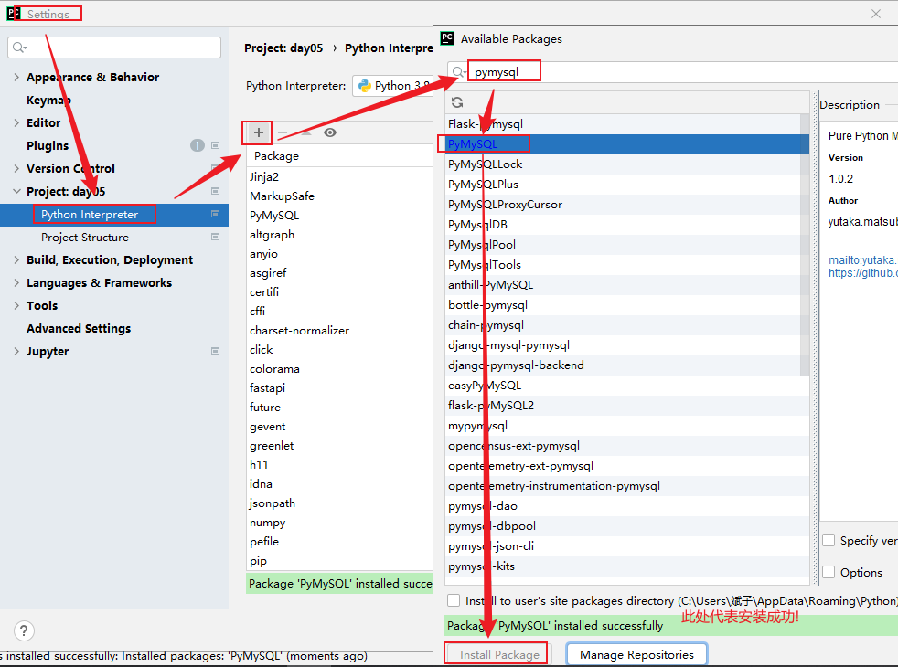

# python与mysql交互

>pymysql是一个纯python实现的mysql客户端库,提供了python程序中操作mysql数据库的操作

## 为什么要学习PyMySQL

如何实现将100000条数据插入到MySQL数据库?

**答案:**

如果使用之前学习的MySQL客户端来完成这个操作，那么这个工作量无疑是巨大的，我们可以通过使用程序代码的方式去连接MySQL数据库，然后对MySQL数据库进行增删改查的方式，实现100000条数据的插入，像这样使用代码的方式操作数据库就称为数据库编程。

## 数据准备

```mysql
-- 创建 "京东" 数据库
create database jing_dong charset=utf8;

-- 使用 "京东" 数据库
use jing_dong;

-- 创建一个商品goods数据表
create table goods(
    id int unsigned primary key auto_increment not null,
    name varchar(150) not null,
    cate_name varchar(40) not null,
    brand_name varchar(40) not null,
    price decimal(10,3) not null default 0,
    is_show bit not null default 1,
    is_saleoff bit not null default 0
);

-- 向goods表中插入数据

insert into goods values(0,'r510vc 15.6英寸笔记本','笔记本','华硕','3399',default,default);
insert into goods values(0,'y400n 14.0英寸笔记本电脑','笔记本','联想','4999',default,default);
insert into goods values(0,'g150th 15.6英寸游戏本','游戏本','雷神','8499',default,default);
insert into goods values(0,'x550cc 15.6英寸笔记本','笔记本','华硕','2799',default,default);
insert into goods values(0,'x240 超极本','超级本','联想','4880',default,default);
insert into goods values(0,'u330p 13.3英寸超极本','超级本','联想','4299',default,default);
insert into goods values(0,'svp13226scb 触控超极本','超级本','索尼','7999',default,default);
insert into goods values(0,'ipad mini 7.9英寸平板电脑','平板电脑','苹果','1998',default,default);
insert into goods values(0,'ipad air 9.7英寸平板电脑','平板电脑','苹果','3388',default,default);
insert into goods values(0,'ipad mini 配备 retina 显示屏','平板电脑','苹果','2788',default,default);
insert into goods values(0,'ideacentre c340 20英寸一体电脑 ','台式机','联想','3499',default,default);
insert into goods values(0,'vostro 3800-r1206 台式电脑','台式机','戴尔','2899',default,default);
insert into goods values(0,'imac me086ch/a 21.5英寸一体电脑','台式机','苹果','9188',default,default);
insert into goods values(0,'at7-7414lp 台式电脑 linux ）','台式机','宏碁','3699',default,default);
insert into goods values(0,'z220sff f4f06pa工作站','服务器/工作站','惠普','4288',default,default);
insert into goods values(0,'poweredge ii服务器','服务器/工作站','戴尔','5388',default,default);
insert into goods values(0,'mac pro专业级台式电脑','服务器/工作站','苹果','28888',default,default);
insert into goods values(0,'hmz-t3w 头戴显示设备','笔记本配件','索尼','6999',default,default);
insert into goods values(0,'商务双肩背包','笔记本配件','索尼','99',default,default);
insert into goods values(0,'x3250 m4机架式服务器','服务器/工作站','ibm','6888',default,default);
insert into goods values(0,'商务双肩背包','笔记本配件','索尼','99',default,default);


# 创建用户表
create TABLE user(
    id int PRIMARY KEY AUTO_INCREMENT,
    user varchar(30),
    pwd varchar(30)
);
insert into user(user,pwd) VALUE ('root','123456');
```

## 安装pymysql库

### 方式1

```properties
命令: pip  install pymysql
```

### 方式2

```properties
命令: pip  install pymysql -i https://pypi.tuna.tsinghua.edu.cn/simple/ 
```

### 方式3



## pymysql使用

### 知识点:

```properties
pymysql使用步骤:
1.导入模块
2.创建连接
3.创建游标
4.执行sql
5.关闭游标
6.关闭连接
```

### 查询操作

#### 知识点:

```properties
fetchone(): 一次只取一条数据
fetchall(): 一次把剩下的所有数据都取到
```

#### 示例:

```python
# 1.导入pymysql模块
import pymysql

# 2.创建连接对象
conn = pymysql.connect(
    host='localhost',
    port=3306,
    user='root',
    password='root',
    database='jing_dong'
)
# 3.创建游标对象
cur = conn.cursor()
# 4.执行sql
row = cur.execute('SELECT * FROM goods')
print(f'影响了{row}行')
# fetchone: 一次拿一条数据
# data1 = cur.fetchone()
# print(data1)
# fetchall: 一次拿剩下的所有的数据
data2 = cur.fetchall()
print(data2)
# 5.关闭游标
cur.close()
# 6.关闭连接
conn.close()

```

### 增删改操作

#### 知识点:

```properties
拓展: 事务->要么都成功,都失败  (特性: 原子性 一致性  隔离性  持久性)

存储引擎: innodb支持事务   myisam不支持事务

增删改操作: 如果数据库底层是innodb引擎,必须手动commit提交 

数据提交:commit()
数据回滚:rollback()
```

#### 增:

```python
# 1.导入pymysql模块
from pymysql import connect

# 2.创建连接对象
conn = connect(
    host='127.0.0.1',
    port=3306,
    user='root',
    password='root',
    database='jing_dong'
)
# 3.创建游标对象
cur = conn.cursor()
# 4.执行sql语句
row = cur.execute("insert into goods(name,cate_name,brand_name) value ('测试','测试','测试')")
print(f'影响了{row}行')
# innoDB引擎要求必须提交,myisam引擎不支持事务(不commit也可以)
conn.commit()
# 5.关闭游标
cur.close()
# 6.关闭连接
conn.close()

```

#### 改:

```python
# 1.导入pymysql模块
from pymysql import connect

# 2.创建连接对象
conn = connect(
    host='127.0.0.1',
    port=3306,
    user='root',
    password='root',
    database='jing_dong'
)
# 3.创建游标对象
cur = conn.cursor()
# 4.执行sql语句
row = cur.execute("update goods set price = 99999 where name='测试'")
print(f'影响了{row}行')
# innoDB引擎要求必须提交,myisam引擎不支持事务(不commit也可以)
conn.commit()
# 5.关闭游标
cur.close()
# 6.关闭连接
conn.close()

```

#### 删:

```python
# 1.导入pymysql模块
from pymysql import connect

# 2.创建连接对象
conn = connect(
    host='127.0.0.1',
    port=3306,
    user='root',
    password='root',
    database='jing_dong'
)
# 3.创建游标对象
cur = conn.cursor()
# 4.执行sql语句
try:
    row = cur.execute("DELETE FROM goods WHERE name='测试'")
    print(f'影响了{row}行')
    # a = 1 / 0
except Exception as e:
    print(f'老弟啊,出错了呀...详情:{e}')
    conn.rollback()

# innoDB引擎要求必须提交,myisam引擎不支持事务(不commit也可以)
conn.commit()
# 5.关闭游标
cur.close()
# 6.关闭连接
conn.close()

```

## 登录案例

>需求:  自己创建一个数据库,里面有user表,用于存储用户名密码(咱们直接写固定  用户名root 密码123456   )
>
>需要完成的功能是用户键盘录入用户名和密码,使用python代码连接数据库判断是否登录成功
>
>分析:  现实生活中如果要登录,必须先注册,用户注册完后,对应的信息就存储到对应网站后台数据库中
>
>用户登录:  用户新输入的用户名密码和数据库中的用户名和密码比较,都相同就登录成功,否则失败

### 建表语句

```mysql
use jing_dong;
create TABLE user(
    id int PRIMARY KEY AUTO_INCREMENT,
    user varchar(30),
    pwd varchar(30)
);
insert into user(user,pwd) VALUE ('root','123456');
```

### 演示sql注入问题:

```python
# 用户登录
username = input('请输入用户名:')
password = input('请输入密码:')
# 后台python代码连接数据库判断
# 1.导入pymysql模块
import pymysql
# 2.创建连接对象
conn = pymysql.connect(
    host='127.0.0.1',
    port=3306,
    user='root',
    password='root',
    database='jing_dong'
)
# 3.创建游标对象
cur = conn.cursor()
# 4.执行sql语句(判断是否登录成功)
# 下面直接传递参数的方式容易出现sql注入问题-> 用户名:随意  密码: ' or 1=1 or '
# select * from user where user='root' and pwd='' or 1=1 or ''
row = cur.execute(f"select * from user where user='{username}' and pwd='{password}'")
if row:
    print('登录成功')
else:
    print('登录失败')
# 5.关闭游标
cur.close()
# 6.关闭连接
conn.close()

```

### 解决sql注入问题

```python
# 用户登录
username = input('请输入用户名:')
password = input('请输入密码:')
# 后台python代码连接数据库判断
# 1.导入pymysql模块
import pymysql
# 2.创建连接对象
conn = pymysql.connect(
    host='127.0.0.1',
    port=3306,
    user='root',
    password='root',
    database='jing_dong'
)
# 3.创建游标对象
cur = conn.cursor()
# 4.执行sql语句(判断是否登录成功)
# 解决sql注入问题:  sql单独定义,用%s占位,把所有参数放到列表里,把sql和参数列表传给execute
sql = "select * from user where user=%s and pwd=%s"
parm = [username,password]
row = cur.execute(sql,parm)
if row:
    print('登录成功')
else:
    print('登录失败')
# 5.关闭游标
cur.close()
# 6.关闭连接
conn.close()
```


