#### 今日内容大纲介绍

* Pandas数据结构介绍
  * **创建Series对象**
  * **创建DataFrame对象**
* Series常见操作
  * 常用属性
  * 常用方法
  * 布尔索引
  * 运算
* DataFrame常见操作
  * 常用属性
  * 常用方法
  * 布尔索引
  * 运算
  * **更改操作**
  * **导入和导出操作**

---

#### 1.Pandas数据结构介绍

* 图解

  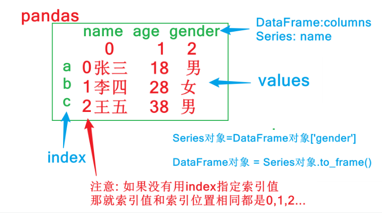

* 解释

  * **DataFrame**

    > 可以把DataFrame看作由Series对象组成的字典，其中key是列名，值是Series

  * **Series**

    > Series和Python中的列表非常相似，但是它的每个元素的数据类型必须相同

  * **Pandas中只有列 或者 二维表, 没有行的数据结构(`即使是行的数据, 也会通过列的方式展示`).**


#### 2.创建Series对象

* 概述

  - Series也是Pandas中的最基本的数据结构对象，下文中简称s对象；是DataFrame的列对象或者行对象，series本身也具有行索引。
  - Series是一种类似于一维数组的对象，由下面三个部分组成：
    - values：一组数据（numpy.ndarray类型）
    - index：相关的数据行索引标签；如果没有为数据指定索引，于是会自动创建一个0到N-1(N为数据的长度)的整数型索引。
    - name:   列标签

* 创建方式

  * 自动生成索引

  * 指定索引
  
    
    

#### 3.创建DataFrame对象

* 概述

  * DataFrame是一个表格型的==结构化==数据结构，它含有一组或多组有序的列（Series），每列可以是不同的值类型（数值、字符串、布尔值等）。

  - **DataFrame是Pandas中的最基本的数据结构对象，简称df；可以认为df就是一个二维数据表，这个表有行有列有索引**
  - DataFrame是Pandas中最基本的数据结构，Series的许多属性和方法在DataFrame中也一样适用.

* 创建方式

  * 字典方式创建

    代码参考课堂讲解
    
  * 列表+列表方式创建
  
    代码参考课堂讲解

#### 4.Series的常用属性

* 常见属性

  <table>
    <tr>
      <td>属性</td><td>说明</td>
    </tr>
    <tr>
      <td>loc</td><td>使用索引值取子集</td>
    </tr>
    <tr>
      <td>iloc</td><td>使用索引位置取子集</td>
    </tr>
    <tr>
      <td>dtype或dtypes</td><td>Series内容的类型</td>
    </tr>
    <tr>
      <td>T</td><td>Series的转置矩阵</td>
    </tr>
     <tr>
      <td>shape</td><td>数据的维数</td>
    </tr>
    <tr>
      <td>size</td><td>Series中元素的数量</td>
    </tr>
    <tr>
      <td>values</td><td>Series的值</td>
    </tr>
     <tr>
      <td>index</td><td>Series的索引值</td>
    </tr> 
  </table>

  
* loc属性

  
  
* iloc属性

  
  
* shape 和 size属性

  
  
* values 属性

  
  
* index属性

  


#### 5.Series的常用方法

- 常见方法

  <table>
    <tr>
      <td>方法</td><td>说明</td>
    </tr>
    <tr>
      <td>append</td><td>连接两个或多个Series</td>
    </tr>
    <tr>
      <td>corr</td><td>计算与另一个Series的相关系数</td>
    </tr>
    <tr>
      <td>cov</td><td>计算与另一个Series的协方差</td>
    </tr>
    <tr>
      <td>describe</td><td>计算常见统计量</td>
    </tr>
     <tr>
      <td>drop_duplicates</td><td>返回去重之后的Series</td>
    </tr>
    <tr>
      <td>equals</td><td>判断两个Series是否相同</td>
    </tr>
    <tr>
      <td>get_values</td><td>获取Series的值，作用与values属性相同</td>
    </tr>
    <tr>
      <td>hist</td><td>绘制直方图</td>
    </tr>
    <tr>
      <td>isin</td><td>Series中是否包含某些值</td>
    </tr>
    <tr>
      <td>min</td><td>返回最小值</td>
    </tr>
    <tr>
      <td>max</td><td>返回最大值</td>
    </tr>
    <tr>
      <td>mean</td><td>返回算术平均值</td>
    </tr>
    <tr>
      <td>median</td><td>返回中位数</td>
    </tr>
    <tr>
      <td>mode</td><td>返回众数</td>
    </tr>
    <tr>
      <td>quantile</td><td>返回指定位置的分位数</td>
    </tr>
    <tr>
      <td>replace</td><td>用指定值代替Series中的值</td>
    </tr>
    <tr>
      <td>sample</td><td>返回Series的随机采样值</td>
    </tr>
    <tr>
      <td>sort_values</td><td>对值进行排序</td>
    </tr>
    <tr>
      <td>to_frame</td><td>把Series转换为DataFrame</td>
    </tr>
    <tr>
      <td>unique</td><td>去重返回数组</td>
    </tr>
      <tr>
      <td>value_counts</td><td>统计不同值数量</td>
    </tr>
      <tr>
      <td>keys</td><td>获取索引值</td>
    </tr>
      <tr>
      <td>head</td><td>查看前5个值</td>
    </tr>
      <tr>
      <td>tail</td><td>查看后5个值</td>
    </tr>
  </table>

  
- 小案例: 电影数据

  


#### 6.Series的布尔索引

> 从`scientists.csv`数据集中，列出大于`Age`列的平均值的具体值，具体步骤如下：

- 加载并观察数据集

  ```python
  import pandas as pd
  
  df = pd.read_csv('data/scientists.csv')
  print(df)
  # print(df.head())
  # 输出结果如下
                     Name        Born        Died  Age          Occupation
  0     Rosaline Franklin  1920-07-25  1958-04-16   37             Chemist
  1        William Gosset  1876-06-13  1937-10-16   61        Statistician
  2  Florence Nightingale  1820-05-12  1910-08-13   90               Nurse
  3           Marie Curie  1867-11-07  1934-07-04   66             Chemist
  4         Rachel Carson  1907-05-27  1964-04-14   56           Biologist
  5             John Snow  1813-03-15  1858-06-16   45           Physician
  6           Alan Turing  1912-06-23  1954-06-07   41  Computer Scientist
  7          Johann Gauss  1777-04-30  1855-02-23   77       Mathematicia
  
  # 演示下, 如何通过布尔值获取元素.
  bool_values = [False, True, True, False, False, False, True, False]
  df[bool_values]
  
  # 输出结果如下
                     Name        Born        Died  Age          Occupation
  1        William Gosset  1876-06-13  1937-10-16   61        Statistician
  2  Florence Nightingale  1820-05-12  1910-08-13   90               Nurse
  6           Alan Turing  1912-06-23  1954-06-07   41  Computer Scientist
  
  ```

- 计算`Age`列的平均值

  
  
- 输出大于`Age`列的平均值的具体值

  
  
  
  


#### 7.Series的运算

> Series和数值型变量计算时，变量会与Series中的每个元素逐一进行计算；
>
> 两个Series之间计算时，索引值相同的元素之间会进行计算；索引值不同的元素的计算结果会用NaN值(缺失值)填充。

- Series和数值型变量计算

  代码参考课堂讲解
  
- 两个Series之间计算时，索引值相同的元素之间会进行计算；索引值不同的元素的计算结果会用NaN值(缺失值)填充

  代码参考课堂讲解


#### 8.DataFrame常用属性和方法

* 基础演示

  ```python
  import pandas as pd
  
  # 加载数据集, 得到df对象
  df = pd.read_csv('data/scientists.csv')
  
  print('=============== 常用属性 ===============')
  # 查看维度, 返回元组类型 -> (行数, 列数), 元素个数代表维度数
  print(df.shape)
  # 查看数据值个数, 行数*列数, NaN值也算
  print(df.size)
  # 查看数据值, 返回numpy的ndarray类型
  print(df.values)
  # 查看维度数
  print(df.ndim)
  # 返回列名和列数据类型
  print(df.dtypes)
  # 查看索引值, 返回索引值对象
  print(df.index)
  # 查看列名, 返回列名对象
  print(df.columns)
  print('=============== 常用方法 ===============')
  # 查看前5行数据
  print(df.head())
  # 查看后5行数据
  print(df.tail())
  # 查看df的基本信息
  df.info()
  # 查看df对象中所有数值列的描述统计信息
  print(df.describe())
  # 查看df对象中所有非数值列的描述统计信息
  # exclude:不包含指定类型列
  print(df.describe(exclude=['int', 'float']))
  # 查看df对象中所有列的描述统计信息
  # include:包含指定类型列, all代表所有类型
  print(df.describe(include='all'))
  # 查看df的行数
  print(len(df))
  # 查看df各列的最小值
  print(df.min())
  # 查看df各列的非空值个数
  print(df.count())
  # 查看df数值列的平均值
  print(df.mean())
  ```

* DataFrame的布尔索引

  ```python
  # 小案例, 同上, 主演脸书点赞量 > 主演脸书平均点赞量的
  movie[movie['actor_1_facebook_likes'] > movie['actor_1_facebook_likes'].mean()]
  
  # df也支持索引操作
  movie.head()[[True, True, False, True, False]]
  ```

  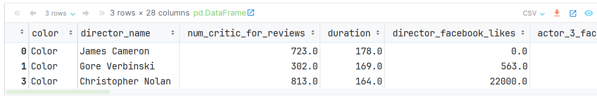

* DataFrame的计算

  ```python
  scientists * 2					# 每个元素, 分别和数值运算
  scientists + scientists			# 根据索引进行对应运算
  scientists + scientists[:4]		# 根据索引进行对应运算, 索引不匹配, 返回NAN
  ```


#### 9. DataFrame-索引操作

> `Pandas中99%关于DF和Series调整的API, 都会默认在副本上进行修改, 调用修改的方法后, 会把这个副本返回`
>
> `这类API都有一个共同的参数: inplace, 默认值是False`
>
> `如果把inplace的值改为True, 就会直接修改原来的数据, 此时这个方法就没有返回值了`

* 通过 set_index()函数 设置行索引名字

  ```python
  # 读取文件, 不指定索引, Pandas会自动加上从0开始的索引
  movie = pd.read_csv('data/movie.csv')  
  movie.head()
  
  # 设置 电影名 为索引列.   
  movie1 = movie.set_index('movie_title')
  movie1.head()
  
  # 如果加上 inplace=True, 则会修改原始的df对象
  movie.set_index('movie_title', inplace=True)  
  movie.head()    # 原始的数据并没有发生改变. 
  ```

  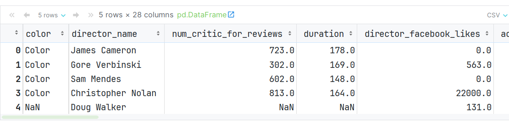

  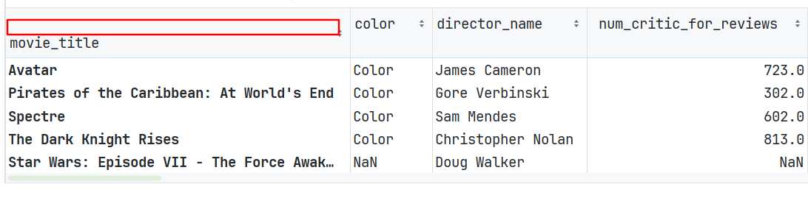

* 加载数据的时候, 直接指定索引列

  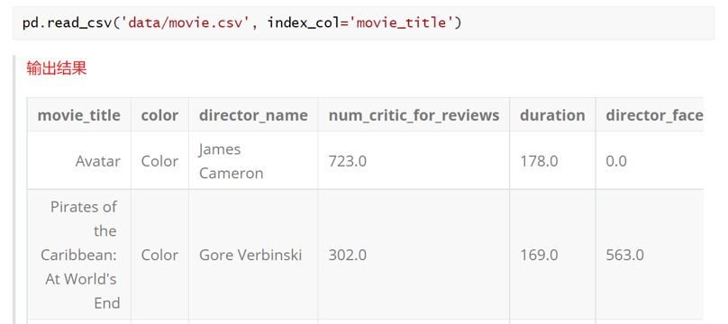

* 通过reset_index()函数, 可以重置索引

  ```python
  # 加上inplace, 就是直接修改 源数据.
  movie.reset_index(inplace=True) 
  movie.head()
  ```

  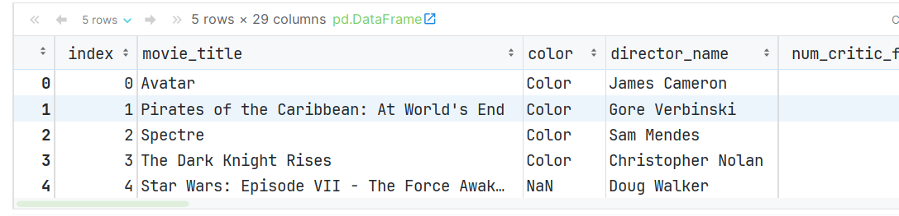


#### 10.DataFrame-修改行列索引

* **方式1:** rename()函数, 可以对原有的行索引名 和 列名进行修改

  ```python
  movie = pd.read_csv('data/movie.csv', index_col='movie_title')
  movie.index[:5]  # 前5个行索引名
  
  movie.columns[:5]  # 前5个列名
  
  # 手动修改下 行索引名 和 列名
  idx_rename = {'Avatar': '阿凡达', "Pirates of the Caribbean: At World's End": '加勒比海盗'}
  col_rename = {'color': '颜色', 'director_name': '导演名'}
  
  # 通过rename()函数, 对原有的行索引名 和 列名进行修改
  movie.rename(index=idx_rename, columns=col_rename).head()
  ```

  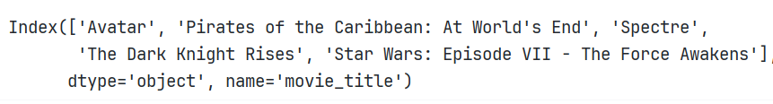

  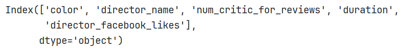

  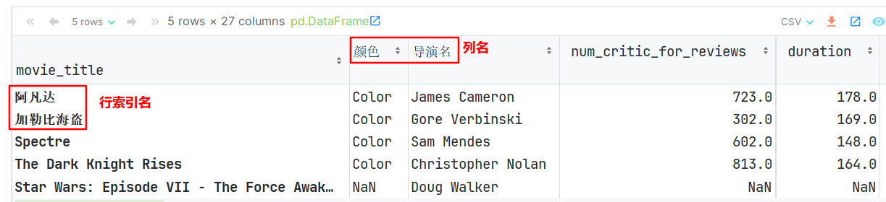

* **方式2:**把 index 和 columns属性提取出来, 修改之后, 再赋值回去

  > `index类型不能直接修改,需要先将其转成列表, 修改列表元素, 再整体替换`

  ```python
  movie = pd.read_csv('data/movie.csv', index_col='movie_title')
  
  # 提取出 行索引名 和 列名, 并转成列表.
  index_list = movie.index.tolist()
  columns_list = movie.columns.tolist()
  
  # 修改列表元素值
  index_list[0] = '阿凡达'
  index_list[1] = '加勒比海盗'
  
  columns_list[0] = '颜色'
  columns_list[1] = '导演名'
  
  # 重新把修改后的值, 设置成 行索引 和 列名
  movie.index = index_list
  movie.columns = columns_list
  
  # 查看数据
  movie.head(5)
  ```

  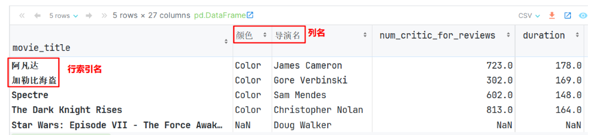


#### 11.添加-删除-插入列

* 添加列

  ```python
  movie = pd.read_csv('data/movie.csv')
  
  # 通过 df[列名] = 值  的方式, 可以给df对象新增一列, 默认: 在df对象的最后添加一列.
  movie['has_seen'] = 0   # 新增一列, 表示: 是否看过(该电影)   
  
  # 新增一列, 表示: 导演和演员 脸书总点赞数
  movie['actor_director_facebook_likes'] = (
      movie['actor_1_facebook_likes'] +
      movie['actor_2_facebook_likes'] +
      movie['actor_3_facebook_likes'] +
      movie['director_facebook_likes']
  )
  
  movie.head()    # 查看内容
  ```

  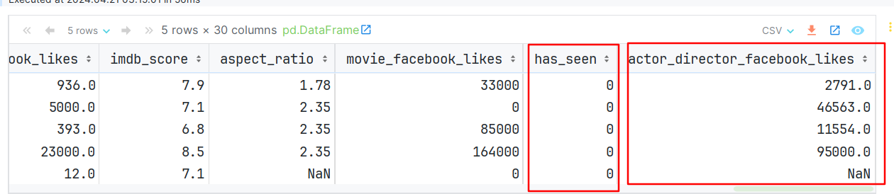

* 删除列 或者 行

  ```python
  # movie.drop('has_seen')  # 报错, 需要指定方式, 按行删, 还是按列删.
  # movie.drop('has_seen', axis='columns')    # 按列删
  # movie.drop('has_seen', axis=1)            # 按列删, 这里的1表示: 列
  
  movie.head().drop([0, 1])                # 按行索引删, 即: 删除索引为0和1的行
  ```

  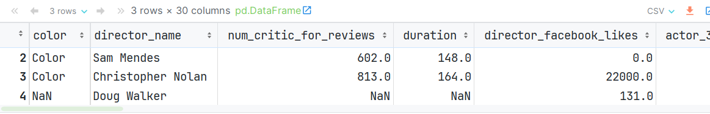

* 插入列

  > 有点特殊, 没有inplace参数, 默认就是在原始df对象上做插入的.

  ```python
  # insert() 表示插入列.   参数解释: loc:插入位置(从索引0开始计数), column=列名, value=值
  # 总利润 = 总收入 - 总预算
  movie.insert(loc=1, column='profit', value=movie['gross'] - movie['budget'])
  movie.head()
  ```

  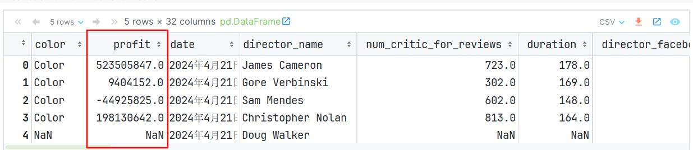

#### 12.DataFrame导入和导出操作

##### 1.DataFrame-保存数据到文件

* 格式

  ```python
  df对象.to_数据格式(路径)
  
  # 例如:
  df.to_csv('data/abc.csv')
  ```

* 代码演示

  > 如要保存的对象是计算的中间结果，或者以后会在Python中复用，推荐保存成pickle文件
  >
  > 如果保存成pickle文件，只能在python中使用, 文件的扩展名可以是`.p，.pkl，.pickl`

  ```python
  # output文件夹必须存在
  df.to_pickle('output/scientists.pickle')                         # 保存为 pickle文件 
  df.to_csv('output/scientists.csv')                               # 保存为 csv文件     
  df.to_excel('output/scientists.xlsx')                             # 保存为 Excel文件 
  df.to_excel('output/scientists_noindex.xlsx', index=False)        # 保存为 Excel文件 
  df.to_csv('output/scientists_noindex.csv', index=False)           # 保存为 Excel文件 
  df.to_csv('output/scientists_noindex.tsv', index=False, sep='\t') 
  
  print('保存成功')
  ```

* 注意, pandas读写excel需要额外安装如下三个包

  ```python
  pip install -i https://pypi.tuna.tsinghua.edu.cn/simple xlwt 
  pip install -i https://pypi.tuna.tsinghua.edu.cn/simple openpyxl
  pip install -i https://pypi.tuna.tsinghua.edu.cn/simple xlrd
  ```


##### 2.DataFrame-读取文件数据

* 格式

  ```python
  pd对象.read_数据格式(路径)
  
  # 例如:
  pd.read_csv('data/movie.csv')
  ```

* 代码演示

  ```python
  # pd.read_pickle('output/scientists.pickle')  # 读取Pickle文件中的内容
  # pd.read_excel('output/scientists.xlsx')     # 多1个索引列
  # pd.read_csv('output/scientists.csv')        # 多1个索引列
  
  pd.read_csv('output/scientists_noindex.csv')  # 正常数据
  ```


