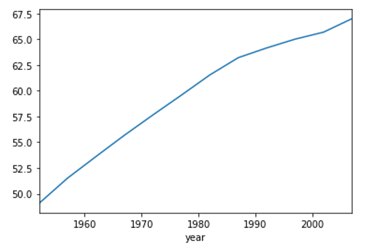

# pandas数据分析入门

#### DataFrame-数据分析入门

* 回顾 `DataFrame` 和 `Series`概念

  * Pandas是用于数据分析的开源Python库，可以实现数据加载，清洗，转换，统计处理，可视化等功能
  * DataFrame和Series是Pandas最基本的两种数据结构
  * **DataFrame用来处理结构化数据**（SQL数据表，Excel表格）
  * **Series用来处理单列数据**，也可以把DataFrame看作由Series对象组成的字典或集合

* **按列加载数据**

  > 做数据分析首先要加载数据，并查看其结构和内容，对数据有初步的了解
  > 查看行，列数据分布情况
  > 查看每一列中存储信息的类型

  ```python
  import pandas as pd
  
  # 1. 加载数据
  df = pd.read_csv('data/gapminder.tsv', sep='\t')    # 指定切割符为\t
  df.head()
  
  # 2. # 查看df类型
  type(df)
  df.shape        # (1704, 6)
  df.columns      # Index(['country', 'continent', 'year', 'lifeExp', 'pop', 'gdpPercap'], dtype='object')
  df.index        # RangeIndex(start=0, stop=1704, step=1)
  df.dtypes       # 查看df对象 每列的数据类型
  df.info()       # 查看df对象 详细信息
  
  
  # 3. 加载一列数据
  # country_series = df['country']
  country_series = df.country     # 效果同上
  country_series.head()           # 查看前5条数据
  # 细节: 如果写 df['country'] 则是Series对象, 如果写 df[['country']]则是df对象
  
  
  # 4. 加载多列数据
  subset = df[['country', 'continent', 'year']]    # df对象
  print(subset.tail())
  ```

* **按行加载数据**

  ```python
  # 1. 按行加载数据
  df.head()       # 获取前5条, 最左侧是一列行号, 也是 df的行索引, 即: Pandas默认使用行号作为 行索引.
  
  # 2. 使用 tail()方法, 获取最后一行数据
  df.tail(n=1)
  
  # 3. 演示 iloc属性 和 loc属性的区别,  loc属性写的是: 行索引值.  iloc写的是行号.
  df.tail(n=1).loc[1703]
  df.tail(n=1).iloc[0]        # 效果同上.
  
  # 4. loc属性 传入行索引, 来获取df的部分数据(一行, 或多行)
  df.loc[0]       # 获取 行索引为 0的行
  df.loc[99]      # 获取 行索引为 99的行
  df.loc[[0, 99, 999]]    # loc属性, 根据行索引值, 获取多条数据.
  
  # 5. 获取最后一条数据
  # df.loc[-1]          # 报错
  df.iloc[-1]           # 正确
  ```

* **获取指定行/列数据**

  ```python
  # 1. 获取指定 行|列 数据
  df.loc[[0, 1, 2], ['country', 'year', 'lifeExp']]  # 行索引, 列名
  df.iloc[[0, 1, 2], [0, 2, 3]]  # 行索引, 列的编号
  
  # 2. 使用loc 获取所有行的, 某些列
  df.loc[:, ['year', 'pop']]  # 获取所有行的 year 和 pop列数据
  
  # 3. 使用 iloc 获取所有行的, 某些列
  df.iloc[:, [2, 3, -1]]  # 获取所有行的, 索引为: 2, 3 以及 最后1列数据
  
  # 4. loc只接收 行列名,  iloc只接收行列序号, 搞反了, 会报错.
  # df.loc[:, [2, 3, -1]]   # 报错
  # df.iloc[:, ['country', 'continent']]    # 报错
  
  # 5. 也可以通过 range()生成序号, 结合 iloc 获取连续多列数据.
  df.iloc[:, range(1, 5, 2)]
  df.iloc[:, list(range(1, 5, 2))]  # 把range()转成列表, 再传入, 也可以.
  
  # 6. 在iloc中, 使用切片语法 获取 n列数据.
  df.iloc[:, 3:5]   # 获取列编号为 3 ~ 5 区间的数据, 包左不包右, 即: 只获取索引为3, 4列的数据.
  df.iloc[:, 0:6:2] # 获取列编号为 0 ~ 6 区间, 步长为2的数据, 即: 只获取索引为0, 2, 4列的数据.
  
  # 7. 使用loc 和 iloc 获取指定行, 指定列的数据.
  df.loc[42, 'country']   # 行索引为42, 列名为:country 的数据
  df.iloc[42, 0]          # 行号为42, 列编号为: 0 的数据
  
  # 8. 获取多行多列
  df.iloc[[0, 1, 2], [0, 2, 3]]  # 行号, 列的编号
  df.loc[2:6, ['country', 'lifeExp', 'gdpPercap']]    # 行索引, 列名  推荐用法.
  ```


#### DataFrame-分组聚合计算

* 概述

  * 在我们使用Excel或者SQL进行数据处理时，Excel和SQL都提供了基本的统计计算功能
  * 当我们再次查看gapminder数据的时候，可以根据数据提出几个问题
    * 每一年的平均预期寿命是多少？
    * 每一年的平均人口和平均GDP是多少？
    * 如果我们按照大洲来计算，每年个大洲的平均预期寿命，平均人口，平均GDP情况又如何？
    * 在数据中，每个大洲列出了多少个国家和地区？

* 分组方式

  * 对于上面提出的问题，需要进行**分组-聚合**计算
  * 先将数据分组（**每一年的平均预期寿命问题 按照年份将相同年份的数据分成一组**） 
  * 对每组的数据再去进行**统计计算**如，求平均，求每组数据条目数（频数）等
  * 再将每一组计算的**结果合并**起来
  * 可以使用DataFrame的**groupby方法完成分组/聚合计算**

* 语法格式

  ```python
  df.groupby('分组字段')['要聚合的字段'].聚合函数()
  df.groupby(['分组字段','分组字段2'])[['要聚合的字段','要聚合的字段2']].聚合函数()
  ```

  > 分组后默认会把**分组字段作为结果的行索引(index)**
  >
  > 如果是多字段分组, 得到的是MultiIndex(复合索引), 此时可以通过reset_index() 把复合索引变成普通的列
  >
  > 例如: **df.groupby(['year', 'continent'])[['lifeExp', 'gdpPercap']].mean().reset_index()**
  >
  > 基本代码调用的过程
  >
  > - 通过df.groupby('year')先创一个分组对象
  > - 从分组之后的数据DataFrameGroupBy中，传入列名进行进一步计算返回结果为一个 SeriesGroupBy ，其内容是分组后的数据
  > - 对分组后的数据计算平均值

* 代码演示

  ```python
  # 1. 统计每年, 平均预期寿命
  # SQL写法: select year, avg(lifeExp) from 表名 group by year;
  df.groupby('year')['lifeExp'].mean()
  
  # 2. 上述代码, 拆解介绍.
  df.groupby('year')                    # 它是1个 DataFrameGroupBy  df分组对象.
  df.groupby('year')['lifeExp']         # 从df分组对象中提取的 SeriesGroupBy Series分组对象(即: 分组后的数据)
  df.groupby('year')['lifeExp'].mean()  # 对 Series分组对象(即: 分组后的数据), 具体求平均值的动作.
  
  # 3. 对多列值, 进行分组聚合操作.
  # 需求: 按照年, 大洲分组, 统计每年, 每个大洲的 平均预期寿命, 平均gdp
  df.groupby(['year', 'continent'])[['lifeExp', 'gdpPercap']].mean()
  
  # 4. 统计每个大洲, 列出了多少个国家和地区.
  df.groupby('continent')['country'].value_counts()   # 频数计算, 即: 每个洲, 每个国家和地区 出现了多少次.
  df.groupby('continent')['country'].nunique()        # 唯一值计数, 即: 每个大洲, 共有多少个国家和地区 参与统计.
  ```


#### Pandas-基本绘图

* 概述

  * 可视化在数据分析的每个步骤中都非常重要
  * 在理解或清理数据时，可视化有助于识别数据中的趋势

* 参考代码

  ```python
  data = df.groupby('year')['lifeExp'].mean()		# Series对象
  data.plot()		# 默认绘制的是: 折线图. 更复杂的绘图, 后续详解.
  ```

  


#### Pandas-电影案例

* 第1步: 加载并查看数据

  ```python
  import pandas as pd
  
  # 1. 加载数据.
  movie = pd.read_csv('data/movie.csv')
  movie.head()
  
  # 2. 查看数据字段说明.
  movie.columns
  
  # 3. 查看数据行列数
  movie.shape     # (4916, 28)
  
  # 4. 统计数值列, 并进行转置.
  movie.describe()
  movie.describe().T      # T表示转置操作, 即: 行列转换.
  
  # 5. 统计对象 和 类型列
  movie.describe(include='all')   # 统计所有的列, 包括: 数值列, 类别类型, 字符串类型
  movie.describe(include=object)  # 类别类型, 字符串类型
  
  # 6. 通过info() 方法了解不同字段的条目数量，数据类型，是否缺失及内存占用情况
  movie.info()
  ```

* 第2步: 完整具体的需求

  ```python
  # 需求1: 找到小成本, 高口碑电影.
  # 即: 从最大的N个值中, 选取最小值.
  
  # 1. 加载数据.
  movie2 = movie[['movie_title', 'imdb_score', 'budget']] # 电影名, 电影评分, 成本(预算)
  
  # nlargest(): 获取某个字段取值最大的前n条数据.
  # nsmallest(): 获取某个字段取值最大的前n条数据.
  # 2. 用 nlargest()方法, 选出 imdb_score 分数最高的100个数据.
  movie2.nlargest(100, 'imdb_score')
  
  # 3. 用 smallest()方法, 从上述数据中, 挑出预算最小的 5步电影.
  movie2.nlargest(100, 'imdb_score').nsmallest(5, 'budget')
  
  
  
  
  # 需求2: 找到每年imdb评分最高的电影
  # 1. 获取数据.
  movie3 = movie[['movie_title', 'title_year', 'imdb_score']] # 电影名, 上映年份, 电影评分
  
  # 2. sort_values() 按照年排序.
  movie3.sort_values('title_year', ascending=False).head()    # 按年降序排列, 查看数据.
  
  # 3. 同时对 title_year, imdb_score 两列进行排序.
  # movie4 = movie3.sort_values(['title_year', 'imdb_score'], ascending=[False, False])
  movie4 = movie3.sort_values(['title_year', 'imdb_score'], ascending=False)  # 效果同上
  movie4.head()
  
  # 4. 用 drop_duplicates()去重, 只保留每年的第一条数据
  # subset: 指定要考虑重复的列。
  # keep:   first/last/False   去重的时候, 保留第一条/保留最后一条/删除所有
  movie4.drop_duplicates(subset='title_year').head()   
  ```


#### Pandas-链家需求实战练习

>==注意: 如果图表中涉及中文,可以复制以下两行解决中文乱码问题==

```python
# 设置正常显示汉字和负号
import matplotlib.pyplot as plt
plt.rcParams['font.sans-serif'] = ['SimHei'] 
plt.rcParams['axes.unicode_minus'] = False 
```


##### 方式1: 转为列名转换为英文操作

* 准备数据

  ```python
  import pandas as pd
  
  # 1. 加载数据
  house_data = pd.read_csv('data/LJdata.csv')
  
  # 2. 把列名替换为英文
  # 2.1 查看原始列名
  house_data.columns
  
  # 2.2 替换原始列名. 可选操作,上课我没有修改,方便大家根据中文操作
  house_data.columns = ['district', 'address', 'title', 'house_type', 'area', 'price', 'floor', 'build_time', 'direction', 'update_time', 'view_num', 'extra_info', 'link']
  ```

* 查看源数据

  ```python
  # 3. 查看数据
  house_data.head()   # 查看数据前 5 行 
  house_data.info()   # 查看列数据 分布
  house_data.describe()   # 查看列统计指标
  house_data.shape        # 查看数据维度: (2760, 13)
  ```

* 完成具体需求

  ```python
  # 4. 需求1: 找到租金最低, 和租金最高的房子.
  # 4.1 获取最低价格 和 最高价格.   by:表示 根据哪列排序, ascending 表示升序或者降序
  house_data.sort_values(by='price').head(1)  # 1300元
  house_data.sort_values(by='price').tail(1)  # 210000元
  
  # 4.2 查看具体的 租金最高 和 租金最低的房子.
  house_data.loc[house_data['price'] == 210000]
  house_data.loc[house_data['price'] == 1300]
  
  
  # 5. 需求2: 找到最近新上的 10套房源.
  house_data.sort_values(by='update_time', ascending=False).head(10)
  
  
  # 6. 需求3: 查看所有更新时间.
  house_data['update_time'].unique()
  
  
  # 7. 需求4: 查看看房人数
  house_data['view_num'].mean()       # 平均值
  house_data['view_num'].median()     # 中位数
  house_data.describe()               # 可以查看上述值.
  
  # 不同看房人数的房源数量,  as_index=False 表示 分组字段不作为行索引(默认为True)
  tmp_df = house_data.groupby('view_num', as_index=False)['district'].count()
  tmp_df.columns = ['view_num', 'count']
  tmp_df.head()
  
  
  # 8. 需求5: 通过图表, 展示上述的数据.
  tmp_df['count'].plot(kind='bar', figsize=(20,10))    # 柱状体, 宽, 高.
  
  
  # 9. 需求6: 房租价格分布
  house_data['price'].mean()  # 平均值
  house_data['price'].std()   # 标准差
  house_data['price'].median()  # 中位数
  
  
  # 10. 需求7: 看房人数最多的朝向.
  popular_direction = house_data.groupby('direction', as_index=False)[['view_num']].sum()
  house_data.groupby('direction', as_index=False)[['view_num']].max()
  
  popular_direction[popular_direction['view_num'] == popular_direction['view_num'].max()]
  
  
  # 11. 需求8: 房型分布情况.
  # 设置正常显示汉字和负号
  import matplotlib.pyplot as plt
  plt.rcParams['font.sans-serif'] = ['SimHei'] # 正常显示汉字
  plt.rcParams['axes.unicode_minus'] = False # 正常显示负号
  
  # mac本设置如下
  # plt.rcParams['font.family'] = 'Arial Unicode MS'
  
  house_type_dis = house_data.groupby(['house_type']).count()
  # %matplot inline
  house_type_dis['district'].plot(kind='bar', figsize=(20, 10))
  
  
  
  # 12. 需求9: 最受欢迎的房型.
  tmp = house_data.groupby('house_type', as_index=False)['view_num'].sum()
  tmp = house_data.groupby('house_type', as_index=False).agg({'view_num': 'sum'}) # 效果同上
  tmp[tmp.view_num == tmp.view_num.max()]
  
  
  # 13. 需求10: 房子的平均租房价格 (元/平米)
  house_data.loc[:, 'price_per_m2'] = house_data['price'] / house_data['area']
  house_data['price_per_m2'].mean()
  
  
  # 14. 需求11: 热门小区
  address_df = house_data[['address', 'view_num']].groupby(['address'], as_index=False).sum()
  address_df.sort_values(by='view_num', ascending=False).head()
  
  
  # 15. 需求12: 出租房源最多的小区.
  tmp_df2 = house_data[['address', 'view_num']].groupby(['address'], as_index=False).count()
  tmp_df2.columns = ['address', 'count']
  tmp_df2.nlargest(columns = 'count', n = 1)
  ```

##### 方式2: 直接使用中文操作

###### 	  导包/加载数据/了解数据

```python
# 导包
import pandas as pd

# 加载数据
df1 = pd.read_csv('../data/LJdata.csv', sep=',')

# 了解数据
df1.info()
df1.describe()
df1.head()
df1.columns
```

###### 	数据分析/可视化

```python
# 需求1: 找出租金最低和租金最高的房子
# 方式1: 使用nlargest()和nsmallest()方法
df1.nlargest(1, '价格')
df1.nsmallest(1,'价格')
# 方式2: 使用df[列]和max(),min()比较
df1[df1['价格'] == df1['价格'].max()]
df1[df1['价格'] == df1['价格'].min()]
# 方式3: 使用sort_values()方法和head(),tail()
df1.sort_values('价格',ascending=False).head(1)
df1.sort_values('价格',ascending=False).tail(1)
```

```python
# 需求2: 找出最近新上10套房源
# 注意: nlargest()和nsmallest()不能操作字符串列
df1.sort_values('更新时间',ascending=False).head(10)
df1.sort_values('更新时间',ascending=True).tail(10)
```

```python
# 需求3: 查看所有更新时间
df1['更新时间'].sort_values().unique()
```

```python
# 需求4: 拓展分组相关其他函数
# first()每组第一个,last()每组最后一个  as_index=False不把分组字段作为索引
gs = df1.groupby('看房人数',as_index=False)
gs.first()
gs.last()
# 需求: 哪些房源看房人数是122的
# get_group(组名): 获取指定一组的数据 
gs.get_group(122)
df1[df1['看房人数'] == 122]
```

```python
# 需求5： 查看房租价格的分布情况
df1['价格'].describe()
```

```python
# 需求6： 查看看房人数最多的朝向
# 先获取每个朝向总看房人数
# 注意: 返回df对象, 需要多加一个[]
t1 = df1.groupby('朝向')[['看房人数']].sum()
# 再获取看房人数最多的朝向
t1[t1['看房人数']==t1['看房人数'].max()]    
```

```python
# 需求7: 每个房型各个朝向
t2 = df1.groupby(['户型']).count()
t2['朝向'].plot.bar()

import matplotlib.pyplot as plt
plt.rcParams['font.sans-serif'] = ['SimHei'] # 正常显示汉字
plt.rcParams['axes.unicode_minus'] = False # 正常显示负号

t2['朝向'].plot(kind='bar', title='房型朝向分布',figsize=(10,5))
```

```python
# 需求8: 最受欢迎的户型
# 先获取每个户型总看房人数
t3 = df1.groupby(['户型'],as_index=False)['看房人数'].sum()
# 再获取看房人数最多的户型
t3[t3['看房人数']==t3['看房人数'].max()]
```

```python
# 需求9: 房子平均租房价格(元/平米)
# df1.loc[:,'平均租房价格'] 如果此列存在就是修改,不存在就是新增
df1.loc[:,'平均租房价格'] = df1['价格']/df1['面积']
# 整体平均租房价格
df1['平均租房价格'].mean()
```

```python
# 需求10: 最热门小区
# 先获取每个小区总看房人数
t4 = df1.groupby(['地址'],as_index=False)['看房人数'].sum()
# 再获取看房人数topN的小区
t4.sort_values('看房人数',ascending=False).head(10)
```

```python
# 需求11: 出租房源最多的1个地址
# 根据地址分组,统计每个地址房源数量
t3 = df1.groupby(['地址'],as_index=False)['户型'].count()
# 修改列名
t3.columns = ['地址','房源数量']
# 先降序排序,然后拿第一个
t3.sort_values('房源数量',ascending=False).head(1)
```


​	   