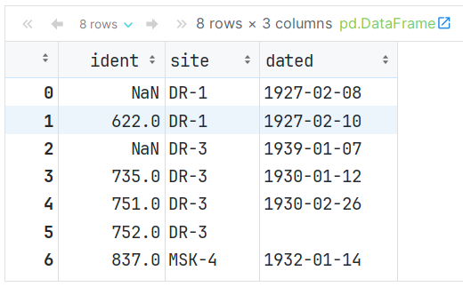

#### 今日内容大纲

* 缺失值处理
* apply方法详解


#### 1.缺失值简介和判断

* 简介

  * 好多数据集都含缺失数据。缺失数据有多重表现形式

    * 数据库中，缺失数据表示为NULL
    * 在某些编程语言中用NA表示
    * 缺失值也可能是空字符串（’’）或数值
    * 在Pandas中使用NaN表示缺失值

  * Pandas中的NaN值来自NumPy库，NumPy中缺失值有几种表示形式：

    * NaN，NAN，nan，他们都一样
    * **缺失值和其它类型的数据不同，它毫无意义，NaN不等于0，也不等于空串**

  * 数据中出现缺失值是很常见的

    - 计算的过程中, 两个表join 可能会有缺失
    - 原始的数据中也有可能直接带着缺失值

    - 数据处理和模型训练的时候, 有很多场景要求必须先把缺失值处理掉, 
    - 想处理缺失值先要在数据中找到缺失值

* 代码演示

  ```python
  # 导包
  import numpy as np
  
  # 1. 缺失值不是 True, False, 空字符串, 0等, 它"毫无意义"
  print(np.NaN == False)
  print(np.NaN == True)
  print(np.NaN == 0)
  print(np.NaN == '')
  
  # 2. np.nan np.NAN np.NaN 都是缺失值, 这个类型比较特殊, 不同通过 == 方式判断, 只能通过API
  print(np.NaN == np.nan)
  print(np.NaN == np.NAN)
  print(np.nan == np.NAN)
  
  # 3. Pandas 提供了 isnull() / isna()方法, 用于测试某个值是否为缺失值
  import pandas as pd
  
  print(pd.isnull(np.NaN))    # True
  print(pd.isnull(np.nan))    # True
  print(pd.isnull(np.NAN))    # True
  
  print(pd.isna(np.NaN))  # True
  print(pd.isna(np.nan))  # True
  print(pd.isna(np.NAN))  # True
  
  # isnull() / isna()方法 还可以判断数据.
  print(pd.isnull(20))    # False
  print(pd.isnull('abc'))    # False
  
  # 4. Pandas的notnull() / notna() 方法可以用于判断某个值是否为缺失值
  print(pd.notnull(np.NaN))   # False
  print(pd.notnull('abc'))   # True
  ```


#### 2.加载缺失值

* 读取包含缺失值的数据

  ```python
  # 加载数据时可以通过keep_default_na 与 na_values 指定加载数据时的缺失值
  pd.read_csv('data/survey_visited.csv')
  
  # 加载数据，不包含默认缺失值,  
  # 参数解释: keep_default_na = False  表示加载数据时, 不加载缺失值.
  pd.read_csv('data/survey_visited.csv', keep_default_na=False)
  
  # 加载数据，手动指定缺失值, 例如: 指定619, 734为缺失值
  # 参数解释: na_values=[值1, 值2...]	表示加载数据时, 设定哪些值为缺失值.
  pd.read_csv('data/survey_visited.csv', na_values=['619', '734'], keep_default_na=False)
  ```

  


#### 3.缺失值可视化

* 代码演示

  ```python
  # 1. 加载数据
  train = pd.read_csv('data/titanic_train.csv')
  test = pd.read_csv('data/titanic_test.csv')
  train.shape
  train.head()
  
  # 2. 查看是否获救数据.
  train['Survived'].value_counts()    # 0: 没获救.   1: 获救
  
  
  # 3. 缺失值可视化(了解)
  # 如果没有安装这个包, 需要先装一下.
  # pip install missingnode
  
  # 导包
  import missingno as msno
  
  # 柱状图, 展示: 每列的 非空值(即: 非缺失值)个数.
  msno.bar(train) 
  
  # 绘制缺失值热力图, 发现缺失值之间是否有关联, 是不是A这一列缺失, B这一列也会缺失.
  msno.heatmap(train) 
  ```

* 表字段介绍

  


#### 4.缺失值处理和非时序数据缺失值填充

* 删除缺失值

  > dropna()函数, 参数介绍如下:
  >
  > * subset=None  默认是: 删除有缺失值的行, 可以通过这个参数来指定, 哪些列有缺失值才会被删除
  >
  > * 例如: subset = ['Age']  只有当年龄有缺失才会被删除
  >
  > * inplace=False  通用参数, 是否修改原始数据默认False
  >
  > * axis=0 通用参数 按行按列删除 默认行
  >
  > * how='any'  只要有缺失就会删除 还可以传入'all' 全部都是缺失值才会被删除

  ```python
  train.shape     # 原始数据, 891行, 12列
  
  # 方式1: 删除缺失值
  # 删除缺失值会损失信息，并不推荐删除，当缺失数据占比较低的时候，可以尝试使用删除缺失值
  # 按行删除: 删除包含缺失值的记录
  # train.dropna().shape        # 默认按行删(该行只要有空值, 就删除该行), 结果为: 183行, 12列
  train.loc[:10].dropna()       # 获取前11行数据, 删除包含空值的行. 
  
  # any: 只要有空值就删除该行|列, all: 该行|列 全为空才删除  subset: 参考哪些列的空值.  inplace=True 在原表修改  
  train.dropna(subset=['Age'], how='any')
  
  # 该列值只要有空, 就删除该列值.
  train.dropna(how='any', axis=1)  # 0(默认): 行,  1: 列 
  
  train.isnull().sum() # 快速计算是否包含缺失值
  ```

* 非时序数据填充

  ```python
  # 方式2: 填充缺失值, 填充缺失值是指用一个估算的值来去替代缺失数
  # 场景1: 非时间序列数据, 可以使用常量来替换（默认值）
  
  # 用 0 来填充 空值.
  train.fillna(0) 
  # 查看填充后, 每列缺失值 情况.
  train.fillna(0).isnull().sum()
  
  # 需求: 用平均年龄, 来替换 年龄列的空值.
  train['Age'].fillna(train['Age'].mean())
  
  ```

  > 非时序数据的缺失值填充, 直接使用fillna(值, inplace=True)
  >
  > - 可以使用统计量  众数 , 平均值, 中位数 ...
  > - 也可以使用默认值来填充  


#### 5.时序数据填充

* 代码演示

  ```python
  # 1. 加载时间序列数据，数据集为印度城市空气质量数据（2015-2020）
  # parse_dates: 把某些列转成时间列. 
  # index_col:   设置指定列为 索引列
  city_day = pd.read_csv('data/city_day.csv', parse_dates=['Date'], index_col='Date')
  
  # 2. 查看缺失值情况.
  city_day.isnull().sum()
  
  # 3. 数据中有很多缺失值，比如 Xylene（二甲苯）和 PM10 有超过50%的缺失值
  # 3.1 查看包含缺失数据的部分
  city_day['Xylene'][50:64]
  
  # 3.2 用固定值填充, 例如: 该列的平均值.
  # 查看平均值.
  city_day['Xylene'].mean()  # 3.0701278234985114
  # 用平均值来填充.
  city_day.fillna(city_day['Xylene'].mean())[50:64]['Xylene']
  
  # 3.3 使用ffill 填充，用时间序列中空值的上一个非空值填充
  # NaN值的前一个非空值是0.81，可以看到所有的NaN都被填充为0.81
  city_day.fillna(method='ffill')[50:64]['Xylene']
  
  # 3.4 使用bfill填充，用时间序列中空值的下一个非空值填充
  # NaN值的后一个非空值是209，可以看到所有的NaN都被填充为209
  city_day.fillna(method='bfill')[50:64]['Xylene']
  
  # 3.5 线性插值方法填充缺失值
  # 时间序列数据，数据随着时间的变化可能会较大。使用bfill和ffill进行插补并不是解决缺失值问题的最优方案。
  # 线性插值法是一种插补缺失值技术，它假定数据点之间存在线性关系，利用相邻数据点中的非缺失值来计算缺失数据点的值。
  # 参数limit_direction: 表示线性填充时, 参考哪些值(forward: 向前, backward:向后, both:前后均参考)
  city_day.interpolate(limit_direction="both")[50:64]['Xylene']
  ```

* 缺失值处理的套路
  - 能不删就不删 , 如果某列数据, 有大量的缺失值(50% 以上是缺失值, 具体情况具体分析)
  - 如果是类别型的, 可以考虑使用 '缺失' 来进行填充
  - 如果是数值型 可以用一些统计量 (均值/中位数/众数) 或者业务的默认值来填充


